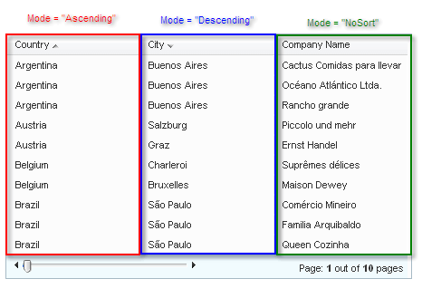

# Controlling Sort Modes


There are three sorting modes in **RadGrid**:

* **Ascending**: When the user clicks once on the sort button in the column header, the table view sorts its items by that column's value, using an ascending sort order. An sorting indicator
appears in the column header to indicate that the column is sorted ascending.

* **Descending**: When the user clicks on the sort button of a column that has a sort mode of "Ascending", the sort mode changes to "Descending". The sorting indicator changes to
to indicate that column is sorted descending.

* **NoSort**: The user can remove the sort on a column by clicking the sort button of a column that has a sort mode of "Descending". When the sort mode is "NoSort", no sorting indicator appears in the column header.



To limit the sorting modes to two-way sorting (ascending and descending), set the **MasterTableView.AllowNaturalSort** property or the **GridTableView.AllowNaturalSort** property to **False**. When **AllowNaturalSort** is **False**, the automatic sequence of sort modes toggles between "Ascending" and "Descending", without allowing a mode of "NoSort".

## SortCommand event

You can change the way the sort mode changes when the user clicks on the sort button in a column header. To change the way the grid responds when a user clicks the sort button, add a **SortCommand** event handler.

In the event handler, you can check the value of the **e.OldSortOrder** and **e.NewSortOrder** arguments to determine the default behavior of the grid. If you want to change that response:

1. Change the **SortExpressions** property of the **GridTableView** to specify the new sort order.

1. Cancel the default action by setting the **e.Canceled** property to **True**.

1. Rebind the **GridTableView** to apply the new sort order.

The following example shows how to change the sequence of sort modes using the **SortCommand** event handler.

The ASPX file declares a grid with a two-level hierarchy and a **SortCommand** event handler:

````ASPNET
<telerik:RadGrid ID="RadGrid1" runat="server" Width="95%" AutoGenerateColumns="False"
  PageSize="3" AllowSorting="True" AllowPaging="True" DataSourceID="AccessDataSource1"
  OnSortCommand="RadGrid1_SortCommand">
  <PagerStyle Mode="NumericPages" />
  <MasterTableView DataKeyNames="CustomerID" DataSourceID="AccessDataSource1" Width="100%">
    <DetailTables>
      <telerik:GridTableView runat="server" DataSourceID="AccessDataSource2" Width="100%">
        <ParentTableRelation>
          <telerik:GridRelationFields DetailKeyField="CustomerID" MasterKeyField="CustomerID" />
        </ParentTableRelation>
        <Columns>
          <telerik:GridBoundColumn SortExpression="OrderID" HeaderText="OrderID" HeaderButtonType="TextButton"
            DataField="OrderID" />
          <telerik:GridBoundColumn SortExpression="OrderDate" HeaderText="Date Ordered" HeaderButtonType="TextButton"
            DataField="OrderDate" />
          <telerik:GridBoundColumn SortExpression="EmployeeID" HeaderText="EmployeeID" HeaderButtonType="TextButton"
            DataField="EmployeeID" />
        </Columns>
      </telerik:GridTableView>
    </DetailTables>
    <Columns>
      <telerik:GridBoundColumn SortExpression="CustomerID" HeaderText="CustomerID" HeaderButtonType="TextButton"
        DataField="CustomerID" />
      <telerik:GridBoundColumn SortExpression="ContactName" HeaderText="Contact Name" HeaderButtonType="TextButton"
        DataField="ContactName" />
      <telerik:GridBoundColumn SortExpression="CompanyName" HeaderText="Company" HeaderButtonType="TextButton"
        DataField="CompanyName" />
    </Columns>
  </MasterTableView></telerik:RadGrid>
<asp:AccessDataSource ID="AccessDataSource1" runat="server" DataFile="~/App_Data/Nwind.mdb"
  SelectCommand="SELECT * FROM [Customers]"></asp:AccessDataSource>
<asp:AccessDataSource ID="AccessDataSource2" runat="server" DataFile="~/App_Data/Nwind.mdb"
  SelectCommand="SELECT * FROM [Orders] WHERE ([CustomerID] = ?)">
  <SelectParameters>
    <asp:Parameter Name="CustomerID" Type="String" />
  </SelectParameters>
</asp:AccessDataSource>
````


The **SortCommand** event handler changes the sequence of sort modes to "Descending", "Ascending", "NoSort" for the EmployeeID field of the detail table, while leaving the default "Ascending", "Descending", "NoSort" sequence on the master table and other detail columns:


````C#
protected void RadGrid1_SortCommand(object source, GridSortCommandEventArgs e)
{
    GridTableView tableView = e.Item.OwnerTableView;
    if (tableView.DataSourceID == "AccessDataSource2" && e.SortExpression == "EmployeeID")
    {
        e.Canceled = true;
        GridSortExpression expression = new GridSortExpression();
        expression.FieldName = "EmployeeID";
        if (tableView.SortExpressions.Count == 0 || tableView.SortExpressions[0].FieldName != "EmployeeID")
        {
            expression.SortOrder = GridSortOrder.Descending;
        }
        else if (tableView.SortExpressions[0].SortOrder == GridSortOrder.Descending)
        {
            expression.SortOrder = GridSortOrder.Ascending;
        }
        else if (tableView.SortExpressions[0].SortOrder == GridSortOrder.Ascending)
        {
            expression.SortOrder = GridSortOrder.None;
        }
        tableView.SortExpressions.AddSortExpression(expression);
        tableView.Rebind();
    }
}
````
````VB.NET
Protected Sub RadGrid1_SortCommand(ByVal source As Object, ByVal e As GridSortCommandEventArgs) Handles RadGrid1.SortCommand
    Dim tableView As GridTableView = e.Item.OwnerTableView
    If tableView.DataSourceID = "AccessDataSource2" AndAlso e.SortExpression = "EmployeeID" Then
        e.Canceled = True
        Dim expression As New GridSortExpression()
        expression.FieldName = "EmployeeID"
        If tableView.SortExpressions.Count = 0 OrElse tableView.SortExpressions(0).FieldName <> "EmployeeID" Then
            expression.SortOrder = GridSortOrder.Descending
        ElseIf tableView.SortExpressions(0).SortOrder = GridSortOrder.Descending Then
            expression.SortOrder = GridSortOrder.Ascending
        ElseIf tableView.SortExpressions(0).SortOrder = GridSortOrder.Ascending Then
            expression.SortOrder = GridSortOrder.None
        End If
        tableView.SortExpressions.AddSortExpression(expression)
        tableView.Rebind()
    End If
End Sub
````

