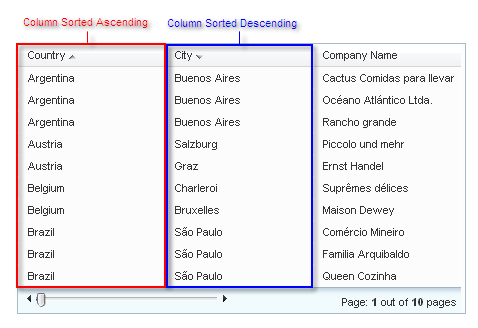

# Multi-Column Sorting

If a **GridTableView** object's **AllowMultiColumnSorting** property is set to **True**, more than one column sort expression can be added to the table view. The sort order is the same as the sequence of expressions in the **GridTableView.SortExpressions** collection.

In the example below, the grid sorted is by Country ascending and then by City descending:

### See Also

 * [Custom Sorting Demo](https://demos.telerik.com/aspnet-ajax/grid/examples/functionality/sorting/custom-sorting/defaultcs.aspx)
