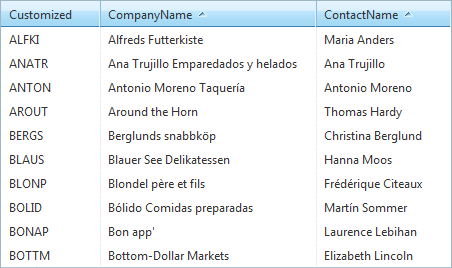
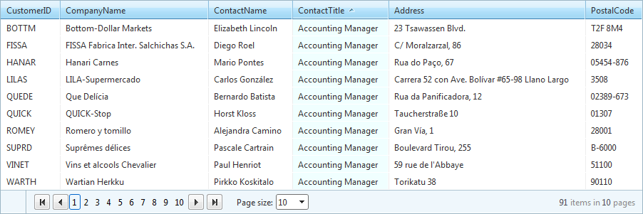

# Sorting Overview


You can have **RadGrid** automatically sort its columns by setting the **AllowSorting** property to **True**. When sorting is enabled, arrow buttons appear on the column headers that allow users to select a sorting mode for each column.

There are three [sorting modes]():

* Ascending

* Descending

* No Sort

You can configure the grid to allow sorting by more than one **DataField** (called [multi-column sorting]()).

>note The sorting of the grid is based on the .NET sorting algorithms and the default type value comparators. Since the string comparator depends on the current culture, you could modify the sorting and orderign data by changing it.
>Additional information could be found at the following MSDN help articles:
>[Comparing and Sorting Data for a Specific Culture]( http://msdn.microsoft.com/en-us/library/a7zyyk0c.aspx)
>[CultureInfo.DefaultThreadCurrentUICulture Property ]( http://msdn.microsoft.com/en-us/library/system.globalization.cultureinfo.defaultthreadcurrentuiculture%28v=VS.110%29.aspx)
>Please note that this will affect other formatting in your page, like decimal separators, month names and etc.
>


## Sorting Expressions

Sorting is controlled by [sorting expressions]() on the **GridTableView** object. You can specify the **SortExpressions** property collection declaratively to provide an initial sort order or manipulate the sorting expressions at runtime to alter the sort order of columns:



## Customizing the sorting arrows

An easy way to change the RadGrid sort arrows is to use the **SortAscImageUrl** and **SortDescImageUrl** properties, which are set **per column**. For example:

````ASPNET
	  <telerik:GridBoundColumn SortAscImageUrl="MySortAscImage.gif" SortDescImageUrl="MySortDescImage.gif" />
````


In case you are using autogenerated columns, the two properties can be set programmatically, e.g. in **ColumnCreated**:


````C#
	    protected void RadGrid1_ColumnCreated(object sender, GridColumnCreatedEventArgs e)
	    {
	        e.Column.SortAscImageUrl = "MySortAscImage.gif";
	    }
````
````VB.NET
	    Protected Sub RadGrid1_ColumnCreated(ByVal sender As Object, ByVal e As GridColumnCreatedEventArgs)
	        e.Column.SortAscImageUrl = "MySortAscImage.gif"
	    End Sub
````


## Setting the background color of sorted columns

To provide additional feedback about sorted columns, you can specify a different background color for sorted columns in two ways:

* by setting **SortingSettings -> EnableSkinSortStyles** to true (default value) which will automatically apply sort color for the *corresponding embedded grid skins*.

* by setting the **SortingSettings.SortedBackColor** property on the **RadGrid** control, or the **SortedBackColor** property on a particular grid column (**GridColumn** object).

>note Setting **SortedBackColor** on a particular column overrides the setting of the **SortingSettings.SortedBackColor** property of the entire grid.
>




# See Also

 * [Multi-Column Sorting]()

 * [Sort Expressions]()

 * [Controlling Sort Modes]()
