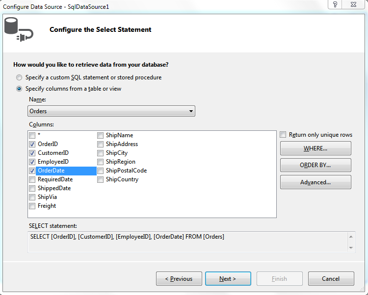
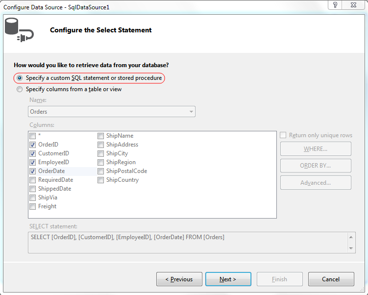
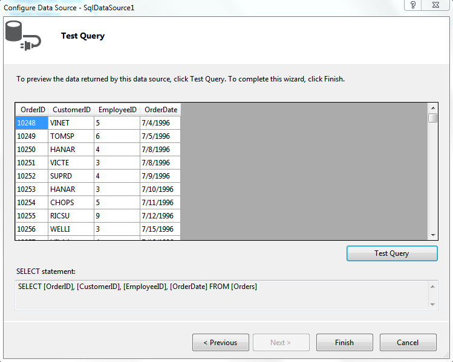
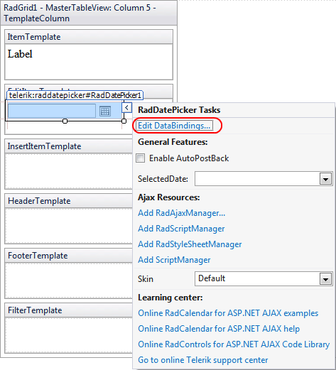
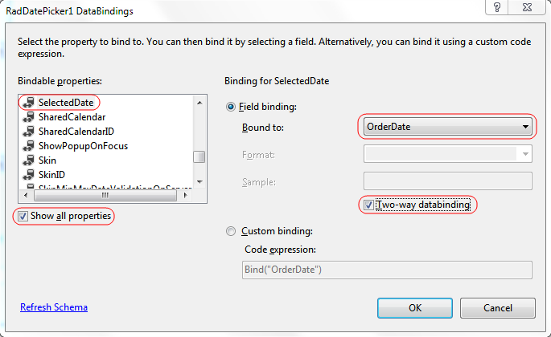
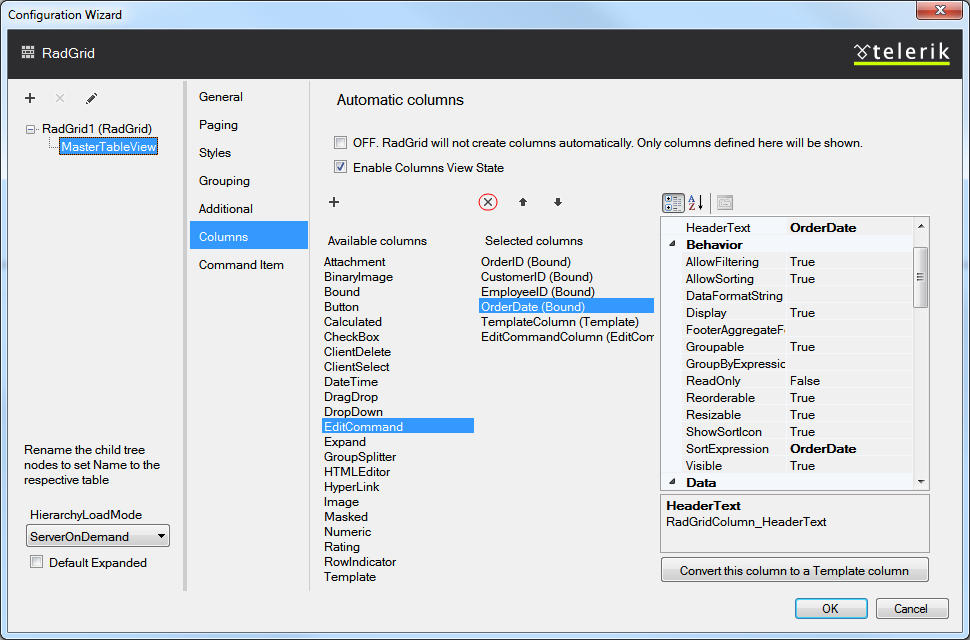
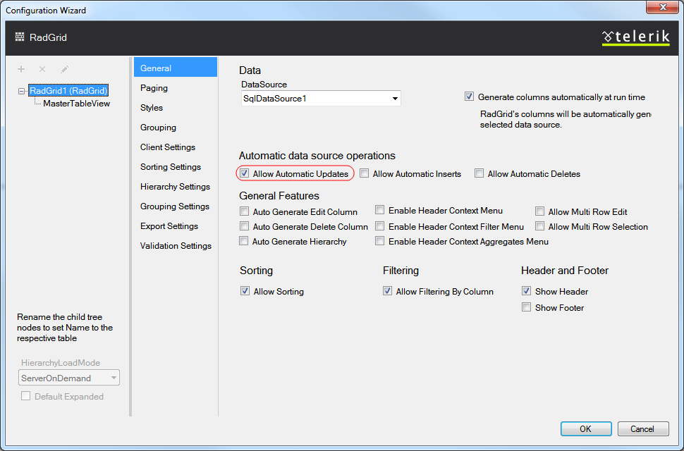
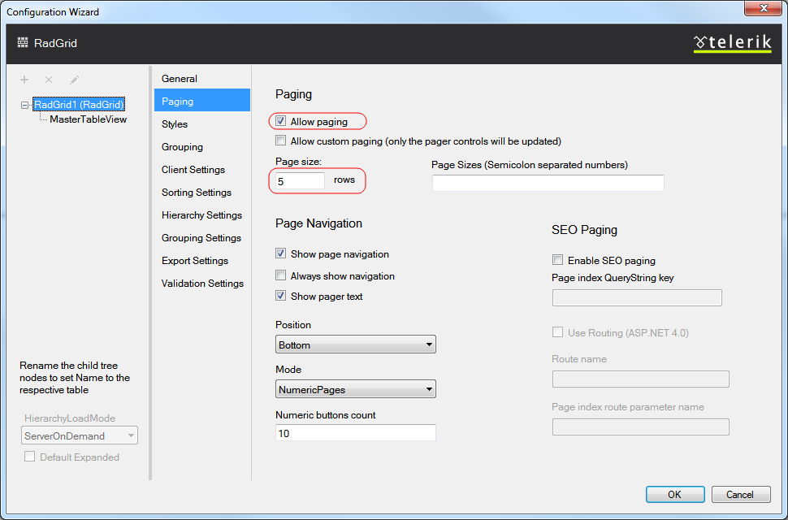
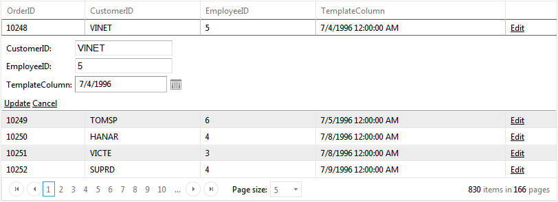

# Add Controls to Column Templates

This tutorial shows how to:

* Add controls to a **RadGrid** template column's ItemTemplate and EditItemTemplate.

* Enable the grid control for editing using automatic updates.

* Set RadGrid's skin using the Smart Tag.

* Enable paging for RadGrid and changing its page size with the design editor.

## Creating and Binding the Grid

1. Locate the "..\Live Demos\App_Data" folder underneath the folder where you have installed yourcontrols. In this folder, find the **Northwind.mdf** file, and copy it into the**App_Data** folder of your Web application. The **Solution Explorer** for you application should look something like the following:

1. Drag and drop a **RadGrid** control from Visual Studio's toolbox onto your Web page:

1. Using the **RadGrid's** [Smart Tag](), expand the drop-down listlabelled **Choose Data Source** and select **<New data source...>**:

1. The **Data Source Configuration Wizard** appears. On the **Choose a Data Source Type** page, select **SQL Database** andclick **OK**:

1. On the **Choose Your Data Connection** page, expand the drop-down list by clicking the little triangle on the right side and select the **Northwind.mdf** from the available options. Then click the **Next** button:

>note If you happen to encounter a **"Database schema could not be retrieved"** exception, please follow the guide in[this]()help topic.
>

1. On the **Configure Select Statement** page, select the Orders table from thedrop-down list, and select theOrderID, CustomerID, EmployeeID, and OrderDate fields and then click **Next** button:

1. Click the **Specify a custom SQL statement or stored procedure** radio button.Then choose **Next**:

1. Add an **Update** statement to the data source:

1. On the **Test Query** page, click the **Test Query** button to see the data. Then click **Finish**, to exit the **Configure Data Source** wizard:

## Adding Template columns

1. Using the RadGrid's Editor, add a template column to the grid:

* Open **RadGrid's Configuration Wizard** from the [Smart Tag]().

* Select **MasterTableView** under **RadGrid** node.

* Select **Columns** tab from the right pane.

* Select **Template** column under **Available columns**.

* Click the **"+"** button to add the template column.

* In the right pane, set the **HeaderText** property to **TemplateColumn**.

1. Click **Edit Templates** from the **RadGrid's** [Smart Tag]():

1. Choose the Template column that you wish to edit:

1. Drag and drop a **RadDatePicker** control from Visual Studio's toolbox ontothe **EditItemTemplate**.

1. Select **Edit DataBindings** from the **RadDatePicker's Smart Tag**:

1. In the **DataBindings** dialog:

* Check **Show all properties** to view the properties of the date picker.

* Choose the **SelectedDate** property as the property to bind.

* Choose the **OrderDate** field as the **Fieldbinding**.

* Check the **Two-way data binding** box to enable the control to update the field value.

1. Use a similar technique to bind the **Label** control:
 to end template editing:

## Enabling editing, paging, and change the Skin

1. Back in **RadGrid's** Editor, add an edit command column to the grid:

1. Remove the **OrderDate** column; the Template column will be used instead:

1. Still in the RadGrid's Editor check the **AllowAutomaticUpdates** checkbox on the right pane:

1. Now select the **MasterTableView** node, then select **Paging** tab and change the **Page size** to **5** rows.

1. From the **RadGrid's** [Smart Tag]() expand the drop-down list labeled **Skin** and choose **Metro** skin.

1. Run the application. Click the edit column to see the edit template you added. Note that if you edit a value in the grid, the database is updated:

