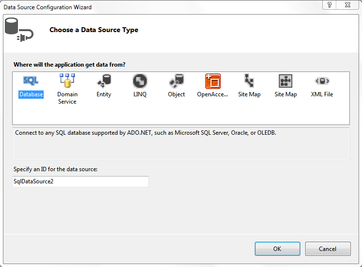
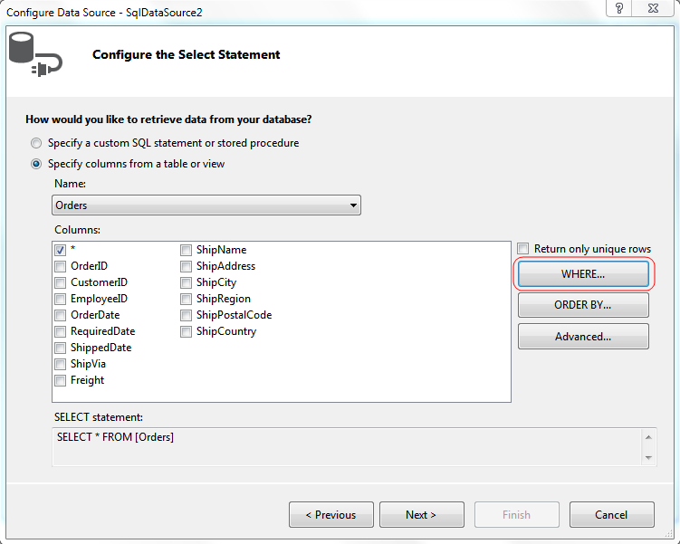
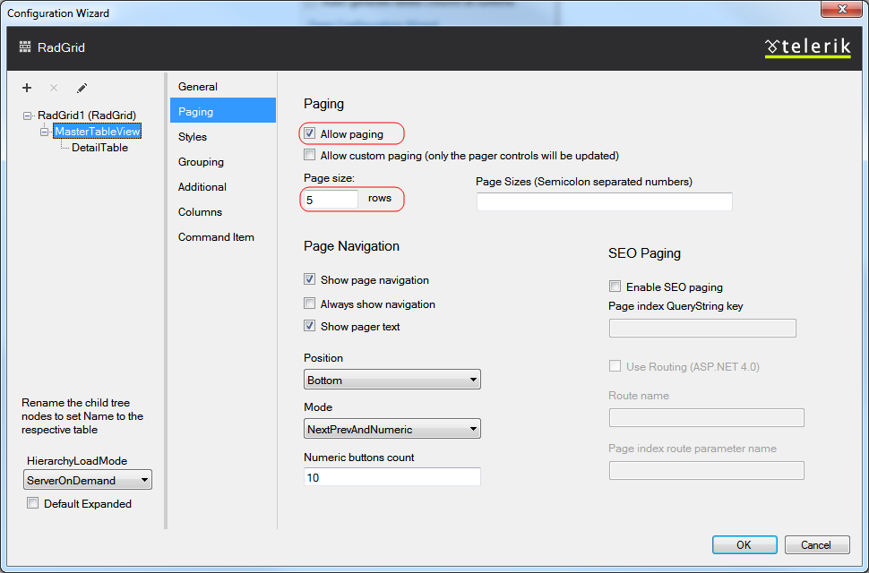
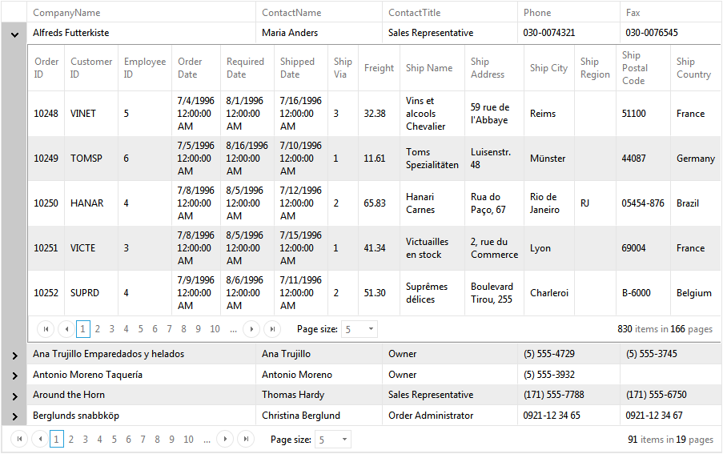

# Building a Hierarchical Grid


This tutorial will walk you through creating a Web page that contains a hierarchical __RadGrid__ control. It shows how to:

* Bind detail tables using a declarative data source.

* Bind detail tables dynamically, using the __DetailTableDataBind__ event.

## Creating the data sources

1. Locate the "..\Live Demos\App_Data" folder underneath the folder where you have installed yourcontrols. In this folder, find the __Northwind.mdf__ file and copy it into the__App_Data__ folder of your Web site. The__Solution Explorer__ for your application should look something like the following:

1. Drag and drop a __RadGrid__ control from the toolbox onto your Web page:

1. Using the __RadGrid's__[Smart Tag]() expand the drop-down list labelled Choose Data Source and select __<New data source...>__:

1. The __Data Source Configuration Wizard__ appears. On the __Choose a Data Source Type__ page, select __SQL Database__ and click __OK__:

1. On the __Choose Your Data Connection__ page, expand the drop-down list by clicking the little triangle on the right side and select the __Northwind.mdf__ from the available options. Then click the __Next__ button:

>note If you happen to encounter a "Database schema could not be retrieved" exception, please follow the guide in[this]()help topic.
>


1. On the __Save the Connection String to the Application Configuration File__ page, set name for the __Connection String__ and then press __Next__:

1. On the __Configure the Select Statement__ page, select the __Customers__ table from the drop-down list, and select all__(*)__ fields. Then choose __Next__:

1. On the __Test Query__ page, click the __Test Query__ button to see the data. Then click __Finish__ to exit the __Configure Data Source__ wizard:

1. Using __RadGrid's__[Smart Tag]() add a second __DataSource__ component to RadGrid.

1. Choose the same database on the __Choose Your Data Connection__ page of the wizard. Then click the __Next__ button:

1. On the __Configure the Select Statement__ page, choose the __Orders__ table and select all columns again. This time, we are creating a data source for a detail table, so we need to add a where clause so the detail records are limited to the ones that match a record in the parent table. Click the __Where...__ button to add a __WHERE__ clause:

1. On the __Add WHERE Clause__ page, choose the __CustomerID__ column, and select __None__ as the source of the parameter. Then click the __Add__ button to add the condition to the __Where__ clause, and click __OK__.

1. The __Configure Select Statement__ page now shows your WHERE clause. Click the __Next__ button, and then, on the next page, choose __Finish__:

1. After you press the __Finish__ button __RadGrid__ will ask you if you want to apply the new datasource schema, choose __No__:

## Creating the grid and binding its Master Table

1. In the __RadGrid's__ Smart Tag, select __SQLDataSource1__ as a data source for the grid. This binds the __MasterTableView__ to the __Customers__ table. If RadGrid asks you whether to apply the new datasource schema, choose __Yes__. In addition, while in the Smart Tag, choose __Metro__ from the __Skin__ drop-down to give the grid a different skin:

1. Still in the Smart Tag, click the link labelled __Open Configuration Wizard__:

1. In the [ RadGrid Editor](),

1. Select the __MasterTableView__ in the __Grid hierarchy__ tree view that you find in the upper left corner.

1. Select __Columns__ tab.

1. Remove any columns you do not want to display for the Master Table:

1. In __General__ tab of the __MasterTableView__ node make sure that the __DataKeyNames__ list contains the string __CustomerID__. This column must be identified as a key name so that it can be used to link to detail tables:

## Creating and binding the first detail table

1. In the __Grid hierarchy__ tree view, click the "+" button while the __MasterTableView__is selected to add a Detail TableView.

1. Select the detail table under __MasterTableView__ node.

1. In the right pane, set the __DataSourceID__ property to __SqlDataSource2__ to bind it to the __Orders__ table.

1. In the __Parent table relation__, fill in the __CustomerID__ string in both fields(__MasterKeyField and DetailKeyField__) click the "+" button to add a relationship between a field in the detail table and its corresponding field in the parent table.

1. Now set the __DataKeyNames__ property of the detail table to __OrderID__. This will be useful later when binding a second detail table as a child of this table view.

1. Before exiting the __RadGrid__ Editor, return to the __MasterTableView__ node, on the right pane click the __Paging__ tab and then check the __Allow paging__ checkbox and set the __Page size__ to __5__ rows:

1. Run the application to see that the grid now displays a two-level hierarchy, with the __Orders__ table nested inside the __Customers__ table:

## Creating and binding the second detail table

1. Bring up the __RadGrid's__ Editor again and add a second Detail Table as a child of the first Detail Table:

1. Because we will be binding the detail table dynamically, there is no need to set any more properties, so exit the property builder:

1. Give the __RadGrid__ a __DetailTableDataBind__ event handler. This event handler

1. Checks if the detail table has a datasource already.

1. Creates a SELECT command based on the current value of the data key from the parent table (This is available because we set the __DataKeyNames__ property of the parent table).

1. Fills a __DataTable__ using the dynamically created SELECT command.

1. Assigns the data table as the __DataSource__ of the detail table view we are binding:

>tabbedCode

````C#
	    protected void RadGrid1_DetailTableDataBind(object sender, Telerik.Web.UI.GridDetailTableDataBindEventArgs e)
	    {
	        if (e.DetailTableView.DataSourceID == "")
	        {
	            GridDataItem dataItem = (GridDataItem)e.DetailTableView.ParentItem;
	            string OrderID = dataItem.GetDataKeyValue("OrderID").ToString();
	            e.DetailTableView.DataSource = GetDataTable("Select * from [Order Details] where OrderID = '" + OrderID + "'");
	        }
	
	    }
	
	    public DataTable GetDataTable(string query)
	    {
	        String ConnString = ConfigurationManager.ConnectionStrings["NorthwindConnectionString"].ConnectionString;
	        SqlDataAdapter adapter = new SqlDataAdapter();
	        DataTable myDataTable = new DataTable();
	        using (SqlConnection conn = new SqlConnection(ConnString))
	        {
	            adapter.SelectCommand = new SqlCommand(query, conn);
	            adapter.Fill(myDataTable);
	        }
	        return myDataTable;
	    }
````
````VB.NET
	
	    Private Sub RadGrid1_DetailTableDataBind(ByVal source As Object, ByVal e As GridDetailTableDataBindEventArgs) Handles RadGrid1.DetailTableDataBind
	        If e.DetailTableView.DataSourceID = "" Then
	            Dim dataItem As GridDataItem = DirectCast(e.DetailTableView.ParentItem, GridDataItem)
	            Dim OrderID As String = dataItem.GetDataKeyValue("OrderID").ToString()
	            e.DetailTableView.DataSource = GetDataTable("Select * from [Order Details] where OrderID = '" + OrderID + "'")
	        End If
	    End Sub
	
	    Public Function GetDataTable(query As String) As DataTable
	        Dim ConnString As [String] = ConfigurationManager.ConnectionStrings("NorthwindConnectionString").ConnectionString
	        Dim adapter As New SqlDataAdapter()
	        Dim myDataTable As New DataTable()
	        Using conn As New SqlConnection(ConnString)
	            adapter.SelectCommand = New SqlCommand(query, conn)
	            adapter.Fill(myDataTable)
	        End Using
	        Return myDataTable
	    End Function
	
````
>end

1. Run the application. Note that you can now see the dynamically bound Detail Table:
