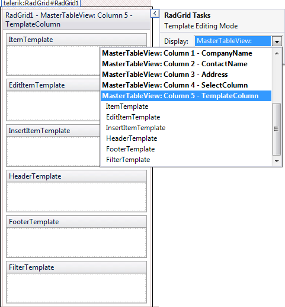

# Getting Started with RadGrid for ASP.NET AJAX

This tutorial will walk you through creating a Web page that contains a **RadGrid** control. It shows how to:

* Bind the grid using a declarative data source.

* Configure the grid to support the most common features including:

* Paging

* Sorting

* Scrolling

* Grouping

* Filtering

* Selecting

* Add a template column for customized data display.

## Creating and Binding the Grid

1. Locate the "..\Live Demos\App_Data" folder underneath the folder where you have installed your controls. In this folder, find the **Northwind.mdf** file, and copy it into the **App_Data** folder of your Web application. The **Solution Explorer** for you application should look something like the following:

1. Drag and drop a **RadGrid** control from the toolbox onto your Web page:

1. Using the **RadGrid** [Smart Tag]() expand the drop-down list labelled Choose Data Source and select **<New data source...>**:

1. The **Data Source Configuration Wizard** appears. On the **Choose a Data Source Type** page, select **SQL Database** and click **OK**:

1. On the **Choose Your Data Connection** page, expand the drop-down list by clicking the little triangle on the right side and select the **Northwind.mdf** from the available options. Then click the **Next** button:

	_Note_: If you happen to encounter a "Database schema could not be retrieved" exception, please follow the guide in [this] () help topic.
1. On the **Configure the Select Statement** page, select the Customers table from the drop-down list, select the CompanyName, ContactName, Address, and PostalCode fields. Then choose **Next**:

1. On the **Test Query** page, click the **Test Query** button to see the data. Then click **Finish** to exit the **Configure Data Source** wizard:

## Configuring the grid for paging, sorting, and scrolling

1. From the **Skin** drop-down of the **RadGrid's** [Smart Tag]() choose the **Metro** skin:

1. In the **General Features** section, check the boxes to enable **paging**, **sorting**, and **scrolling**:

1. Still in the **Smart Tag** click the link labeled **Open Editor**:

1. In the **RadGrid**[Editor]():

* Select **RadGrid** from the **Configuration Manager**.

* On the right side, click **Styles** tab. Then select **RadGrid style**.

* In the **Layout** section of the RadGrid's style editor, locate the **Width** property and set it to **720px**:

1. On the same window, just one tab above the **Styles** tab select **Paging tab**. Then on the right pane, set the **Page size** to **30** rows.

1. Run the application to check out what you have created so far. Note the pager elements in the grid footer and the scroll bar on the right side. When you click on column headers the column data will be sorted:

## Configuring the grid for selecting, filtering, and grouping

1. Add a select column:

* Open the **Editor**.

* Select **MasterTableView** under **RadGrid** node.

* Select **Columns** from the right pane.

* Select **Button** column under **Available columns**.

* Click the **"+"** button to add the button column.

* Use the up arrow button to move it to the first position.

* You need to customize the column a bit in order to work as a select column.

* Set values to the **HeaderText**, **Text**, and **CommandName** properties.

* Additionally, you could change the **UniqueName** and **BackColor** of the column.

1. Use the **RadGrid** [Smart Tag]() to enable **filtering** and **grouping**:

1. Run the application to see the result of your changes. A select column appears as the first column of the grid. Each column now has a filter control at the top. A grouping panel appears at the top of the grid. Drag the header of the **PostalCode** column onto the grouping panel. The rows of the grid are now grouped by postal code, and an item for this group appears in the grouping panel that lets you change the sort order of the groups:

## Adding Template columns

1. Back in the Editor, add a template column to the grid:

* Select **MasterTableView** under **RadGrid** node.

* Select **Columns** from the right pane.

* Select **Template** column under **Available columns**.

* Click the **"+"** button to add the template column.

* In the right pane, set the **HeaderText** property to **TemplateColumn**.

1. In the [Smart Tag]() select **Edit Templates** option:

1. In the drop-down list of the **Smart Tag** in Template Editing Mode, select the template column to bring up the template design surface for the template column:

1. Add a **Label** to the item template and a **TextBox** to its edit item template, using drag and drop from the Visual Studio toolbox. From the **Smart Tag** of the **Label** and of the **TextBox**, choose **Edit DataBindings** to display the DataBindings editor:

1. In the DataBindings editor for the **Label** and for the **TextBox**, bind the **Text** property to a field in the datasource:

1. Now, you have a fully functional **RadGrid** with no code behind. Paging, sorting, filtering, scrolling and grouping are enabled. There is a column for server-side selection and a template column for specific data display:

