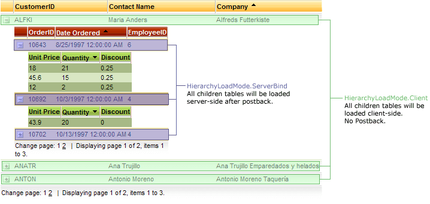

# Hierarchy load modes

If you work in hierarchy mode, you can define when the **DataBind** for **GridTableView** will occur. In order to do this, you need to set the following property:

**GridTableView.HierarchyLoadMode**

The possible values are:

* **HierarchyLoadMode.ServerBind** - all child **GridTableViews** will be bound immediately when **DataBind** occurs for a parent **GridTableView** or **RadGrid**.

* **HierarchyLoadMode.ServerOnDemand** - **DataBind** of a child **GridTableView** would only take place when an item is Expanded (see **GridItem.Expanded**). This is the default value.

* **HierarchyLoadMode.Client** is similar to **HierarchyLoadMode.ServerBind**, but items are expanded client-side, using JavaScript manipulations, instead of postback to the server.In order to use client-side hierarchy expand, you will need to set also **ClientSettings.AllowExpand.Collapse**to true.

* **HierarchyLoadMode.Conditional** is mix of **HierarchyLoadMode.ServerOnDemand and HierarchyLoadMode.ClientBind**, with the difference that when an item i expanded once and postback fires for the initial expand, next time the same item will be expanded on the client .This behavior is also persisted across postback to the server – so if you have previously expanded an item from then on it will only be expanded / collapsed on the client regardless of how many postbacks you perform. The behavior is the same if you have previously loaded hierarchy with expanded items (e.g. setting Expanded=”true” in the PreRender event) – these expanded items will also be collapsed / expanded on the client.

>note There are cases in which the described conditional behavior is not preserved, all items are returned to their default state and a postback will be required to expand / collapse them. Such cases include rebinding and/or recreating the structure of the grid with changing the order / position of the items on the server. Some examples might be: **manual rebinding, grouping, sorting, filtering, item drag-drop, etc** .
>

Changing this property value impacts the performance the following way:

* In **HierarchyLoadMode.ServerBind** mode:

* The roundtrip to the database happens only once - when the grid is bound.

* The ViewState holds all data for the detail tables.

* Only detail table-views of the expanded items are rendered.

* You need to postback to the server to in order to expand an item.

* In **HierarchyLoadMode.ServerOnDemand** mode:

* The roundtrip to the database happens when the grid is bound and when an item is expanded.

* The ViewState holds data only for the visible Items (the smallest possible ViewState).

* Only detail table-views of the expanded items are rendered.

* You need to postback to the server in order to expand an item.

* In **HierarchyLoadMode.Client** mode:

* The roundtrip to the database happens only when grid is bound.

* The ViewState holds all detail tables data.

* All items are rendered - even if not visible (not expanded).

* No postback to the server is needed to expand an item - expand/collapse of hierarchy items is managed client-side.

* In **HierarchyLoadMode.Conditional** mode:

* The roundtrip to the database happens when the grid is bound and when an item is expanded first time.

* The ViewState holds data only for the visible Items.

* Only detail table-views of the expanded items are rendered..

* You need to postback to the server in order to expand an item first time and after that for expanding already expanded item no postback to the server is needed - expand/collapse of hierarchy items is managed client-side.

## 

Using different load modes in Telerik RadGrid

As **HierarchyLoadMode** is a **GridTableView** setting (not **RadGrid** property) you can even more fine tune the way that Telerik RadGrid handles loading of hierarchy tables.You can set **HierarchyLoadMode.Client** or **HierarchyLoadMode.Conditional** for tables that need fast view and **HierarchyLoadMode.ServerBind** for tables that are less likely to be accessed.

Thus you can balance the loading of the grid between:

* the client - this will require more bandwidth but will assure less load to the server and database and quicker expand.

* the server - will save some client-load for the inner tables of the grid.

or use **HierarchyLoadMode.Conditional** in order to force this balanced behaviour in the RadGrid.

The example below shows the advanced hierarchy model of Telerik RadGrid with mixed mode expand/collapse (client-side and server-side). A three level hierarchy is demonstrated with Customer Master Table and two nested Detail Tables: Orders and OrderDetails. The first level of hierarchy uses client-side (**HierarchyLoadMode.Client**) expand and the second level uses server-side mode (**HierarchyLoadMode.ServerBind**)

