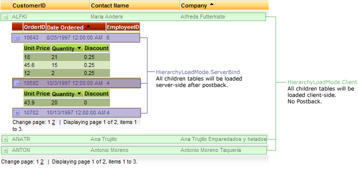

# Hierarchy Load Modes

In hierarchy mode, define when **DataBind** occurs for a **GridTableView** by setting the following property:

**GridTableView.HierarchyLoadMode**

````ASP.NET
<MasterTableView HierarchyLoadMode="Client"></MasterTableView>

<!-- or for DetailTables -->
<telerik:GridTableView HierarchyLoadMode="ServerBind"></telerik:GridTableView>
````

````C#
RadGrid1.MasterTableView.HierarchyLoadMode = GridChildLoadMode.Client;

// for the first DetailTable of the first griditem
GridTableView tableView = RadGrid1.MasterTableView.Items[0].ChildItem.NestedTableViews[0] as GridTableView;
tableView.HierarchyLoadMode = GridChildLoadMode.Client;
````

````VB
RadGrid1.MasterTableView.HierarchyLoadMode = GridChildLoadMode.Client

' for the first DetailTable of the first griditem
Dim tableView As GridTableView = TryCast(RadGrid1.MasterTableView.Items(0).ChildItem.NestedTableViews(0), GridTableView)
tableView.HierarchyLoadMode = GridChildLoadMode.Client
````

The possible values are:

* **HierarchyLoadMode.ServerBind** - all child **GridTableViews** will be bound immediately when **DataBind** occurs for a parent **GridTableView** or **RadGrid**.

* **HierarchyLoadMode.ServerOnDemand** - **DataBind** of a child **GridTableView** occurs only when an item is expanded (see **GridItem.Expanded**). This is the default value.

* **HierarchyLoadMode.Client** is similar to **HierarchyLoadMode.ServerBind**, but items are expanded on the client through JavaScript instead of through a server postback. To use client-side hierarchy expansion, also set **ClientSettings.AllowExpandCollapse** to `true`.

* **HierarchyLoadMode.Conditional** combines **HierarchyLoadMode.ServerOnDemand** with client-side expansion. The first expansion of an item triggers a postback. Later expansions of the same item occur on the client. This behavior persists across postbacks. It also applies to items that you load as expanded, for example, by setting `Expanded="true"` in the **PreRender** event.

>note Rebinding or recreating the grid structure can reset the conditional behavior and require a postback to expand or collapse an item. Examples include **manual rebinding, grouping, sorting, filtering, and item drag-and-drop**.
>


Changing this property value impacts the performance the following way:

* In **HierarchyLoadMode.ServerBind** mode:

* The round trip to the database happens only once, when the grid is bound.

* The **ViewState** holds all data for the detail tables.

* Only detail table-views of the expanded items are rendered.

* You must post back to the server to expand an item.

* In **HierarchyLoadMode.ServerOnDemand** mode:

* The round trip to the database happens when the grid is bound and when an item is expanded.

* The **ViewState** holds data only for the visible items, which produces the smallest possible view state.

* Only detail table-views of the expanded items are rendered.

* You must post back to the server to expand an item.

* In **HierarchyLoadMode.Client** mode:

* The round trip to the database happens only when the grid is bound.

* The **ViewState** holds data for all detail tables.

* All items are rendered - even if not visible (not expanded).

* No postback to the server is needed to expand an item because hierarchy expansion and collapse are managed on the client.

* In **HierarchyLoadMode.Conditional** mode:

* The round trip to the database happens when the grid is bound and when an item is expanded for the first time.

* The **ViewState** holds data only for the visible items.

* Only detail table views for expanded items are rendered.

* You must post back to the server to expand an item for the first time. Later expansions and collapses are managed on the client.

## Using Different Load Modes

Use different load modes in RadGrid to control how each hierarchy table loads.

Because **HierarchyLoadMode** is a **GridTableView** setting rather than a **RadGrid** property, you can fine-tune how each hierarchy table loads. Set **HierarchyLoadMode.Client** or **HierarchyLoadMode.Conditional** for tables that need client-side expansion, and set **HierarchyLoadMode.ServerBind** for tables that need server-side loading.

This lets you balance grid loading between the client and server:

* **Client** loading requires more bandwidth but reduces server and database load and provides faster expansion.

* **Server** loading reduces the client-side load for inner grid tables.

You can also use **HierarchyLoadMode.Conditional** to combine these behaviors in RadGrid.

The example below shows the advanced hierarchy model of Telerik RadGrid with mixed mode expand/collapse (client-side and server-side). A three level hierarchy is demonstrated with Customer Master Table and two nested Detail Tables: Orders and OrderDetails. The first level of hierarchy uses client-side (**HierarchyLoadMode.Client**) expand and the second level uses server-side mode (**HierarchyLoadMode.ServerBind**)



## See Also

- [Understanding the hierarchical grid structure]()
- [Hierarchical data binding using declarative relations]()
- [Hierarchical data binding using the DetailTableDataBind event]()


