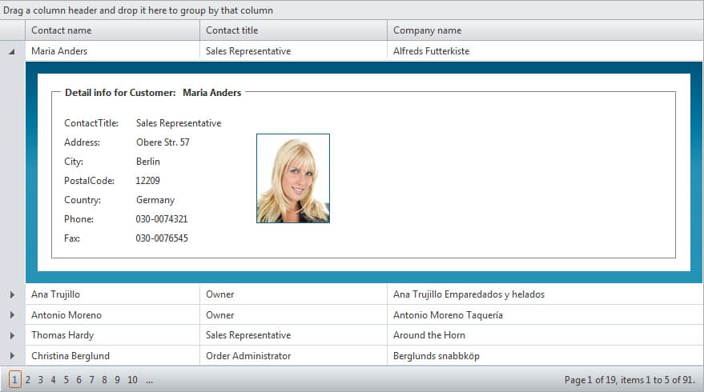

# NestedView Template

The RadGrid `NestedViewTemplate` lets you customize the structure and appearance of detail content in a hierarchical grid. Use it to display related content in a separate view for each detail item or to provide tabs for navigating between entries.



Specify the detail template between the `NestedViewTemplate` tags of its parent **GridTableView**. The template appears when you expand the parent item. You can also bind the nested view template to a single record by setting **NestedViewSettings.DataSourceID** and defining the parent relation through **NestedViewSettings.ParentTableRelation**. The following example shows the overall structure of a hierarchical grid with detail templates:

````ASP.NET
<telerik:RadGrid RenderMode="Lightweight" ID="RadGrid1" DataSourceID="SqlDataSource1" runat="server">
   <MasterTableView DataKeyNames="CustomerID">
       <Columns>
           <!-- Column definitions here, optional if using auto-generated columns -->
       </Columns>
       <NestedViewSettings DataSourceID="SqlDataSource2">
           <ParentTableRelation>
             <telerik:GridRelationFields MasterKeyField="CustomerID" DetailKeyField="CustomerID" />
           </ParentTableRelation>
       </NestedViewSettings>
       <NestedViewTemplate>
           <!-- NestedView template definition here -->
       </NestedViewTemplate>
    </MasterTableView>
</telerik:RadGrid>
````

Alternatively, define the `NestedViewTemplate` inside a detail table:


````ASP.NET
<telerik:RadGrid RenderMode="Lightweight" ID="RadGrid1" DataSourceID="SqlDataSource1" runat="server">
    <MasterTableView DataKeyNames="CustomerID">
          <Columns>
            <!-- Column definitions here, optional if using auto-generated columns -->
          </Columns>
       <DetailTables>
        <GridTableView DataKeyNames="OrderID">
          <Columns>
            <!-- Column definitions here, optional if using auto-generated columns -->
          </Columns>
         <NestedViewTemplate>
            <!-- NestedView template definition here -->
         </NestedViewTemplate>
        </GridTableView>
       </DetailTables>
    </MasterTableView>
</telerik:RadGrid>
````


When you set a nested view template at a given level, RadGrid ignores regular detail table definitions at the same level. For example, RadGrid ignores the detail tables between the **DetailTables** tags in the following code:

````ASP.NET
<telerik:RadGrid RenderMode="Lightweight" ID="RadGrid1" DataSourceID="SqlDataSource1" runat="server">
  <MasterTableView DataKeyNames="CustomerID">
    <NestedViewTemplate>
      <!-- NestedView template definition here -->
    </NestedViewTemplate>
    <DetailTables>
      <!-- Some regular detail table definitions here -->
    </DetailTables>
  </MasterTableView>
</telerik:RadGrid>
````


For a live example of the RadGrid `NestedViewTemplate` feature, see the [NestedViewTemplate demo](https://demos.telerik.com/aspnet-ajax/Grid/Examples/Hierarchy/nestedviewtemplatedeclarativerelations/defaultcs.aspx).


To support this feature, RadGrid exposes a **NestedViewSettings** property for its table view objects. **NestedViewSettings** lets you specify the data source on the page to which the template is bound and the relation to the parent level. Define these settings declaratively or programmatically through **NestedViewSettings.DataSourceID** and **NestedViewSettings.ParentTableRelation**. Specify **ParentTableRelation** in the same way as declarative relations for hierarchical tables.

As with declarative hierarchy relations, the data source for the nested view template must use a `WHERE` clause to retrieve the related record. The `WHERE` clause must include the field from the **ParentTableRelation** definition between the master and child tables. Include the same field in the inner data source control's **SelectParameters** with exactly the same `Name`. However, a **SessionField** value is not required. If the data source returns more than one record, RadGrid uses only the first record to bind the controls in the template. The following code is an excerpt from the sample:

````ASP.NET
<telerik:ScriptManager ID="ScriptManager1" runat="server" />
<telerik:RadAjaxManager ID="RadAjaxManager1" runat="server">
  <AjaxSettings>
    <telerik:AjaxSetting AjaxControlID="RadGrid1">
      <UpdatedControls>
        <telerik:AjaxUpdatedControl ControlID="RadGrid1" LoadingPanelID="RadAjaxLoadingPanel1" />
      </UpdatedControls>
    </telerik:AjaxSetting>
  </AjaxSettings>
</telerik:RadAjaxManager>
<telerik:RadAjaxLoadingPanel ID="RadAjaxLoadingPanel1" runat="server" />
<telerik:RadGrid RenderMode="Lightweight" ID="RadGrid1" DataSourceID="SqlDataSource1" runat="server" AutoGenerateColumns="False"
  AllowSorting="True" AllowPaging="True" PageSize="5" GridLines="None" ShowGroupPanel="True">
  <MasterTableView DataSourceID="SqlDataSource1" DataKeyNames="CustomerID" AllowMultiColumnSorting="True"
    GroupLoadMode="Server">
    <Columns>
      <telerik:GridBoundColumn DataField="CustomerID" HeaderText="CustomerID" ReadOnly="True"
        SortExpression="CustomerID" UniqueName="CustomerID">
      </telerik:GridBoundColumn>
      <telerik:GridBoundColumn DataField="CompanyName" HeaderText="CompanyName" SortExpression="CompanyName"
        UniqueName="CompanyName">
      </telerik:GridBoundColumn>
      <telerik:GridBoundColumn DataField="ContactName" HeaderText="ContactName" SortExpression="ContactName"
        UniqueName="ContactName">
      </telerik:GridBoundColumn>
    </Columns>
    <NestedViewSettings DataSourceID="SqlDataSource2">
      <ParentTableRelation>
        <telerik:GridRelationFields DetailKeyField="CustomerID" MasterKeyField="CustomerID" />
      </ParentTableRelation>
    </NestedViewSettings>
    <NestedViewTemplate>
      <asp:Panel ID="NestedViewPanel" runat="server" CssClass="viewWrap">
        <div class="contactWrap">
          <fieldset style="padding: 10px;">
            <legend style="padding: 5px;"><b>Detail info for Customer:<%#Eval("ContactName") %></b>
            </legend>
            <table>
              .......
              <tr>
                <td>
                  ContactTitle:
                </td>
                <td>
                  <asp:Label ID="titleLabel" Text='<%#Bind("ContactTitle") %>' runat="server"></asp:Label>
                </td>
              </tr>
              <tr>
                <td>
                  Address:
                </td>
                <td>
                  <asp:Label ID="addressLabel" Text='<%#Bind("Address") %>' runat="server"></asp:Label>
                </td>
              </tr>
              .......
            </table>
          </fieldset>
        </div>
      </asp:Panel>
    </NestedViewTemplate>
  </MasterTableView>
  <PagerStyle Mode="NumericPages"></PagerStyle>
  <ClientSettings AllowDragToGroup="true" />
</telerik:RadGrid>
<asp:SqlDataSource ID="SqlDataSource2" ConnectionString="<%$ ConnectionStrings:NorthwindConnectionString %>"
  SelectCommand="SELECT [CustomerID],[ContactName],[ContactTitle], [Address],[City],[PostalCode],[Country],[Phone],[Fax] FROM [Customers] where CustomerID=@CustomerID"
  runat="server">
  <SelectParameters>
    <asp:Parameter Name="CustomerID" />
  </SelectParameters>
</asp:SqlDataSource>
<asp:SqlDataSource ID="SqlDataSource1" ConnectionString="<%$ ConnectionStrings:NorthwindConnectionString %>"
  SelectCommand="SELECT [CustomerID], [CompanyName], [ContactName] FROM [Customers]"
  runat="server"></asp:SqlDataSource>
````


An alternative approach to binding the nested view template without defining nested view settings for it is demonstrated in the code below:


````ASP.NET
<asp:ScriptManager ID="ScriptManager1" runat="server" />
<telerik:RadAjaxManager ID="RadAjaxManager1" runat="server">
  <AjaxSettings>
    <telerik:AjaxSetting AjaxControlID="RadGrid1">
      <UpdatedControls>
        <telerik:AjaxUpdatedControl ControlID="RadGrid1" />
      </UpdatedControls>
    </telerik:AjaxSetting>
  </AjaxSettings>
</telerik:RadAjaxManager>
<telerik:RadGrid RenderMode="Lightweight" ID="RadGrid1" Skin="Vista" ShowStatusBar="true" DataSourceID="SqlDataSource1"
  runat="server" Width="95%" AutoGenerateColumns="False" AllowSorting="True" AllowMultiRowSelection="False"
  AllowPaging="True" GridLines="None">
  <PagerStyle Mode="NumericPages"></PagerStyle>
  <MasterTableView Width="100%" DataSourceID="SqlDataSource1" DataKeyNames="CustomerID"
    AllowMultiColumnSorting="True">
    <NestedViewTemplate>
      <fieldset id="InnerContainer" runat="server" style="padding: 10px;">
        <legend style="padding: 5px;"><b>Orders for contact name:</b>
          <asp:Label ID="Label1" Font-Bold="true" Font-Italic="true" Text='<%# Eval("CustomerID") %>'
            Visible="false" runat="server" />
          <asp:Label ID="Label2" Font-Bold="true" Font-Italic="true" Text='<%# Eval("ContactName") %>'
            runat="server" />
        </legend>
        <asp:SqlDataSource ID="DetailsDataSource" ConnectionString="<%$ ConnectionStrings:NorthwindConnectionString %>"
          ProviderName="System.Data.SqlClient" SelectCommand="SELECT * FROM Orders Where CustomerID = @CustomerID"
          runat="server">
          <SelectParameters>
            <asp:ControlParameter ControlID="Label1" PropertyName="Text" Type="String" Name="CustomerID" />
          </SelectParameters>
        </asp:SqlDataSource>
        <asp:DetailsView ID="DetailsView1" AllowPaging="true" GridLines="None" Width="100%"
          DataSourceID="DetailsDataSource" runat="server">
        </asp:DetailsView>
      </fieldset>
    </NestedViewTemplate>
    <Columns>
      <telerik:GridBoundColumn SortExpression="CustomerID" HeaderText="CustomerID" HeaderButtonType="TextButton"
        DataField="CustomerID" UniqueName="CustomerID">
      </telerik:GridBoundColumn>
      <telerik:GridBoundColumn SortExpression="ContactName" HeaderText="Contact Name" HeaderButtonType="TextButton"
        DataField="ContactName" UniqueName="ContactName">
      </telerik:GridBoundColumn>
      <telerik:GridBoundColumn SortExpression="CompanyName" HeaderText="Company" HeaderButtonType="TextButton"
        DataField="CompanyName" UniqueName="CompanyName">
      </telerik:GridBoundColumn>
    </Columns>
    <SortExpressions>
      <telerik:GridSortExpression FieldName="CompanyName"></telerik:GridSortExpression>
    </SortExpressions>
  </MasterTableView>
</telerik:RadGrid>
<asp:SqlDataSource ID="SqlDataSource1" ConnectionString="<%$ ConnectionStrings:NorthwindConnectionString %>"
  ProviderName="System.Data.SqlClient" SelectCommand="SELECT * FROM Customers" runat="server">
</asp:SqlDataSource>
````

````C#
public partial class DefaultCS : System.Web.UI.Page
{
    protected void RadGrid1_PreRender(object sender, EventArgs e)
    {
        if (!Page.IsPostBack)
        {
            RadGrid1.MasterTableView.Items[0].Expanded = true;
            RadGrid1.MasterTableView.Items[0].ChildItem.FindControl("InnerContainer").Visible = true;
        }
    }
    protected void RadGrid1_ItemCommand(object source, GridCommandEventArgs e)
    {
        if (e.CommandName == RadGrid.ExpandCollapseCommandName)
        {
            ((GridDataItem)e.Item).ChildItem.FindControl("InnerContainer").Visible =
                !e.Item.Expanded;
        }
    }
    protected void RadGrid1_ItemCreated(object sender, GridItemEventArgs e)
    {
        if (e.Item is GridNestedViewItem)
        {
            e.Item.FindControl("InnerContainer").Visible = ((GridNestedViewItem)e.Item).ParentItem.Expanded;
        }
    }
}
````
````VB
Partial Public Class DefaultVB
    Inherits System.Web.UI.Page
    Protected Sub RadGrid1_PreRender(ByVal sender As Object, ByVal e As EventArgs) Handles RadGrid1.PreRender
        If Not Page.IsPostBack Then
            RadGrid1.MasterTableView.Items(0).Expanded = True
			RadGrid1.MasterTableView.Items(0).ChildItem.FindControl("InnerContainer").Visible = True
        End If
    End Sub
    Protected Sub RadGrid1_ItemCommand(ByVal source As Object, ByVal e As GridCommandEventArgs) Handles RadGrid1.ItemCommand
        If e.CommandName = RadGrid.ExpandCollapseCommandName Then
            DirectCast(e.Item, GridDataItem).ChildItem.FindControl("InnerContainer").Visible = Not e.Item.Expanded
        End If
    End Sub
    Protected Sub RadGrid1_ItemCreated(ByVal sender As Object, ByVal e As GridItemEventArgs) Handles RadGrid1.ItemCreated
        If TypeOf e.Item Is GridNestedViewItem Then
            e.Item.FindControl("InnerContainer").Visible = (DirectCast(e.Item, GridNestedViewItem)).ParentItem.Expanded
        End If
    End Sub
End Class
````

## See Also

- [What you should know about hierarchical grids]()
- [Hierarchical data binding using declarative relations]()
- [Hierarchy load modes]()

