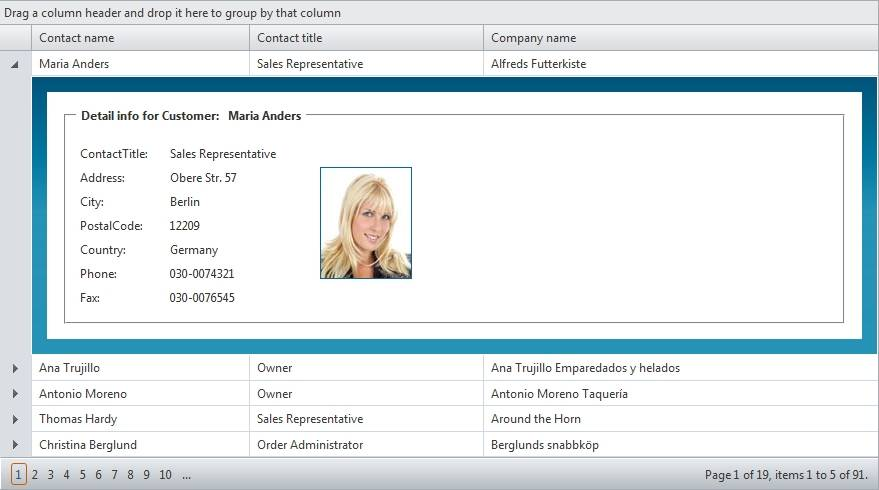

# NestedView template


## 

This feature of RadGrid gives you the freedom to design the overall structure and appearance of detail tables in hierarchical grid. Thus based on your custom preferences you have the ability model the look and feel of the child table container in order to display the detail info in non table-dependant format. The functionality is especially useful when you would like to present the related content providing separate view for each detail item or tabs for navigation between the entries.

The detail table template should be specified between the NestedViewTemplate tags of its parent GridTableView. The template will appear when you expand the respective parent item. In addition, the nested view template can be data bound to a single record from a data source object by setting the NestedViewSettings.DataSourceID property of the give table view and defining a relation to the parent level through the NestedViewSettings.ParentTableRelation property of the same table view. Here is the overall structure of hierarchical grid with detail templates:

````ASPNET
	        <telerik:RadGrid ID="RadGrid1" DataSourceID="SqlDataSource1" runat="server">
	           <MasterTableView DataKeyNames="CustomerID">
	               <Columns>
	                   <!-- Column definitions here, optional if using auto-generated columns -->
	               </Columns>
	               <NesteViewSettings DataSourceID="SqlDataSource2">
	                   <telerik:ParentTableRelation MasterKeyField="CustomerID" DetailKeyField="CustomeriD"/>
	               </NestedViewSettings>
	               <NestedViewTemplate>
	                   <!-- NestedView template definition here -->
	               </NestedViewTemplate>
	            </MasterTableView>
	        </telerik:RadGrid>
````


or

````ASPNET
	     <telerik:RadGrid ID="RadGrid1" DataSourceID="SqlDataSource1" runat="server">
	         <MasterTableView DataKeyNames="CustomerID">
	               <Columns>
	                 <!-- Column definitions here, optional if using auto-generated columns -->
	               </Columns>
	            <DetailTables>
	             <GridTableView DataKeyNames="OrderID">
	               <Columns>
	                 <!-- Column definitions here, optional if using auto-generated columns -->
	               </Columns>
	              <NestedViewTemplate>
	                 <!-- NestedView template definition here -->
	              </NestedViewTemplate>
	             </GridTableView>
	            </DetailTables>
	         </MasterTableView>
	     </telerik:RadGrid
````


Note that when you set NestedView template at a given level the regular detail tables definitions you may have at the same level will be disregarded. For example, the detail tables between the __DetailTables__ tag in this code will be automatically ignored:

````ASPNET
	  <telerik:RadGrid ID="RadGrid1" DataSourceID="SqlDataSource1" runat="server">
	    <MasterTableView DataKeyNames="CustomerID">
	      <NestedViewTemplate>
	        <!-- NestedView template definition here -->
	      </NestedViewTemplate>
	      <DetailTables>
	        <!-- Some regular detail table definitions here -->
	      </DetailTables>
	    </MasterTableView>
	  </telerik:RadGrid>
````


Online demo representing the NestedView template feature of RadGrid can be viewed [here](http://demos.telerik.com/aspnet-ajax/Grid/Examples/Hierarchy/nestedviewtemplatedeclarativerelations/defaultcs.aspx).

RadGrid gives you the ability to data bind the controls in a nested view template to a single item of a specified data source. You can have three modes of data binding the nested view template: ServerOnDemand, ServerBind or Client, which can be set through the HierarchyLoadMode property of the corresponding table view.

To support this feature, RadGrid exposes an additional property for its table view objects called __NestedViewSettings__. The __NestedViewSettings__ allow you to specify a data source object contained on the page to which the template should be bound, as well as a relation to the parent level. These two properties can be defined declaratively or programmatically through the __NestedViewSettings.DataSourceID__ and __NestedViewSettings.ParentTableRelation__ properties respectively. The __ParentTableRelation__ is specified in the same way as the declarative relations for hierarchical tables.

As with the hierarchy declarative relations, you should have a WHERE clause in the SelectCommand of the data source control for the nested view template to retrieve the record for it. The WHERE clause should include the field from the ParentTableRelation definition between the master/child table. Furthermore, the same field has to be included in the SelectParameters of the "inner" data source controls with exactly the same Name. However, __no__ SesssionField value is required.If more than one records are fetched from the data source for the nested view template, only the first one will be used to bind the controls in the latter.Below is a code extraction from the sample:

````C#
	  <telerik:ScriptManager ID="ScriptManager1" runat="server" />
	  <telerik:RadAjaxManager ID="RadAjaxManager1" runat="server">
	    <AjaxSettings>
	      <telerik:AjaxSetting AjaxControlID="RadGrid1">
	        <UpdatedControls>
	          <telerik:AjaxUpdatedControl ControlID="RadGrid1" LoadingPanelID="RadAjaxLoadingPanel1" />
	        </UpdatedControls>
	      </telerik:AjaxSetting>
	    </AjaxSettings>
	  </telerik:RadAjaxManager>
	  <telerik:RadAjaxLoadingPanel ID="RadAjaxLoadingPanel1" runat="server" />
	  <telerik:RadGrid ID="RadGrid1" DataSourceID="SqlDataSource1" runat="server" AutoGenerateColumns="False"
	    AllowSorting="True" AllowPaging="True" PageSize="5" GridLines="None" ShowGroupPanel="True">
	    <MasterTableView DataSourceID="SqlDataSource1" DataKeyNames="CustomerID" AllowMultiColumnSorting="True"
	      GroupLoadMode="Server">
	      <Columns>
	        <telerik:GridBoundColumn DataField="CustomerID" HeaderText="CustomerID" ReadOnly="True"
	          SortExpression="CustomerID" UniqueName="CustomerID">
	        </telerik:GridBoundColumn>
	        <telerik:GridBoundColumn DataField="CompanyName" HeaderText="CompanyName" SortExpression="CompanyName"
	          UniqueName="CompanyName">
	        </telerik:GridBoundColumn>
	        <telerik:GridBoundColumn DataField="ContactName" HeaderText="ContactName" SortExpression="ContactName"
	          UniqueName="ContactName">
	        </telerik:GridBoundColumn>
	      </Columns>
	      <NestedViewSettings DataSourceID="SqlDataSource2">
	        <ParentTableRelation>
	          <telerik:GridRelationFields DetailKeyField="CustomerID" MasterKeyField="CustomerID" />
	        </ParentTableRelation>
	      </NestedViewSettings>
	      <NestedViewTemplate>
	        <asp:Panel ID="NestedViewPanel" runat="server" CssClass="viewWrap">
	          <div class="contactWrap">
	            <fieldset style="padding: 10px;">
	              <legend style="padding: 5px;"><b>Detail info for Customer:<%#Eval("ContactName") %></b>
	              </legend>
	              <table>
	                .......
	                <tr>
	                  <td>
	                    ContactTitle:
	                  </td>
	                  <td>
	                    <asp:Label ID="titleLabel" Text='<%#Bind("ContactTitle") %>' runat="server"></asp:Label>
	                  </td>
	                </tr>
	                <tr>
	                  <td>
	                    Address:
	                  </td>
	                  <td>
	                    <asp:Label ID="addressLabel" Text='<%#Bind("Address") %>' runat="server"></asp:Label>
	                  </td>
	                </tr>
	                .......
	              </table>
	            </fieldset>
	          </div>
	        </asp:Panel>
	      </NestedViewTemplate>
	    </MasterTableView>
	    <PagerStyle Mode="NumericPages"></PagerStyle>
	    <ClientSettings AllowDragToGroup="true" />
	  </telerik:RadGrid>
	  <asp:SqlDataSource ID="SqlDataSource2" ConnectionString="<%$ ConnectionStrings:NorthwindConnectionString %>"
	    SelectCommand="SELECT [CustomerID],[ContactName],[ContactTitle], [Address],[City],[PostalCode],[Country],[Phone],[Fax] FROM [Customers] where CustomerID=@CustomerID"
	    runat="server">
	    <SelectParameters>
	      <asp:Parameter Name="CustomerID" />
	    </SelectParameters>
	  </asp:SqlDataSource>
	  <asp:SqlDataSource ID="SqlDataSource1" ConnectionString="<%$ ConnectionStrings:NorthwindConnectionString %>"
	    SelectCommand="SELECT [CustomerID], [CompanyName], [ContactName]FROM [Customers]"
	    runat="server"></asp:SqlDataSource>
````


An alternative approach to binding the nested view template without defining nested view settings for it is demonstrated in the code below:

>tabbedCode

````ASPNET
	  <asp:ScriptManager ID="ScriptManager1" runat="server" />
	  <telerik:RadAjaxManager ID="RadAjaxManager1" runat="server">
	    <AjaxSettings>
	      <telerik:AjaxSetting AjaxControlID="RadGrid1">
	        <UpdatedControls>
	          <telerik:AjaxUpdatedControl ControlID="RadGrid1" />
	        </UpdatedControls>
	      </telerik:AjaxSetting>
	    </AjaxSettings>
	  </telerik:RadAjaxManager>
	  <telerik:RadGrid ID="RadGrid1" Skin="Vista" ShowStatusBar="true" DataSourceID="SqlDataSource1"
	    runat="server" Width="95%" AutoGenerateColumns="False" AllowSorting="True" AllowMultiRowSelection="False"
	    AllowPaging="True" GridLines="None">
	    <PagerStyle Mode="NumericPages"></PagerStyle>
	    <MasterTableView Width="100%" DataSourceID="SqlDataSource1" DataKeyNames="CustomerID"
	      AllowMultiColumnSorting="True">
	      <NestedViewTemplate>
	        <fieldset style="padding: 10px;">
	          <legend style="padding: 5px;"><b>Orders for contact name:</b>
	            <asp:Label ID="Label1" Font-Bold="true" Font-Italic="true" Text='<%# Eval("CustomerID") %>'
	              Visible="false" runat="server" />
	            <asp:Label ID="Label2" Font-Bold="true" Font-Italic="true" Text='<%# Eval("ContactName") %>'
	              runat="server" />
	          </legend>
	          <asp:SqlDataSource ID="DetailsDataSource" ConnectionString="<%$ ConnectionStrings:NorthwindConnectionString %>"
	            ProviderName="System.Data.SqlClient" SelectCommand="SELECT * FROM Orders Where CustomerID = @CustomerID"
	            runat="server">
	            <SelectParameters>
	              <asp:ControlParameter ControlID="Label1" PropertyName="Text" Type="String" Name="CustomerID" />
	            </SelectParameters>
	          </asp:SqlDataSource>
	          <asp:DetailsView ID="DetailsView1" AllowPaging="true" GridLines="None" Width="100%"
	            DataSourceID="DetailsDataSource" runat="server">
	          </asp:DetailsView>
	        </fieldset>
	      </NestedViewTemplate>
	      <Columns>
	        <telerik:GridBoundColumn SortExpression="CustomerID" HeaderText="CustomerID" HeaderButtonType="TextButton"
	          DataField="CustomerID" UniqueName="CustomerID">
	        </telerik:GridBoundColumn>
	        <telerik:GridBoundColumn SortExpression="ContactName" HeaderText="Contact Name" HeaderButtonType="TextButton"
	          DataField="ContactName" UniqueName="ContactName">
	        </telerik:GridBoundColumn>
	        <telerik:GridBoundColumn SortExpression="CompanyName" HeaderText="Company" HeaderButtonType="TextButton"
	          DataField="CompanyName" UniqueName="CompanyName">
	        </telerik:GridBoundColumn>
	      </Columns>
	      <SortExpressions>
	        <telerik:GridSortExpression FieldName="CompanyName"></telerik:GridSortExpression>
	      </SortExpressions>
	    </MasterTableView>
	  </telerik:RadGrid>
	  <asp:SqlDataSource ID="SqlDataSource1" ConnectionString="<%$ ConnectionStrings:NorthwindConnectionString %>"
	    ProviderName="System.Data.SqlClient" SelectCommand="SELECT * FROM Customers" runat="server">
	  </asp:SqlDataSource>
````
````C#
	
	    public partial class DefaultCS : System.Web.UI.Page
	    {
	        protected void RadChart1_ItemDataBound(object sender, Telerik.Charting.ChartItemDataBoundEventArgs e)
	        {
	            e.SeriesItem.Name = (string)DataBinder.Eval(e.DataItem, "pName");
	        }
	        protected void RadGrid1_PreRender(object sender, EventArgs e)
	        {
	            if (!Page.IsPostBack)
	            {
	                RadGrid1.MasterTableView.Items[0].Expanded = true;
	                RadGrid1.MasterTableView.Items[0].ChildItem.FindControl("InnerContainer").Visible = true;
	            }
	        }
	        protected void RadGrid1_ItemCommand(object source, GridCommandEventArgs e)
	        {
	            if (e.CommandName == RadGrid.ExpandCollapseCommandName)
	            {
	                ((GridDataItem)e.Item).ChildItem.FindControl("InnerContainer").Visible =
	                    !e.Item.Expanded;
	            }
	        }
	        protected void RadGrid1_ItemCreated(object sender, GridItemEventArgs e)
	        {
	            if (e.Item is GridNestedViewItem)
	            {
	                e.Item.FindControl("InnerContainer").Visible = ((GridNestedViewItem)e.Item).ParentItem.Expanded;
	            }
	        }
	    }	
````
````VB.NET
	    Partial Public Class DefaultVB
	        Inherits System.Web.UI.Page
	        Protected Sub RadChart1_ItemDataBound(ByVal sender As Object, ByVal e As Telerik.Charting.ChartItemDataBoundEventArgs)
	            e.SeriesItem.Name = DirectCast(DataBinder.Eval(e.DataItem, "pName"), String)
	        End Sub
	        Protected Sub RadGrid1_PreRender(ByVal sender As Object, ByVal e As EventArgs) Handles RadGrid1.PreRender
	            If Not Page.IsPostBack Then
	                RadGrid1.MasterTableView.Items(0).Expanded = True
					RadGrid1.MasterTableView.Items(0).ChildItem.FindControl("InnerContainer").Visible = True
	            End If
	        End Sub
	        Protected Sub RadGrid1_ItemCommand(ByVal source As Object, ByVal e As GridCommandEventArgs) Handles RadGrid1.ItemCommand
	            If e.CommandName = RadGrid.ExpandCollapseCommandName Then
	                DirectCast(e.Item, GridDataItem).ChildItem.FindControl("InnerContainer").Visible = Not e.Item.Expanded
	            End If
	        End Sub
	        Protected Sub RadGrid1_ItemCreated(ByVal sender As Object, ByVal e As GridItemEventArgs) Handles RadGrid1.ItemCreated
	            If TypeOf e.Item Is GridNestedViewItem Then
	                e.Item.FindControl("InnerContainer").Visible = (DirectCast(e.Item, GridNestedViewItem)).ParentItem.Expanded
	            End If
	        End Sub
	    End Class
````
>end
