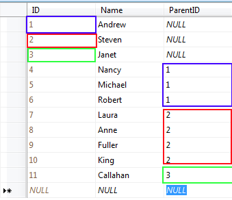

# Self-referencing hierarchy


You can build multiple levels of a hierarchical grid using a single table in the data source by specifying relations inside the same table. The grid can automatically generate detail table views that copy the properties of the __MasterTableView__ and display data based on the relations you specify.

To build a self-referencing hierarchy,

1. Add all fields from the data source that define the parent/child relationships to the __DataKeyNames__ array of the __MasterTableView__.

1. Set the __SelfReferencingSettings__ property of the __MasterTableView__ to describe the data relationship between the data for parent and child tables (between the fields you added to __DataKeyNames__):

* The __ParentKeyName__ sub-property specifies the field in the parent table view.

* The __KeyName__ sub-property specifies the field in the detail table view that links to the field specified by __ParentKeyName__.

* The __MaximumDepth__ sub-property limits the depth of nested detail tables. Note that this specifies the number of detail tables you can nest -- the master table view is not counted in this value.

1. If you want to display a tree-like structure, Set the __FilterExpression__ property of the __MasterTableView__ to filter out all items except those that belong at the root level of the hierarchy. Note that this must be done on __Page_Load__, so that the filter does not apply to any detail tables.

## Example

The following example shows a grid with a self-referencing hierarchy based on a single data table having root node with null value for parent id in the source.For example:

In the ASPX file, the grid declaration does not need to include any detail tables. The __MasterTableView__ includes a __SelfHierarchySettings__ section to describe the data relationships and a __DataKeyNames__ property that lists the relevant fields:

````ASPNET
	  <telerik:RadGrid ID="RadGrid1" runat="server" OnNeedDataSource="RadGrid1_NeedDataSource"
	    OnItemCreated="RadGrid1_ItemCreated">
	    <MasterTableView AllowSorting="true" DataKeyNames="ID, ParentID" Width="100%">
	      <SelfHierarchySettings ParentKeyName="ParentID" KeyName="ID" />
	    </MasterTableView>
	    <ClientSettings AllowExpandCollapse="true">
	    </ClientSettings>
	  </telerik:RadGrid>
````


The __Page_Load__ event handler filters out all but the root element in the __MasterTableView__:


````C#
	    public void Page_Load(object sender, EventArgs e)
	    {
	        if (RadGrid1.EnableLinqExpressions)
	        {
	            RadGrid1.MasterTableView.FilterExpression = @"(Convert.ToInt32(iif(it[""ParentID""]==Convert.DBNull,null,it[""ParentID""])) = 0)";
	        }
	        else
	        {
	            RadGrid1.MasterTableView.FilterExpression = "ParentID=0";
	        }
	    }
````
````VB.NET
	    Public Sub Page_Load(ByVal sender As Object, ByVal e As EventArgs) Handles Me.Load
	        If RadGrid1.EnableLinqExpressions Then
	            RadGrid1.MasterTableView.FilterExpression = "(Convert.ToInt32(iif(it[""ParentID""]==Convert.DBNull,null,it[""ParentID""])) = 0)"
	        Else
	            RadGrid1.MasterTableView.FilterExpression = "ParentID=0"
	        End If
	    End Sub
````


The next step is to bind the __RadGrid__ to data in the __NeedDataSource__event handler:


````C#
	
	
	    protected void RadGrid1_NeedDataSource(object source, GridNeedDataSourceEventArgs e)
	    {
	        RadGrid1.DataSource = GetDataTable("SELECT ID, Name, ParentID FROM SelfReferencing");
	    }
	    public DataTable GetDataTable(string query)
	    {
	        String ConnString = ConfigurationManager.ConnectionStrings["TelerikConnectionString"].ConnectionString;
	        SqlDataAdapter adapter = new SqlDataAdapter();
	        DataTable myDataTable = new DataTable();
	        using (SqlConnection conn = new SqlConnection(ConnString))
	        {
	            adapter.SelectCommand = new SqlCommand(query, conn);
	            adapter.Fill(myDataTable);
	        }
	        return myDataTable;
	    }
	
````
````VB.NET
	    Protected Sub RadGrid1_NeedDataSource(ByVal source As Object, ByVal e As Telerik.Web.UI.GridNeedDataSourceEventArgs) Handles RadGrid1.NeedDataSource
	        RadGrid1.DataSource = GetDataTable("SELECT ID, Name, ParentID FROM SelfReferencing")
	    End Sub
	    Public Function GetDataTable(ByVal query As String) As DataTable
	        Dim ConnString As [String] = ConfigurationManager.ConnectionStrings("TelerikConnectionString").ConnectionString
	        Dim adapter As New SqlDataAdapter()
	        Dim myDataTable As New DataTable()
	        Using conn As New SqlConnection(ConnString)
	            adapter.SelectCommand = New SqlCommand(query, conn)
	            adapter.Fill(myDataTable)
	        End Using
	        Return myDataTable
	    End Function
````


In order to hide the expand/collapse images when there are no records in self-referencing hierarchy, see [Hiding the expand/collapse images]().

>caution NOTE: The advanced data binding using NeedDataSource is the recommended approach when creating self-hierarchical RadGrid.
>


## Bind a self-referencing RadGrid to a data source control

By design the __RadGrid__does not support a self-referencing hierarchy bound to a data source control. In order to achieve this you need to write some custom logic. Below is the code of a simple demo implementation.

The first step is to set a __RadGrid.DataSourceID__ to the datasource control:

````ASPNET
	  <telerik:RadGrid ID="RadGrid1" runat="server" DataSourceID="SqlDataSource1" OnColumnCreated="RadGrid1_ColumnCreated"
	        OnItemCreated="RadGrid1_ItemCreated" OnItemDataBound="RadGrid1_ItemDataBound">
	        <MasterTableView HierarchyDefaultExpanded="true" HierarchyLoadMode="Client" AllowSorting="true"
	            DataKeyNames="EmployeeID, ReportsTo" Width="100%">
	            <SelfHierarchySettings ParentKeyName="ReportsTo" KeyName="EmployeeID" />
	        </MasterTableView>
	        <ClientSettings AllowExpandCollapse="true" />
	    </telerik:RadGrid>
	    <asp:SqlDataSource ID="SqlDataSource1" ConnectionString="<%$ ConnectionStrings:NorthwindConnectionString %>"
	        ProviderName="System.Data.SqlClient" SelectCommand="SELECT EmployeeID, LastName, FirstName, Title, ReportsTo FROM Employees"
	        runat="server">
	    </asp:SqlDataSource>
````


Then apply __FilterExpression__in the __Page_Load__ event handler.


````C#
	    public void Page_Load(object sender, EventArgs e)
	    {
	        if (RadGrid1.EnableLinqExpressions)
	        {
	            RadGrid1.MasterTableView.FilterExpression = @"it[""ReportsTo""] = Convert.DBNull";
	        }
	        else
	        {
	            RadGrid1.MasterTableView.FilterExpression = "ReportsTo IS NULL";
	        }
	    }
	
````
````VB.NET
	    Public Sub Page_Load(ByVal sender As Object, ByVal e As EventArgs) Handles MyBase.Load
	        If RadGrid1.EnableLinqExpressions Then
	            RadGrid1.MasterTableView.FilterExpression = "it[""ReportsTo""] = Convert.DBNull"
	        Else
	            RadGrid1.MasterTableView.FilterExpression = "ReportsTo IS NULL"
	        End If
	    End Sub
````


Next step is to hide the default expand/collapse column and include button control for expand/collapse of nested tables as part of the first column in the grid:


````C#
	
	
	    protected void RadGrid1_ColumnCreated(object sender, GridColumnCreatedEventArgs e)
	    {
	        if (e.Column is GridExpandColumn)
	        {
	            e.Column.Visible = false;
	        }
	        else if (e.Column is GridBoundColumn)
	        {
	            e.Column.HeaderStyle.Width = Unit.Pixel(100);
	        }
	    }
	    protected void RadGrid1_ItemCreated(object sender, GridItemEventArgs e)
	    {
	        CreateExpandCollapseButton(e.Item, "EmployeeID");
	        if (e.Item is GridHeaderItem && e.Item.OwnerTableView != RadGrid1.MasterTableView)
	        {
	            e.Item.Style["display"] = "none";
	        }
	        if (e.Item is GridNestedViewItem)
	        {
	            e.Item.Cells[0].Visible = false;
	        }
	    }
	    protected void RadGrid1_ItemDataBound(object sender, GridItemEventArgs e)
	    {
	        CreateExpandCollapseButton(e.Item, "EmployeeID");
	    }
	    public void CreateExpandCollapseButton(GridItem item, string columnUniqueName)
	    {
	        if (item is GridDataItem)
	        {
	            if (item.FindControl("MyExpandCollapseButton") == null)
	            {
	                Button button = new Button();
	                button.Click += new EventHandler(button_Click);
	                button.CommandName = "ExpandCollapse";
	                button.CssClass = (item.Expanded) ? "rgCollapse" : "rgExpand";
	                button.ID = "MyExpandCollapseButton";
	                if (item.OwnerTableView.HierarchyLoadMode == GridChildLoadMode.Client)
	                {
	                    string script = String.Format(@"$find(""{0}"")._toggleExpand($get('{1}'),event); return false;", item.Parent.Parent.ClientID, button.ClientID);
	                    button.OnClientClick = script;
	                }
	                int level = item.ItemIndexHierarchical.Split(':').Length;
	                if (level > 1)
	                {
	                    button.Style["margin-left"] = level + 10 + "px";
	                }
	                TableCell cell = ((GridDataItem)item)[columnUniqueName];
	                cell.Controls.Add(button);
	                cell.Controls.Add(new LiteralControl("&nbsp;"));
	                cell.Controls.Add(new LiteralControl(((GridDataItem)item).GetDataKeyValue(columnUniqueName).ToString()));
	            }
	        }
	    }
	    void button_Click(object sender, EventArgs e)
	    {
	        ((Button)sender).CssClass = (((Button)sender).CssClass == "rgExpand") ? "rgCollapse" : "rgExpand";
	    }
	
````
````VB.NET
	    Protected Sub RadGrid1_ColumnCreated(ByVal sender As Object, ByVal e As GridColumnCreatedEventArgs) Handles RadGrid1.ColumnCreated
	        If TypeOf e.Column Is GridExpandColumn Then
	            e.Column.Visible = False
	        ElseIf TypeOf e.Column Is GridBoundColumn Then
	            e.Column.HeaderStyle.Width = Unit.Pixel(100)
	        End If
	    End Sub
	    Protected Sub RadGrid1_ItemCreated(ByVal sender As Object, ByVal e As GridItemEventArgs) Handles RadGrid1.ItemCreated
	        CreateExpandCollapseButton(e.Item, "EmployeeID")
	        If TypeOf e.Item Is GridHeaderItem AndAlso Not e.Item.OwnerTableView Is RadGrid1.MasterTableView Then
	            e.Item.Style("display") = "none"
	        End If
	        If TypeOf e.Item Is GridNestedViewItem Then
	            e.Item.Cells(0).Visible = False
	        End If
	    End Sub
	    Protected Sub RadGrid1_ItemDataBound(ByVal sender As Object, ByVal e As GridItemEventArgs) Handles RadGrid1.ItemDataBound
	        CreateExpandCollapseButton(e.Item, "EmployeeID")
	    End Sub
	    Public Sub CreateExpandCollapseButton(ByVal item As GridItem, ByVal columnUniqueName As String)
	        If TypeOf item Is GridDataItem Then
	            If item.FindControl("MyExpandCollapseButton") Is Nothing Then
	                Dim button As New Button()
	                AddHandler button.Click, AddressOf button_Click
	                button.CommandName = "ExpandCollapse"
	                button.CssClass = IIf((item.Expanded), "rgCollapse", "rgExpand")
	                button.ID = "MyExpandCollapseButton"
	                If item.OwnerTableView.HierarchyLoadMode = GridChildLoadMode.Client Then
	                    Dim script As String = [String].Format("$find(""{0}"")._toggleExpand(this, event); return false;", item.Parent.Parent.ClientID)
	                    button.OnClientClick = script
	                End If
	                Dim level As Integer = item.ItemIndexHierarchical.Split(":"c).Length
	                If level > 1 Then
	                    button.Style("margin-left") = level + 10 & "px"
	                End If
	                Dim cell As TableCell = (DirectCast(item, GridDataItem))(columnUniqueName)
	                cell.Controls.Add(button)
	                cell.Controls.Add(New LiteralControl(" "))
	                cell.Controls.Add(New LiteralControl((DirectCast(item, GridDataItem)).GetDataKeyValue(columnUniqueName).ToString()))
	            End If
	        End If
	    End Sub
	    Sub button_Click(ByVal sender As Object, ByVal e As EventArgs)
	        CType(sender, Button).CssClass = IIf((CType(sender, Button).CssClass = "rgExpand"), "rgCollapse", "rgExpand")
	    End Sub
````


Finally, as a polishing touch, an event handler for the __Page.PreRenderComplete__ event is added to recursively locate and hide any empty detail table views:


````C#
	
	
	    public void Page_PreRenderComplete(object sender, EventArgs e)
	    {
	        HideExpandColumnRecursive(RadGrid1.MasterTableView);
	    }
	    public void HideExpandColumnRecursive(GridTableView tableView)
	    {
	        GridItem[] nestedViewItems = tableView.GetItems(GridItemType.NestedView);
	        foreach (GridNestedViewItem nestedViewItem in nestedViewItems)
	        {
	            foreach (GridTableView nestedView in nestedViewItem.NestedTableViews)
	            {
	                nestedView.Style["border"] = "0";
	                Button MyExpandCollapseButton = (Button)nestedView.ParentItem.FindControl("MyExpandCollapseButton");
	                if (nestedView.Items.Count == 0)
	                {
	                    if (MyExpandCollapseButton != null)
	                    {
	                        MyExpandCollapseButton.Style["visibility"] = "hidden";
	                    }
	                    nestedViewItem.Visible = false;
	                }
	                else
	                {
	                    if (MyExpandCollapseButton != null)
	                    {
	                        MyExpandCollapseButton.Style.Remove("visibility");
	                    }
	                }
	                if (nestedView.HasDetailTables)
	                {
	                    HideExpandColumnRecursive(nestedView);
	                }
	            }
	        }
	    }
````
````VB.NET
	    Public Sub Page_PreRenderComplete(ByVal sender As Object, ByVal e As EventArgs) Handles MyBase.PreRenderComplete
	        HideExpandColumnRecursive(RadGrid1.MasterTableView)
	    End Sub
	    Public Sub HideExpandColumnRecursive(ByVal tableView As GridTableView)
	        Dim nestedViewItems As GridItem() = tableView.GetItems(GridItemType.NestedView)
	        For Each nestedViewItem As GridNestedViewItem In nestedViewItems
	            For Each nestedView As GridTableView In nestedViewItem.NestedTableViews
	                nestedView.Style("border") = "0"
	                Dim MyExpandCollapseButton As Button = DirectCast(nestedView.ParentItem.FindControl("MyExpandCollapseButton"), Button)
	                If nestedView.Items.Count = 0 Then
	                    If MyExpandCollapseButton <> Nothing Then
	                        MyExpandCollapseButton.Style("visibility") = "hidden"
	                    End If
	                    nestedViewItem.Visible = False
	                Else
	                    If MyExpandCollapseButton <> Nothing Then
	                        MyExpandCollapseButton.Style.Remove("visibility")
	                    End If
	                End If
	                If nestedView.HasDetailTables Then
	                    HideExpandColumnRecursive(nestedView)
	                End If
	            Next
	        Next
	    End Sub
````


For a live example of a self-referencing grid, see [Self-referencing heierarchy](http://demos.telerik.com/aspnet-ajax/Grid/Examples/Hierarchy/SelfReferencing/DefaultCS.aspx).

If you want to display the header of the master table, but hide the headers on detail tables, set the grid's __ShowHeader__ property to __True__ and use the __ItemCreated__ event to hide the headers on detail tables:

````C#
	    protected void RadGrid1_ItemCreated(object sender, GridItemEventArgs e)
	    {
	        if (e.Item is GridHeaderItem && e.Item.OwnerTableView != RadGrid1.MasterTableView)
	        {
	            e.Item.Style["display"] = "none";
	        }
	    }
````


````VB.NET
	    Protected Sub RadGrid1_ItemCreated(ByVal sender As Object, ByVal e As GridItemEventArgs) Handles RadGrid1.ItemCreated
	        If (TypeOf e.Item Is GridHeaderItem AndAlso (Not e.Item.OwnerTableView Is RadGrid1.MasterTableView)) Then
	            e.Item.Style("display") = "none"
	        End If
	    End Sub
````


>caution Self-referencing RadGrid hierarchy does not support CRUD operations when it is bound with DataSource control. If you need CRUD operations you should use NeedDataSource databinding.
>

