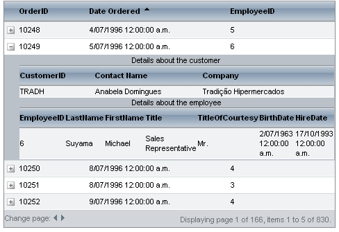

# Several Tables at a Level

## Configure Multiple Tables at One Level

You can have more than one table at a hierarchy level. Declare the tables in the **DetailTables** collection of their parent table. You must also set the appropriate **ParentTableRelation** values for the parent and child tables.

When setting up several detail tables at the same level, complete these steps:

1. In the parent table view, set the **DataKeyNames** property so that it includes the fields of the parent table that link the detail tables to the parent table.

2. For each detail table, add **GridRelationFields** objects to the **ParentTableRelation** collection for each field needed to link the tables.

  - Set **DetailKeyField** to the key field in the detail table that must match a field in the parent table. When using declarative data sources, specify this field as a parameter in the `SELECT` statement for the detail table's data source.

  - Set **MasterKeyField** to the matching field in the parent table. This field must be listed in the parent table's **DataKeyNames** property.

For more information about binding detail tables to a parent table, see [Hierarchical data-binding using declarative relations]() and [Hierarchical data-binding using DetailTableDataBind event]().

When nesting several tables at the same level, set the **Caption** property of each detail **GridTableView** to identify the detail table that the nested table displays.

The following is an excerpt from the declaration of a grid that shows two tables nested at the same level:

````ASP.NET
<telerik:RadGrid RenderMode="Lightweight" ID="RadGrid1" runat="server" Skin="WebBlue" PageSize="5" AllowPaging="True">
  <MasterTableView DataSourceID="SqlDataSource1" DataKeyNames="CustomerID,EmployeeID"
    AllowMultiColumnSorting="True" Width="100%" TableLayout="Auto" AutoGenerateColumns="False">
    ...
    <DetailTables>
      <telerik:GridTableView runat="server" Caption="Details about the customer" DataSourceID="SqlDataSource2" DataKeyNames="CustomerID"
        Width="100%" TableLayout="Auto" AutoGenerateColumns="False">
        <ParentTableRelation>
          <telerik:GridRelationFields DetailKeyField="CustomerID" MasterKeyField="CustomerID" />
        </ParentTableRelation>
        ...
      </telerik:GridTableView>
      <telerik:GridTableView runat="server" Caption="Details about the employee" DataSourceID="SqlDataSource3" DataKeyNames="EmployeeID"
        Width="100%" TableLayout="Auto">
        <ParentTableRelation>
          <telerik:GridRelationFields DetailKeyField="EmployeeID" MasterKeyField="EmployeeID" />
        </ParentTableRelation>
        ...
      </telerik:GridTableView>
    </DetailTables>
    ...
  </MasterTableView>
</telerik:RadGrid>
````


The declaration from which the excerpt above was taken results in the following grid:



## See Also

- [Single table at a level]()
- [Hierarchical data binding using declarative relations]()
- [Hierarchical data binding using the DetailTableDataBind event]()
