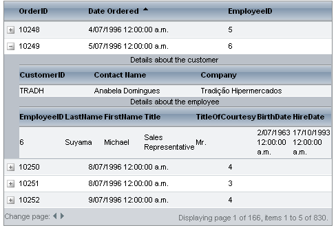

# Several tables at a level


## 

You can have more than one table in a hierarchy level. The tables that reside in the same level are all declared in the **DetailTables** collection of their parent table. You also need to set appropriate **ParentTableRelations** for the parent/child tables included in the corresponding relation.

When setting up several detail tables at the same level:

1. In the parent table view, set the **DataKeyNames** property so that it includes the fields of the parent table that link the detail tables to the parent table.

1. For each detail table, add **GridRelationFields** objects to the **ParentTableRelation** property collection for each field needed to link the tables.

* Set the **DetailKeyField** to the key field in the detail table that must match a field in the parent table. When using declarative data sources, this field must be specified by a parameter of the SELECT statement for the data source of the detail table.

* Set the **MasterKeyField** to the matching field in the parent table. This field must be listed in the **DataKeyNames** property of the parent table.

For more information about binding detail tables to a parent table, see [Hierarchical data-binding using declarative relations]() and [Hierarchical data-binding using DetailTableDataBind event]().

When nesting several tables at the same level, it is a good idea to set the **Caption** property of the detail **GridTableView** to identify which detail table the nested table displays.

The following is an excerpt from the declaration of a grid that shows two tables nested at the same level:

````ASP.NET
<telerik:RadGrid RenderMode="Lightweight" ID="RadGrid1" runat="server" Skin="WebBlue" PageSize="5" AllowPaging="True">
  <MasterTableView DataSourceID="SqlDataSource1" DataKeyNames="CustomerID,EmployeeID"
    AllowMultiColumnSorting="True" Width="100%" TableLayout="Auto" AutoGenerateColumns="False">
    ...
    <DetailTables>
      <telerik:GridTableView runat="server" Caption="Details about the customer" DataSourceID="SqlDataSource2"
        Width="100%" TableLayout="Auto" AutoGenerateColumns="False">
        <ParentTableRelation>
          <telerik:GridRelationFields DetailKeyField="CustomerID" MasterKeyField="CustomerID" />
        </ParentTableRelation>
        ...
      </telerik:GridTableView>
      <telerik:GridTableView runat="server" Caption="Details about the employee" DataSourceID="SqlDataSource3"
        Width="100%" TableLayout="Auto">
        <ParentTableRelation>
          <telerik:GridRelationFields DetailKeyField="EmployeeID" MasterKeyField="EmployeeID" />
        </ParentTableRelation>
        ...
      </telerik:GridTableView>
    </DetailTables>
    ...
  </MasterTableView>
</telerik:RadGrid>
````


The declaration from which the excerpt above was taken results in the following grid:


