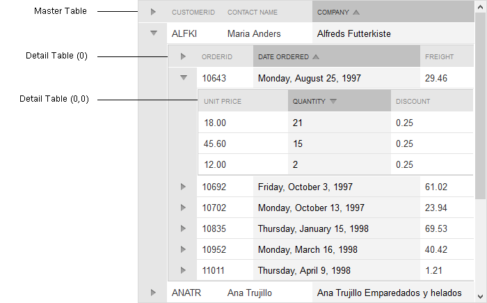
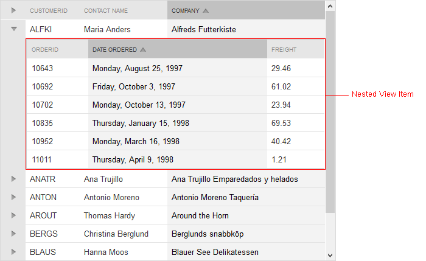

# What You Should Know

RadGrid supports hierarchical representations of related data tables in a `DataSet`.



## Master Table

The **MasterTableView** is the top-level table in the hierarchy. It is a **GridTableView** with a **GridTableViewCollection**. The collection holds the detail tables related to fields in the master table. Each detail table can have its own **GridTableViewCollection** with additional detail tables, forming the hierarchy.

You can view the **MasterTableView** as the root of the hierarchical tree. The tables beneath it are the tree nodes. The **MasterTableView** has its own property sections in Visual Studio.

## Detail Tables

Detail tables are the inner tables of the grid. Each detail table is related to fields in its parent table.

Each Detail Table is placed in an item (row) of its parent table. This special item is called **NestedViewItem**.



## Expand/Collapse All

RadGrid provides buttons in hierarchy expand-column headers that expand or collapse all detail items on a given level. Enable these buttons through the **EnableHierarchyExpandAll** property at the grid or table-view level.

The new expand-all functionality supports all hierarchy load modes.

When grouping and hierarchy are combined in a table view, the hierarchy expand-all button is visible only when the expand-all button for the last group level is visible.

## Controlling Expanded State

By default, items in a hierarchical RadGrid are collapsed. To expand them automatically, use the **HierarchyDefaultExpanded** property. If the hierarchy contains several levels, set the property separately for each **GridTableView** instance.
````ASP.NET
<MasterTableView HierarchyDefaultExpanded="true">
````

Starting with Q3 2013, RadGrid also provides the **RetainExpandStateOnRebind** property. When you enable it, RadGrid preserves the expanded state of parent items during rebind operations such as paging and editing.

## See Also

- [Hierarchical data-binding using declarative relations]()

- [Hierarchical data-binding using DetailTableDataBind event]()

- [Binding hierarchical grids]()
