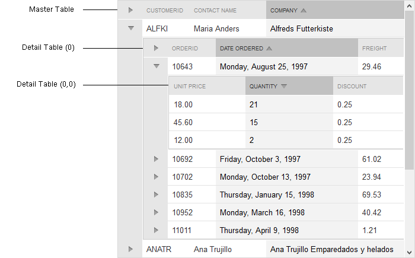

# What you should know

A unique feature for Telerik RadGrid is the support for hierarchical representation of related data tables (DataSet).

## Master Table

The **MasterTableView** is the topmost table of the hierarchical structure. It is a **GridTableView Class** with **GridTableViewCollection Class**. The collection holds the so called DetailTables - tables related to the fields of the MasterTable. Each DetailTable can have its own **GridTableViewCollection** with other Detail Tables, thus forming the hierarchical structure.

You can look on the MasterTable as a Root for the hierarchical tree. All tables underneath will be the tree nodes. The MasterTable is an object and has own sections of properties in Visual Studio.

## Detail Tables

Detail tables are the inner tables of the grid. They are related to a field in its parent table.

Each Detail Table is placed in an item (row) of its parent table. This special item is called **NestedViewItem**.

## Expand/Collapse all

RadGrid’s hierarchy structure has been extended with buttons in the hierarchy expand column headers that allow all detail items ona given level to be expanded/collapsed. The buttons in question are switched on through the**EnableHierarchyExpandAll** property exposed both on the level of the grid and the table views.

The new expand-all functionality supports all hierarchy load modes.

When you have grouping and hierarchy combined in a common table view, the visibility of the hierarchy expand-all button depends on whether the expand-all button for the last group level is expanded/visible.

## See Also

 * [Hierarchical data-binding using declarative relations]()

 * [Hierarchical data-binding using DetailTableDataBind event]()

 * [Binding hierarchical grids]()
