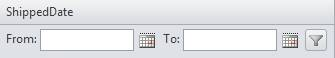

# Filter for GridDateTimeColumn


##

The default drop-down list of filter functions for **GridDateTimeColumn** contains the following items:

* NoFilter

* EqualTo

* NotEqualTo

* GreaterThan

* LessThan

* GreaterThanOrEqualTo

* LessThanOrEqualTo

* IsNull

* NotIsNull

Since Q2 2012 GridDateTimeColumn has an EnableRangeFiltering and EnableTimeIndependentFiltering properties. Range filtering function allows user to use between filtering for date/time columns out of the box. While the time independent filtering disregards the time portion of the date/time object when filtering the datasource.

## RangeFiltering for GridDateTimeColumn

In order to enable the range filtering function you should set the **EnableRangeFiltering** property for the specific column to true:


````ASP.NET
<telerik:RadGrid RenderMode="Lightweight" AutoGenerateColumns="false" ID="RadGrid1" DataSourceID="SqlDataSource1"
    Width="760px" AllowFilteringByColumn="True" AllowSorting="True" PageSize="15"
    ShowFooter="True" AllowPaging="True" runat="server" GridLines="None" EnableLinqExpressions="false">
    <PagerStyle Mode="NextPrevAndNumeric" />
    <GroupingSettings CaseSensitive="false" />
    <MasterTableView AutoGenerateColumns="false" EditMode="InPlace" AllowFilteringByColumn="True"
        ShowFooter="True" TableLayout="Auto">
        <Columns>
            <telerik:GridNumericColumn DataField="OrderID" HeaderText="OrderID" SortExpression="OrderID"
                UniqueName="OrderID" FilterControlWidth="40px" AutoPostBackOnFilter="false" CurrentFilterFunction="equalto"
                FilterDelay="4000" ShowFilterIcon="false">
            </telerik:GridNumericColumn>
            <telerik:GridBoundColumn FilterControlWidth="105px" DataField="ShipName" HeaderText="ShipName"
                SortExpression="ShipName" UniqueName="ShipName" AutoPostBackOnFilter="true" CurrentFilterFunction="Contains"
                ShowFilterIcon="false">
            </telerik:GridBoundColumn>
            <telerik:GridDateTimeColumn FilterControlWidth="50px" DataField="OrderDate" HeaderText="OrderDate"
                SortExpression="OrderDate" UniqueName="OrderDate" PickerType="None" DataFormatString="{0:d}">
            </telerik:GridDateTimeColumn>
            <telerik:GridDateTimeColumn FilterControlWidth="120px" DataField="ShippedDate" HeaderText="ShippedDate"
                SortExpression="ShippedDate" UniqueName="ShippedDate" PickerType="DatePicker"
                DataFormatString="{0:D}" EnableRangeFiltering="true">
                <HeaderStyle Width="160px" />
            </telerik:GridDateTimeColumn>
            <telerik:GridBoundColumn FilterControlWidth="50px" DataField="ShipCountry" HeaderText="ShipCountry"
                SortExpression="ShipCountry" UniqueName="ShipCountry">
            </telerik:GridBoundColumn>
            <telerik:GridMaskedColumn FilterControlWidth="50px" DataField="ShipPostalCode" HeaderText="ShipPostalCode"
                SortExpression="ShipPostalCode" UniqueName="ShipPostalCode" Mask="#####">
                <FooterStyle Font-Bold="true" />
            </telerik:GridMaskedColumn>
            <telerik:GridNumericColumn HeaderStyle-Width="90px" FilterControlWidth="50px" DataField="Freight"
                DataType="System.Decimal" HeaderText="Freight" SortExpression="Freight" UniqueName="Freight"
                Aggregate="Sum">
                <FooterStyle Font-Bold="true" />
            </telerik:GridNumericColumn>
        </Columns>
    </MasterTableView>
    <ClientSettings>
        <Scrolling AllowScroll="false" />
    </ClientSettings>
</telerik:RadGrid>        
<asp:SqlDataSource ID="SqlDataSource1" ConnectionString="<%$ ConnectionStrings:NorthwindConnectionString %>"
    ProviderName="System.Data.SqlClient" SelectCommand="SELECT * FROM Orders" runat="server">
</asp:SqlDataSource>   
````


After the property has been enabled two filter controls will be rendered, which will allow the user to enter lower and upper bounds(inclusive) for the filter operation.


Additionally, the list of the available filter options is also changed after enabling the property:

* NoFilter

* Between

* NotBetween

* IsNull

* IsNotNull

## TimeIndependentFiltering for GridDateTimeColumn

Time independent filtering functionality is controlled by the **EnableTimeIndependentFiltering** property:


````ASP.NET
<telerik:RadGrid RenderMode="Lightweight" AutoGenerateColumns="false" ID="RadGrid2" DataSourceID="SqlDataSource1"
    Width="760px" AllowFilteringByColumn="True" AllowSorting="True" PageSize="15"
    ShowFooter="True" AllowPaging="True" runat="server" GridLines="None" EnableLinqExpressions="false">
    <PagerStyle Mode="NextPrevAndNumeric" />
    <GroupingSettings CaseSensitive="false" />
    <MasterTableView AutoGenerateColumns="false" EditMode="InPlace" AllowFilteringByColumn="True"
        ShowFooter="True" TableLayout="Auto">
        <Columns>
            <telerik:GridNumericColumn DataField="OrderID" HeaderText="OrderID" SortExpression="OrderID"
                UniqueName="OrderID" FilterControlWidth="40px" AutoPostBackOnFilter="false" CurrentFilterFunction="equalto"
                FilterDelay="4000" ShowFilterIcon="false">
            </telerik:GridNumericColumn>
            <telerik:GridBoundColumn FilterControlWidth="105px" DataField="ShipName" HeaderText="ShipName"
                SortExpression="ShipName" UniqueName="ShipName" AutoPostBackOnFilter="true" CurrentFilterFunction="Contains"
                ShowFilterIcon="false">
            </telerik:GridBoundColumn>
           <telerik:GridDateTimeColumn DataField="OrderDate" HeaderText="OrderDate" FilterControlWidth="95px"
                SortExpression="OrderDate" UniqueName="OrderDate" PickerType="DatePicker" EnableTimeIndependentFiltering="true">
            </telerik:GridDateTimeColumn>
            <telerik:GridDateTimeColumn FilterControlWidth="120px" DataField="ShippedDate" HeaderText="ShippedDate"
                SortExpression="ShippedDate" UniqueName="ShippedDate" PickerType="DatePicker"
                DataFormatString="{0:D}">
                <HeaderStyle Width="160px" />
            </telerik:GridDateTimeColumn>
            <telerik:GridBoundColumn FilterControlWidth="50px" DataField="ShipCountry" HeaderText="ShipCountry"
                SortExpression="ShipCountry" UniqueName="ShipCountry">
            </telerik:GridBoundColumn>
            <telerik:GridMaskedColumn FilterControlWidth="50px" DataField="ShipPostalCode" HeaderText="ShipPostalCode"
                SortExpression="ShipPostalCode" UniqueName="ShipPostalCode" Mask="#####">
                <FooterStyle Font-Bold="true" />
            </telerik:GridMaskedColumn>
            <telerik:GridNumericColumn HeaderStyle-Width="90px" FilterControlWidth="50px" DataField="Freight"
                DataType="System.Decimal" HeaderText="Freight" SortExpression="Freight" UniqueName="Freight"
                Aggregate="Sum">
                <FooterStyle Font-Bold="true" />
            </telerik:GridNumericColumn>
        </Columns>
    </MasterTableView>
    <ClientSettings>
        <Scrolling AllowScroll="false" />
    </ClientSettings>
</telerik:RadGrid>        
<asp:SqlDataSource ID="SqlDataSource2" ConnectionString="<%$ ConnectionStrings:NorthwindConnectionString %>"
    ProviderName="System.Data.SqlClient" SelectCommand="SELECT * FROM Orders" runat="server">
</asp:SqlDataSource>   
````


No visual changes are observed in the filter item after the property has been enabled. The filter menu remains with the same options.

## See Also

 * [Basic Filtering](http://demos.telerik.com/aspnet-ajax/grid/examples/generalfeatures/filtering/defaultcs.aspx">)
