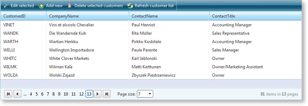

# RadToolBar as Command Item


## 

[This example](http://demos.telerik.com/aspnet-ajax/toolbar/examples/applicationscenarios/gridcommanditem/defaultcs.aspx?product=grid) demonstrates how to use **RadToolBar**as a custom **RadGrid**Command item container. The buttons in the toolbar have CommandName values set which are internally 'recognized' by the grid when its event bubbling mechanism is triggered (after pressing a button from the command item toolbar). Thus the respective command is executed without any extra coding.


Below is a code extraction from the relevant online demo in the RadGrid:


````JavaScript
function onToolBarClientButtonClicking(sender, args) {
  var button = args.get_item();
  if (button.get_commandName() == "DeleteSelected") {
    args.set_cancel(!confirm('Delete all selected customers?'));
  }
}
````
````ASP.NET
<telerik:RadGrid ID="RadGrid2" AllowAutomaticUpdates="true" AllowAutomaticDeletes="true"
  DataSourceID="SqlDataSource1" Width="97%" AllowSorting="True" AutoGenerateColumns="true"
  AllowPaging="True" GridLines="None" runat="server" ShowFooter="True" AllowMultiRowSelection="True"
  PageSize="7" AllowMultiRowEdit="True" HorizontalAlign="NotSet" OnItemDeleted="RadGrid1_ItemDeleted">
  <PagerStyle Mode="NextPrevAndNumeric" />
  <MasterTableView Width="100%" GridLines="None" CommandItemDisplay="Top" DataSourceID="SqlDataSource1"
    EditMode="InPlace" HorizontalAlign="NotSet" DataKeyNames="CustomerID" AllowAutomaticInserts="True">
    <CommandItemTemplate>
      <telerik:RadToolBar ID="RadToolBar1" runat="server" OnClientButtonClicking="onToolBarClientButtonClicking">
        <Items>
          <telerik:RadToolBarButton Text="Edit selected" CommandName="EditSelected" ImageUrl="~/ToolBar/Examples/ApplicationScenarios/GridCommandItem/Images/Edit.gif"
            Visible='<%# RadGrid1.EditIndexes.Count == 0 %>'>
          </telerik:RadToolBarButton>
          <telerik:RadToolBarButton Text="Update" CommandName="UpdateEdited" ImageUrl="~/ToolBar/Examples/ApplicationScenarios/GridCommandItem/Images/Update.gif"
            Visible='<%# RadGrid1.EditIndexes.Count > 0 %>'>
          </telerik:RadToolBarButton>
          <telerik:RadToolBarButton Text="Cancel editing" CommandName="CancelAll" ImageUrl="~/ToolBar/Examples/ApplicationScenarios/GridCommandItem/Images/Cancel.gif"
            Visible='<%# RadGrid1.EditIndexes.Count > 0 || RadGrid1.MasterTableView.IsItemInserted %>'>
          </telerik:RadToolBarButton>
          <telerik:RadToolBarButton Text="Add new" CommandName="InitInsert" ImageUrl="~/ToolBar/Examples/ApplicationScenarios/GridCommandItem/Images/AddRecord.gif"
            Visible='<%# !RadGrid1.MasterTableView.IsItemInserted %>'>
          </telerik:RadToolBarButton>
          <telerik:RadToolBarButton Text="Add this Customer" CommandName="PerformInsert" ImageUrl="~/ToolBar/Examples/ApplicationScenarios/GridCommandItem/Images/Insert.gif"
            Visible='<%# RadGrid1.MasterTableView.IsItemInserted %>'>
          </telerik:RadToolBarButton>
          <telerik:RadToolBarButton Text="Delete selected customers" CommandName="DeleteSelected"
            ImageUrl="~/ToolBar/Examples/ApplicationScenarios/GridCommandItem/Images/Delete.gif">
          </telerik:RadToolBarButton>
          <telerik:RadToolBarButton Text="Refresh customer list" CommandName="RebindGrid" ImageUrl="~/ToolBar/Examples/ApplicationScenarios/GridCommandItem/Images/Refresh.gif">
          </telerik:RadToolBarButton>
        </Items>
      </telerik:RadToolBar>
    </CommandItemTemplate>
  </MasterTableView>
  <ClientSettings>
    <Selecting AllowRowSelect="True" EnableDragToSelectRows="True" />
  </ClientSettings>
</telerik:RadGrid>
<asp:SqlDataSource ID="SqlDataSource1" ConnectionString="<%$ ConnectionStrings:NorthwindConnectionString %>"
          SelectCommand="SELECT [CustomerID], [CompanyName], [ContactName], [ContactTitle] FROM [Customers]" runat="server"
          DeleteCommand="DELETE FROM [Customers] WHERE [CustomerID] = ?" InsertCommand="INSERT INTO [Customers] ([CustomerID], [CompanyName], [ContactName], [ContactTitle]) VALUES (?, ?, ?, ?)"
          UpdateCommand="UPDATE [Customers] SET [CompanyName] = ?, [ContactName] = ?, [ContactTitle] = ? WHERE [CustomerID] = ? AND [CompanyName] = ? AND [ContactName] = ? AND [ContactTitle] = ?">
          <UpdateParameters>
              <asp:Parameter Name="CompanyName" Type="String" />
              <asp:Parameter Name="ContactName" Type="String" />
              <asp:Parameter Name="ContactTitle" Type="String" />
              <asp:Parameter Name="original_CustomerID" Type="String" />
              <asp:Parameter Name="original_CompanyName" Type="String" />
              <asp:Parameter Name="original_ContactName" Type="String" />
              <asp:Parameter Name="original_ContactTitle" Type="String" />
          </UpdateParameters>
          <DeleteParameters>
              <asp:Parameter Name="original_CustomerID" Type="String" />
          </DeleteParameters>
          <InsertParameters>
              <asp:Parameter Name="CustomerID" Type="String" />
              <asp:Parameter Name="CompanyName" Type="String" />
              <asp:Parameter Name="ContactName" Type="String" />
              <asp:Parameter Name="ContactTitle" Type="String" />
          </InsertParameters>
  </asp:SqlDataSource>
````
````C#
protected void RadGrid1_ItemDeleted(object source, GridDeletedEventArgs e)
{
e.ExceptionHandled = true;
}
````
````VB
Protected Sub RadGrid1_ItemDeleted(ByVal source As Object, ByVal e As GridDeletedEventArgs)
e.ExceptionHandled = True
End Sub
````

Additional information about the event bubbling mechanism of RadGrid for ASP.NET AJAX can be found here: [Command reference]()
