# RadGrid Key Features

RadGrid provides data management, navigation, editing, accessibility, styling, and export features for ASP.NET AJAX applications.

## RadGrid Feature Overview

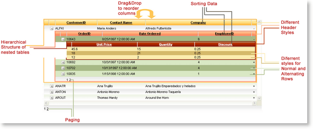

The following features describe the main capabilities available in RadGrid:

* [Cross-browser support](https://www.telerik.com/aspnet-ajax/tech-sheets/browser-support) covers Internet Explorer, Gecko-based browsers, Opera, Safari, and Chrome.

* [Accessibility support]() includes the documented W3C and Section 508 compliance information. Review the [RadGrid accessibility demo](https://demos.telerik.com/aspnet-ajax/grid/examples/generalfeatures/accessibility/defaultcs.aspx) and the [official Section 508 site](http://www.section508.gov/).

* [Hierarchical table structures and mixed load modes]() support related `DataSet` objects and detail-table templates. See the image below and the [three-level hierarchy demo](https://demos.telerik.com/aspnet-ajax/Grid/Examples/Hierarchy/ThreeLevel/DefaultCS.aspx).

	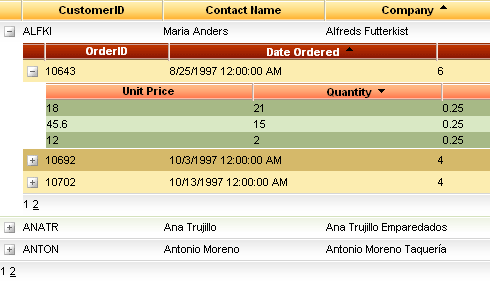

* [Global item templates](https://demos.telerik.com/aspnet-ajax/grid/examples/data-binding/client-side/client-item-template/defaultcs.aspx) let you define a custom layout for each grid record.

* [RadAjax integration and loading indicators]() improve responsiveness and minimize traffic to the server.

* [Codeless data binding]() uses the data source controls introduced in ASP.NET 2.x and 3.x.

* [Client-side binding]() supports client-side sorting, paging, and filtering. [Various data sources](https://demos.telerik.com/aspnet-ajax/grid/examples/data-binding/client-side/declarative/defaultcs.aspx) are supported when they implement `IList`, `IEnumerable`, or `ICustomTypeDescriptor`.

* [Filtering]() applies a filter pattern on a per-column basis. See the image below.

	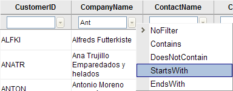

* [Header context menus]() support sorting, grouping, and showing or hiding columns based on user preferences.

* [Grouping with group footers and footer aggregates]() supports multilevel grouping, group-by expressions, and grouping by multiple columns. See the image below and the [Outlook-style grouping demo](https://demos.telerik.com/aspnet-ajax/Grid/Examples/GroupBy/OutlookStyle/DefaultCS.aspx).

	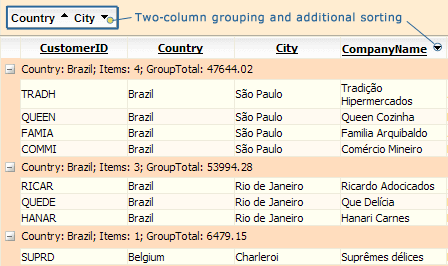

* [Multi-column sorting]() supports sorting by several columns and defining a color for sorted columns. See the image below and the [sorting demo](https://demos.telerik.com/aspnet-ajax/Grid/Examples/GeneralFeatures/Sorting/DefaultCS.aspx).

	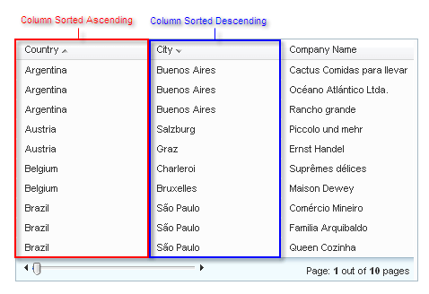

* [View state optimization]() provides `ServerBind`, `ServerOnDemand`, and `Client` modes for loading detail tables.

* [Control state support]() lets RadGrid track common features when view state is disabled.

* Grid state preservation after postback preserves the appearance, group-by state, sorting, current page, edit state, selected state, and resizing state after a postback.

* [AJAX-based virtual scrolling]() supports navigation through large data structures. See the image below.

	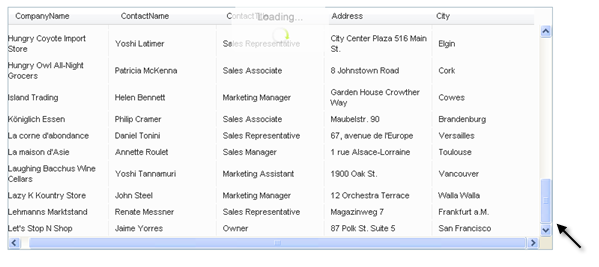

* [Migration from Microsoft GridView to Telerik RadGrid](https://demos.telerik.com/aspnet-ajax/Grid/Examples/GeneralFeatures/Migration/DefaultCS.aspx) uses similar declarative syntax to simplify migration from the DataGrid control.

* [Rich column types]() include bound, checkbox, drop-down, button, hyperlink, client-select, date-time, numeric, masked, HTML editor, and template columns. See the image below and the [column types demo](https://demos.telerik.com/aspnet-ajax/Grid/Examples/GeneralFeatures/ColumnTypes/DefaultCS.aspx).

	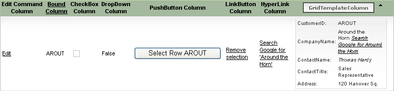

* [Paging]() displays grid data in smaller pages for easier navigation.

* [Column and row resizing]() supports real-time resizing, resizing the grid when a column changes size, and clipping cell content.

* [Drag and drop of grid items]() supports reordering records within a grid, moving them to another grid, or dropping them on another page element.

* [Column reordering with drag and drop]() lets users reorder columns by dragging their headers. See the image below and the [column resizing demo](https://demos.telerik.com/aspnet-ajax/grid/examples/client/resizing/defaultcs.aspx).

	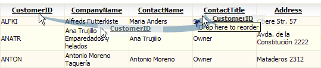

* [Scrolling with static headers and frozen columns]() keeps headers visible and can keep selected columns fixed. See the image below and the [scrolling demo](https://demos.telerik.com/aspnet-ajax/Grid/Examples/Client/Scrolling/DefaultCS.aspx).

	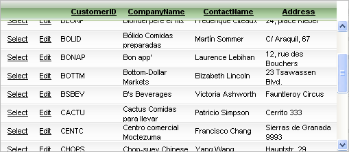

* [Multi-row and area selection]() supports selecting multiple rows with **Ctrl** + **Click** or by dragging across rows. See the image below and the [row selection demo](https://demos.telerik.com/aspnet-ajax/grid/examples/functionality/selecting/row-selection/defaultcs.aspx).

	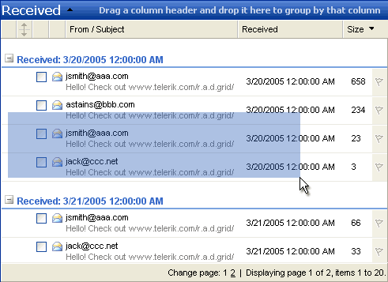

* [Design-time support]() lets you build, customize, and populate a grid in the Visual Studio design environment.

* [Client-side API support]() provides methods for resizing, moving, reordering, selecting, and scrolling columns.

* [Exporting]() supports Microsoft Excel, Microsoft Word, CSV, and PDF formats.

* Flexible editing supports [in-place editing](), [edit forms](), [custom edit forms](), and [popup edit forms]().

* [Custom editors]() let you replace default editors with validation, rich-text editing, or other functionality. See the image below and the [custom editor demo](https://demos.telerik.com/aspnet-ajax/Grid/Examples/DataEditing/UserControlEditForm/DefaultCS.aspx).

	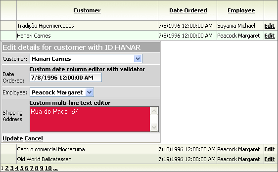

* [Appearance customization]() uses skins to customize grid elements, including individual `DetailTable` instances in a hierarchical grid.

* [ListView and DataList-like layouts](https://demos.telerik.com/aspnet-ajax/listview/examples/migration/defaultcs.aspx) display data in a custom layout while retaining sorting, paging, and filtering.

* [Keyboard support]() enables navigation, editing, and selection with the keyboard. See the [keyboard navigation demo](https://demos.telerik.com/aspnet-ajax/Grid/Examples/Hierarchy/ThreeLevel/DefaultCS.aspx).

## See Also

Continue with these related RadGrid resources:

- [Review the RadGrid overview]()
- [Get started with RadGrid]()

