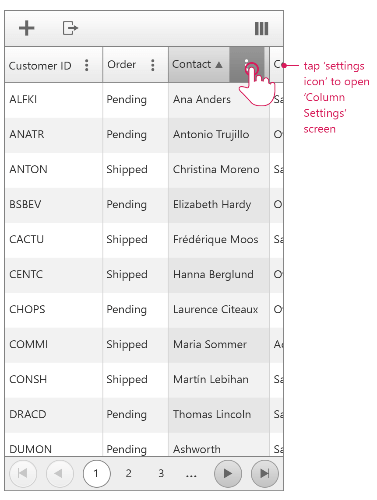
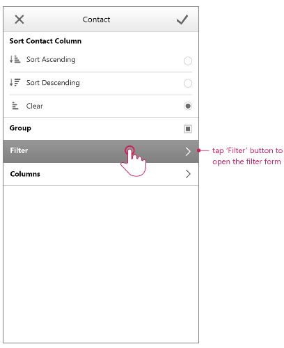
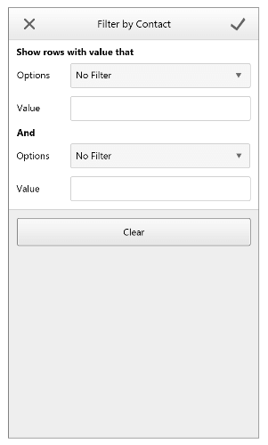
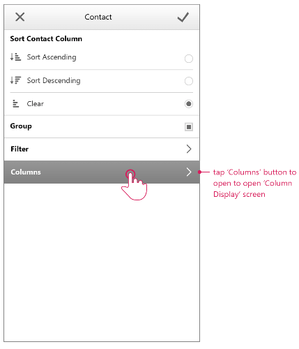
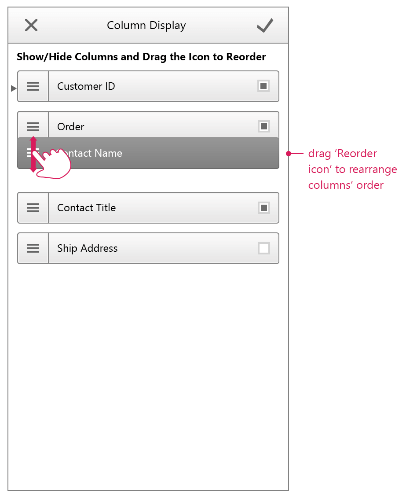

# Column Settings

The following article outlines the settings that are available for the columns in **RadGrid** when **RenderMode** is set to **Mobile**.

## Accessing Column settings

The column settings are accessed by tapping the settings icon.

**Image 1:** Opening column settings view

When you tap on the settings icon in a column header, you will see the settings for the corresponding column. You can sort, group, add filter, show/hide or rearrange columns.

**Image 2:** Settings available for the column

### Filtering

You can access the filter settings by tapping the **Filter** option

**Image 3:** Filer settings

### Column display

When you tap on the **Columns** setting you open the **Column Display** options.

**Image 4:** Opening Column Display

The **Column Display** options enable you to show, hide or rearrange the columns.

**Image 5:** Column Display Options

# See Also

 * [Overview]()

 * [Grouping]()

 * [Filtering]()

 * [Resizing and Reordering]()
