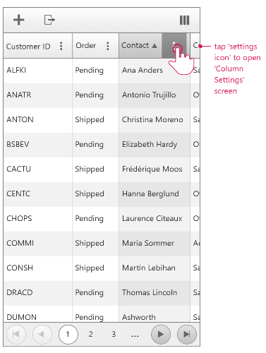
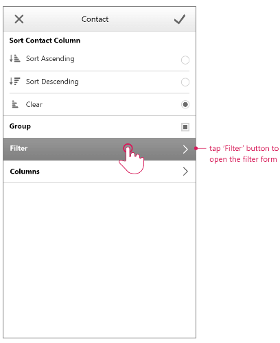
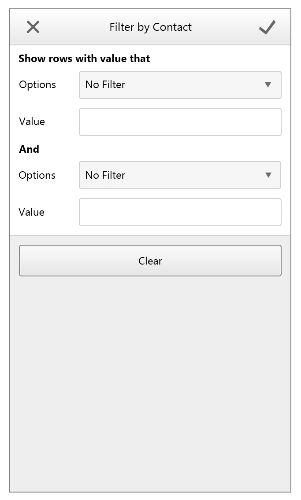
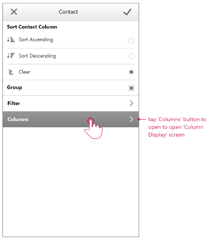
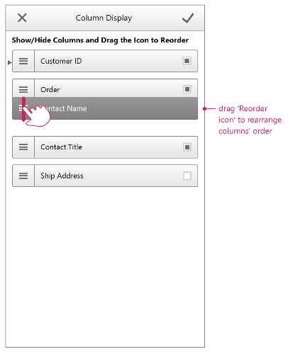

# Column Settings

The following article outlines the settings that are available for the columns in **RadGrid** when **RenderMode** is set to **Mobile**.

## Open column settings

The column settings are accessed by tapping the settings icon.

> caption Figure 1: Opening the RadGrid mobile column settings view

When you tap on the settings icon in a column header, you will see the settings for the corresponding column. You can sort, group, add filter, show/hide or rearrange columns.

> caption Figure 2: Settings available for a RadGrid column

### Filter a column

Access the filter settings by tapping **Filter**.

> caption Figure 3: RadGrid mobile filter settings

### Show, hide, and reorder columns

Tap **Columns** to open the **Column Display** options.

> caption Figure 4: Opening the RadGrid mobile column display options

The **Column Display** options enable you to show, hide or rearrange the columns.

> caption Figure 5: RadGrid mobile column display options

## See Also

- [Mobile support overview]()

- [Grouping]()

- [Filtering]()

- [Resizing and reordering]()
