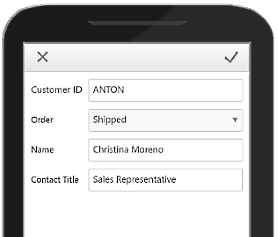

# Data Editing

When using **Mobile** rendering, you can use all RadGrid edit modes: **EditForms**, **InPlace**, **Batch**, and **PopUp**.

## Edit data in Mobile render mode

Although Mobile render mode uses a different HTML layout, editing works in the same way in most edit modes. The main difference is **PopUp** edit mode, which uses a separate mobile editing menu.

> caption Figure 1: RadGrid mobile PopUp edit menu

## Column editors with mobile rendering

When you set **RenderMode** to **Mobile**, RadGrid renders native controls by default. Native controls are HTML5 equivalents of Telerik controls. For example, **RadNumericTextBox** is replaced with `<input type="number" />`. This behavior affects how you access column editors, so implementations from other render modes may not apply.

If native controls do not meet your requirements, disable them in one of two ways. Set **UseNativeEditorsInMobileMode** to `False` on a **GridEditableColumn** to disable native editors for one column.

To disable native editors for the entire website, set **UseGridNativeEditorsInMobileMode** to `False` in `web.config`.

## See Also

- [Accessing controls]()
- [Mobile rendering overview]()
