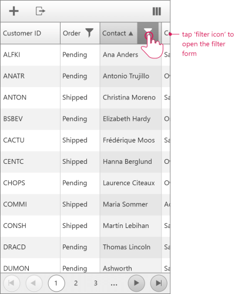
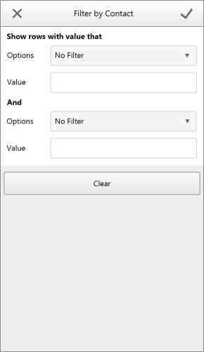
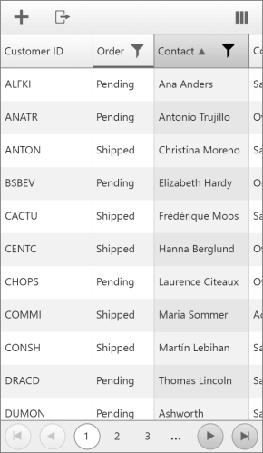

# Filtering

## Filter data in Mobile render mode

When **RadGrid** uses **Mobile** **RenderMode**, its filtering layout and interaction are adapted for mobile and tablet devices.

## Default Filtering

In Mobile render mode, RadGrid replaces the standard auto-generated text boxes with a filter form. Set **AllowFilteringByColumn** to `True` on the corresponding **GridTableView** to enable filtering.

> caption Figure 1: RadGrid filtering in Mobile render mode

When the filter item is visible, use the generated buttons to open the filter form.

> caption Figure 2: RadGrid mobile filter form

Enter the filtering criteria in the filter form.

> caption Figure 3: Records filtered by the Order field

## Open the context filter menu

You can also open the filter form from the context menu. Set **AllowFilteringByColumn**, **EnableHeaderContextMenu**, and **EnableHeaderContextFilterMenu** to `True` to show filtering in the context menu.

## See Also

- [Mobile support overview]()
- [Column settings]()
