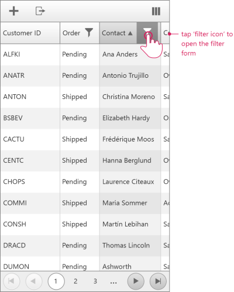

# Filtering

## 

When the active __RenderMode__ of the __RadGrid__ is set to __Mobile__, its filtering layout and user interaction will differ from that of its standard interface. This is done to optimize the user convenience when the page is accessed via a mobile or tablet device.

## Default Filtering

In the __Mobile__ filtering version of RadGrid, the regular auto-generated textboxes are replaced with an appropriate filter form,which can be used to type in the desired filtering criteria. To enable this functionality, you have to set the __AllowFilteringByColumn__ property of the corresponding GridTableView to __True__.

__Basic RadGrid in Mobile mode__

Once the filter item is visible, you can use the generated buttons to move into filter form.

__Filter Form__

The filter form can be thereby opened and the user may enter their custom filtering dependencies.

__Records filtered by the Order field__

## Context Filter Menu

There is also an alternative way to open the filter form. When the __EnableHeaderContextMenu__ property is enabled, you will also need to set the __EnableHeaderContextFilterMenu__ to __True__ in order for the filtering to appear in the context menu options.

# See Also

 * [Overview]()
