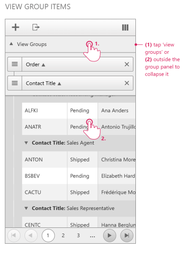
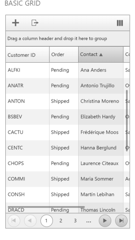
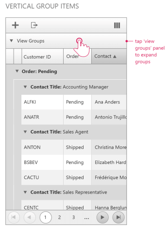
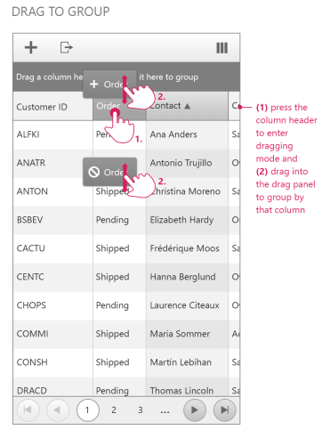

# Grouping

## Basic Grouping

The grouping functionality of the Adaptive RadGrid control has the following characteristics:

* The group panel item always renders as part of the table header below the command item and above the column headers (this is only valid for **RenderMode** set to "**Mobile**"). You will expand the group view when you click anywhere in the row with the "**View Groups**" pointer. If you click outside the group panel, the group view will be collapsed.
In case you set the "**ShowUnGroupButton**" property of the grid control to "**true**", a close button will render next to each group item.
(screenshot)

* The grid has a separate **gridGrouPanelItem**, which you can access and modify on the server as any other item in the grid

* The GroupPanel property (both server and client-side) is obsolete when RenderMode is set to "Mobile". If you are using it, it will not give any effect

* When the grid is not grouped the default text in the groupPanelItem is "Drag a column header and drop it here to group"

* When the grid gets grouped – you see only an arrow pointing down and the text "View Groups"

* Drag to group action works the same way as before – you drag a column header and drop it on the group panel item. It will **not** be visible in the group panel item. The group items can be dragged and reordered only by using the icon in the left part of the item (image). When the "**AllowDragToReorder**" property is set to "**false**" the mentioned icon will not be visible.

# See Also
