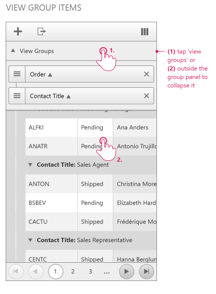
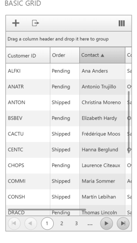
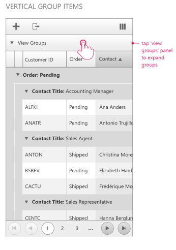
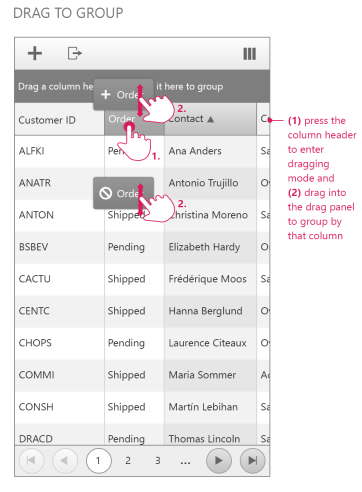

# Grouping

## Basic Grouping

The grouping functionality of RadGrid in Mobile render mode has the following characteristics:

* The group panel item renders as part of the table header below the command item and above the column headers when **RenderMode** is **Mobile**. Tap the row with the **View Groups** pointer to expand the group view. Tap outside the group panel to collapse it. If **GridGroupingSettings.ShowUnGroupButton** is `True`, a close button appears next to each group item.

> caption Figure 1: RadGrid mobile group panel

* The grid has a separate group panel item that you can access and modify on the server like other grid items.

* The **GroupPanel** property is obsolete when **RenderMode** is **Mobile** and has no effect.

* When the grid is not grouped, the default group panel text is **Drag a column header and drop it here to group**.

> caption Figure 2: RadGrid mobile group panel before grouping

* When the grid is grouped, the group panel shows a down arrow and the text **View Groups**.

> caption Figure 3: RadGrid mobile group panel after grouping

* To group data, drag a column header and drop it on the group panel item. The grouped column is not visible in the group panel item. Drag and reorder group items by using the icon on the left side of the item. Set **AllowDragToReorder** to `False` to hide the icon.

> caption Figure 4: Reordering group items in RadGrid Mobile render mode

## See Also

- [Column settings]()
- [Mobile rendering overview]()
