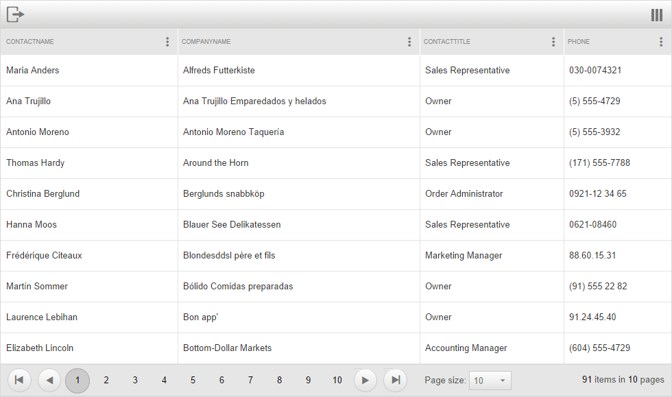

# Mobile Rendering Overview

Since the Q3 2014 beta release, RadGrid has included adaptive behavior for touch devices. In **Mobile** render mode, the grid adapts its layout to the device screen size and provides larger touch zones.

> caption Figure 1: RadGrid adaptive mobile behavior

## Mobile vs Auto render modes

Set the **RenderMode** property to **Mobile** to enable the mobile layout. Set it to **Auto** when the page must adapt between mobile and desktop devices.

## Special Mobile rendering features

When you set **RenderMode** to **Mobile** or **Auto**, a context menu appears in the top-right corner of the grid. Use it to reduce the number of visible columns or rearrange them on the client.

When you set **AllowFilteringByColumn**, **EnableHeaderContextMenu**, and **EnableHeaderContextFilterMenu** to `True`, a column settings menu appears in each column header. Use the popup to group, sort, and filter the corresponding column.

RadGrid adaptive behavior supports editing on desktop and mobile devices. In **PopUp** edit mode, the edit form fills the RadGrid container and places the **Save** and **Cancel** buttons at the top. Enable this layout by setting **RenderMode** to **Auto** and **GridTableView.EditMode** to **PopUp**.

>note Only the `NextPrevNumericAndAdvanced` pager mode is supported for mobile devices.

## See Also

- [Mobile support overview]()
- [Column settings]()
- [Data editing]()
