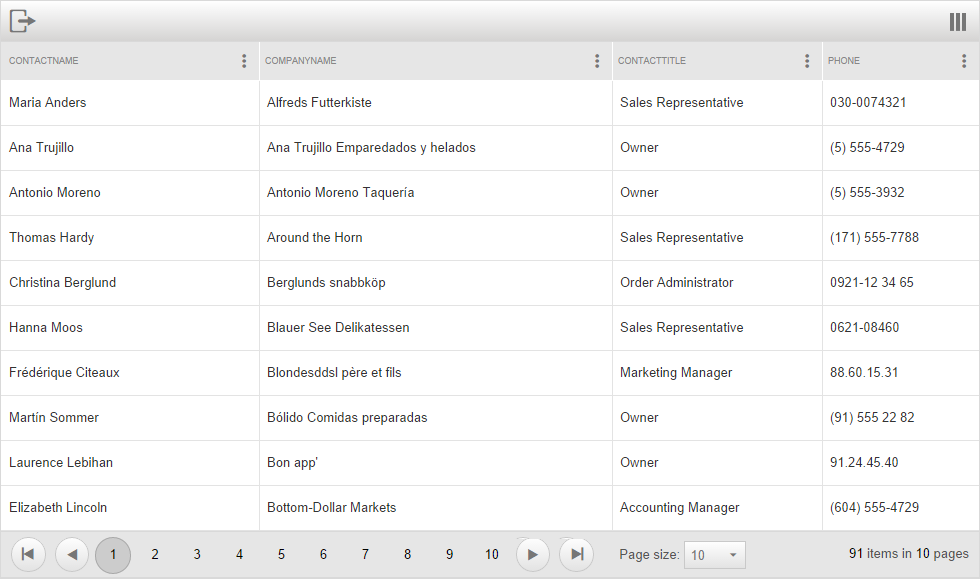

# Mobile Rendering Overview

Since Q3 2014 Beta release of Telerik UI controls **RadGrid** is optimized for touchdevices and comes with built-in **Adaptive behavior**.When you access the grid control via a mobile device, the control will change to create a user experience tailored to the device screen size. In this mode,RadGrid is mobile-friendly and its touch zones are bigger and easier to select.

## Mobile vs Auto render modes

You can enable the mobile layout of the control by setting the **RenderMode** property of the Grid to **"Mobile"**. To cover the rendering of both mobile and desktop devices, you could set the**RenderMode** property to **"Auto"**. This option will automatically decide how to render the control on a smartphone, tablet or PC.

## Special Mobile rendering features

When you change the grid **RenderMode** to **Mobile** or **Auto** a context menu placed at the top right corner of the grid will appear.By clicking on it you can reduce the columns number on the client or rearrange them in the desired order.

Also when you set **EnableHeaderContextMenu** and **EnableHeaderContextFilterMenu** properties to true a Column Settings menu placed inside each column header will be shown. Via the Column Settings popup which will open you can group the respective column, sort and filter its data.

Telerik ASP.NET Grid Adaptive behavior supports easy editing for users on both desktop and mobile. When the demo is opened on a mobile device the **PopUp** edit form will take the entire RadGrid container and position **Save** and**Cancel** buttons at the top for a better user experience. You can turn on this feature by setting the RadGrid **RenderMode** property to **Auto** and setting **GridTableView.EditMode** property to **PopUp**. It's as simple as that.
