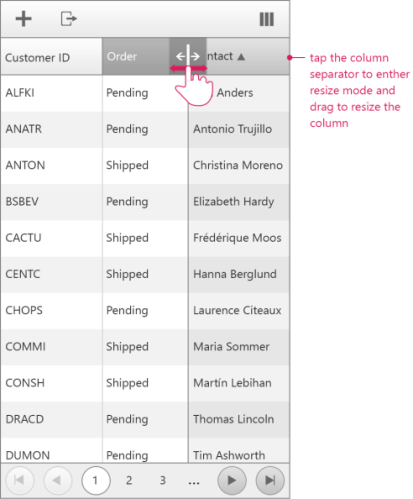
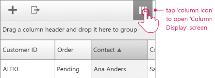
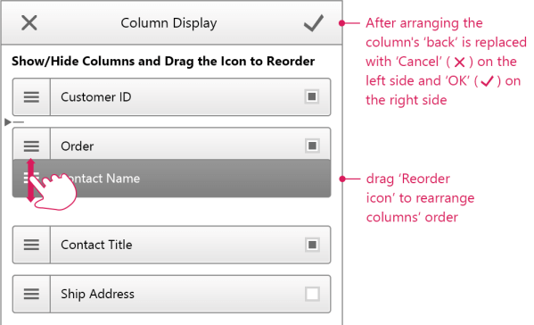

# Resizing and Reordering

This article explains how to resize and reorder columns when **RadGrid** uses **Mobile** **RenderMode**.

## Resizing

The functionality is similar to the desktop experience. Tap the column separator instead of clicking it to enter resize mode.

> caption Figure 1: Resizing a RadGrid column in Mobile render mode

## Reordering

Reordering columns in Mobile render mode differs from the desktop experience. Open the column display form by tapping the column view button.

> caption Figure 2: Opening the RadGrid mobile column display form

Drag and drop the columns into the desired order, then tap **OK** to apply the changes.

> caption Figure 3: Applying the reordered RadGrid columns

## See Also

- [Column settings]()
- [Mobile rendering overview]()
