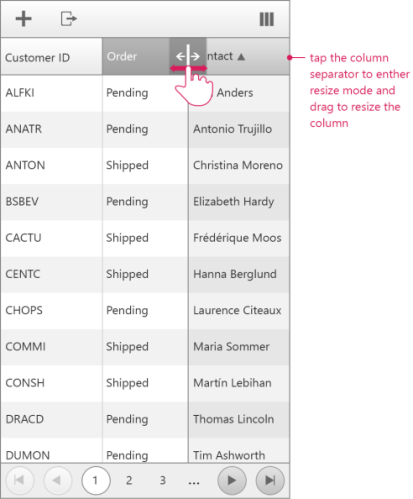
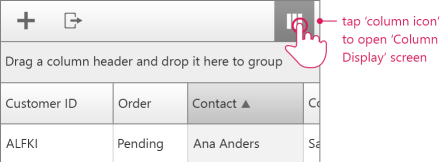
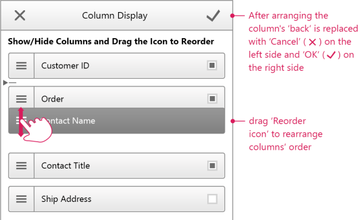

# Resizing and Reordering

In this help article you will find helpful information on how to resize and reorder columns when the **RenderMode** is set to **Mobile**.

## Resizing

The functionality works in a similar manner as when viewing the page on a desktop machine. The only difference is that the user should tap, instead of clicking on the column separator in order to enter in resize mode.

## Reordering

Reordering columns using the **Mobile** version is slightly different from performing the same action on desktop machines. In order to change the columns order you first need to open the columns display form using the column view button.

Once the view is shown you can perform the reordering by dragging and dropping. Afterwards you should tap on the OK button to apply the changes.

