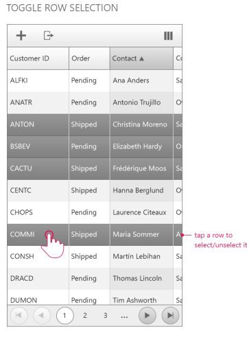
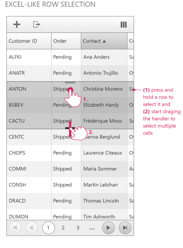
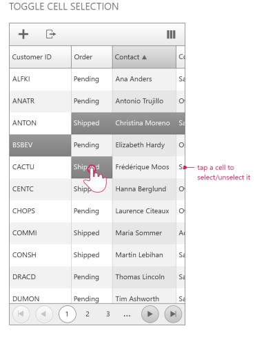

# Selecting

## Default Selection

The selection functionality of RadGrid in Mobile render mode has the following characteristics:

* **Toggle selection** — Tap a row to select it.

* **Excel-like row selection** — Press and hold a row, then drag the handler to select multiple rows.

* **Toggle cell selection** — Tap a cell to select it.

>note Cell selection is supported only in single-selection mode. Multiple-cell selection is not supported when RadGrid uses **Mobile** render mode.

## See Also

- [Mobile support overview]()
- [Mobile rendering overview]()
