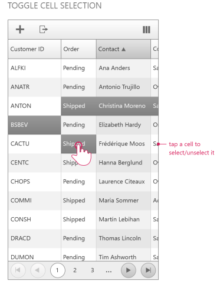

# Selecting

## Default Selection

The selection functionality of the Adaptive RadGrid control has the following characteristics:

* Toggle selection – Tap a row to select it

* Excel-Like Row Selection- Press and hold a row to select it, after that start dragging the handler to select multiple rows(screenshot)

* Toggle Cell Selection –Tap a cell to select it (screenshot)

>note Note that the cell selection is supported only for single selection mode. The multi cell selection is not supported in the Grid control with render mode set to “ **Mobile** ”
>

# See Also
