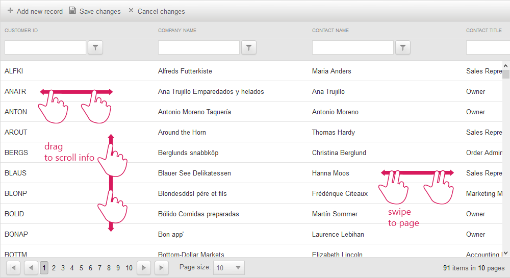

# Mobile Support Overview

Even though the __RadGrid__ control currently does not provide separate mobile render mode, all of the __RadGrid__ functionalities are tested and properly working on __mobile devices__.

## 

On mobile devices the __scrolling__ and __row drag-drop__ features in the grid are performed by the same __touch gesture__: dragging of the content area of the grid with one tough point. This imposes a limitation when both features are enabled on touch devices because it cannot be exclusively determined which one of the two should be performed. One way to distinguish between scrolling and row drag-drop on mobile devices is to use a __GridDragDropColumn__ - this way the dragging of the rows will be performed only when you drag a row by the icon in the GridDragDropColumn and on the rest of the content area scrolling will be performed.

## 

__Since Q2 2014__ the __RadGrid__ also provides a __custom swipe gesture__ in order to cover the __paging__ functionality on mobile devices. In order to accomplish this you need to detect __swipe gesture__ with the following requirements:

* Two or more touch points are in permanent contact with the touch surface.

* All of the touch points should be moving in the same direction.

* All touch points should maintain the same direction throughout the whole course of their movement (e.g. moving left then moving up then moving left again is not allowed).

* If one or more of the touch points deviates from the course of movement of the other touch points the gesture is considered invalid.

* All touch points should have passed a certain threshold since their initial position in order to be successfully registered as swipe gesture.

The image below demonstrates the grid control __scrolling__ and __paging__ mobile __gestures__.
