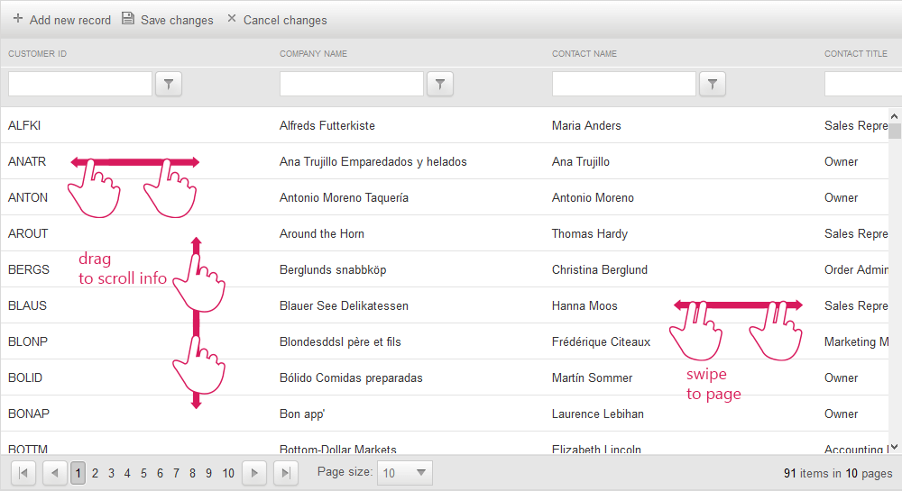

# Mobile Support Overview

RadGrid supports mobile devices through its **Mobile** and **Auto** render modes. The grid retains its core functionality while adapting touch interactions and layout for smaller screens.

## Scrolling and row drag-and-drop

On mobile devices, scrolling and row drag-and-drop use the same touch gesture: dragging the grid content with one touch point. When both features are enabled, RadGrid cannot determine which action the user intends to perform.

To separate the gestures, add a `GridDragDropColumn`. RadGrid then starts row drag-and-drop only when the user drags the row by the icon in that column; dragging elsewhere scrolls the grid.

## Swipe paging

Since Q2 2014, RadGrid has supported a custom swipe gesture for paging on mobile devices. A swipe gesture must meet the following requirements:

- Two or more touch points remain in contact with the touch surface.

- All touch points move in the same direction.

- All touch points maintain that direction throughout the gesture. For example, moving left, then up, and then left again is not valid.

- If one or more touch points deviates from the others, RadGrid considers the gesture invalid.

- All touch points pass the required distance threshold from their initial positions.

> caption Figure 1: RadGrid touch gestures for scrolling and paging

## See Also

- [Render modes]()
- [Mobile rendering overview]()
