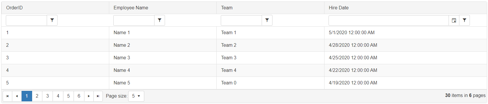
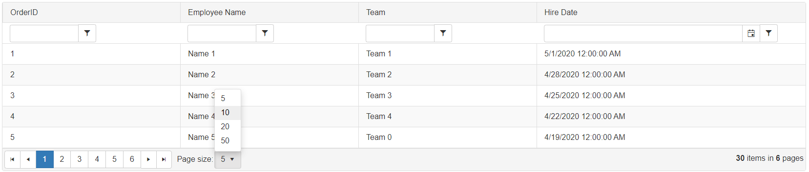
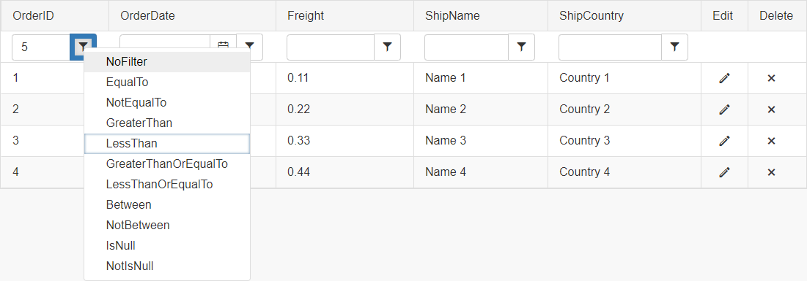
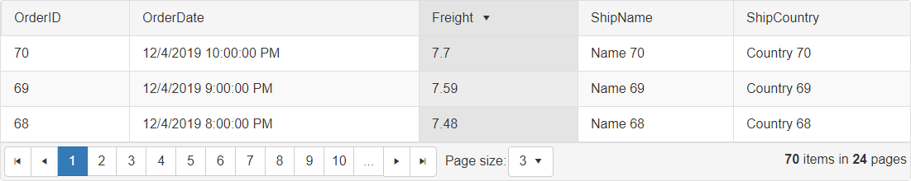
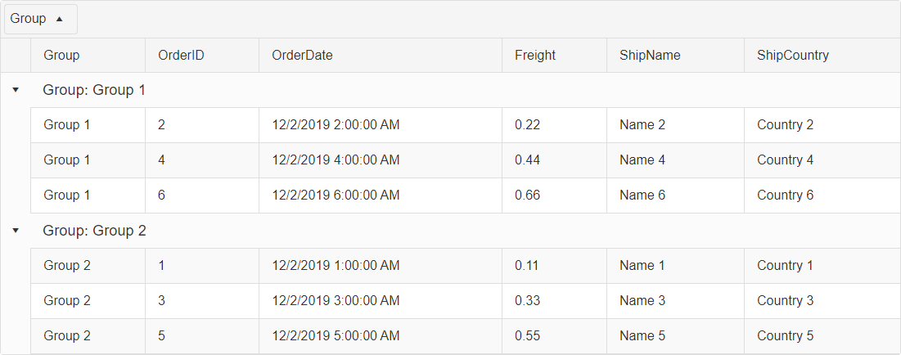
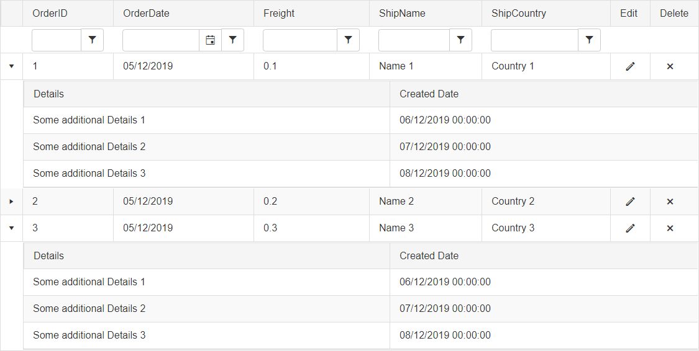
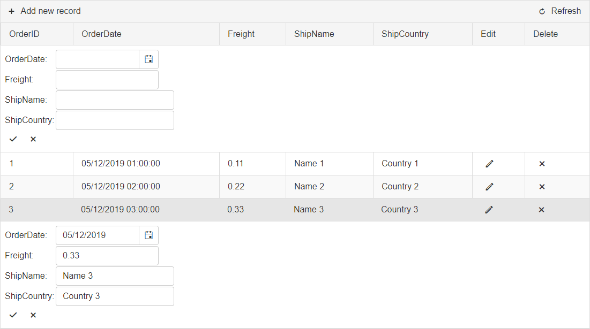
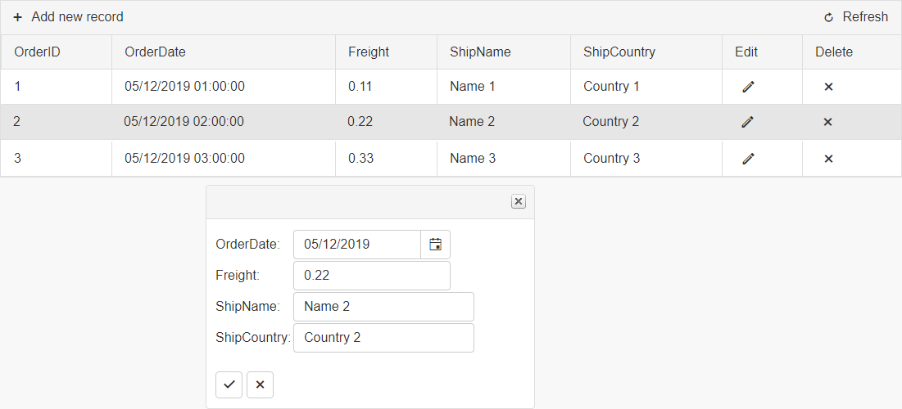
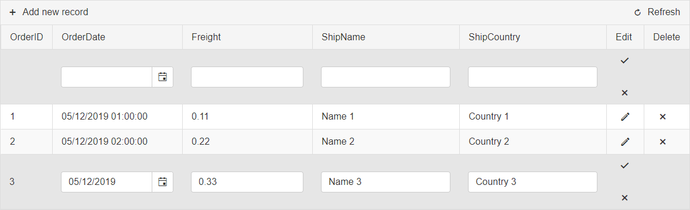

# Grid Overview

This article provides a quick introduction so you can get your AJAX data grid up and running in a few seconds. You can find 
how to enable key features like paging, sorting, filtering, editing, grouping, exporting and accessibility support, as well as how to bind data.

Telerik **RadGrid** is designed to eliminate the typical trade-off associated with ASP.NET grid controls — rich functionality at the expense of weight and performance. Thanks to its innovative architecture, **RadGrid** is extremely fast and generates very little output. Added to this is true cross-browser support — all major/modern browsers, see [Browser Support - Telerik UI for ASP.NET AJAX](https://www.telerik.com/aspnet-ajax/tech-sheets/browser-support)

To test it by your own and see its benefits in practice you can start a free trial using the button below

>caption To create a basic `RadGrid`:

1. ensure you have a script manager on the page (use \<asp:ScriptManager> tag to declare one)
1. use the \<telerik:RadGrid> tag to declare the grid and to set its global properties
1. use its `DataSource` (or `DataSourceID`) property to reference the variable (or the DataSource component) that will hold your collection of data, see [Telerik RadGrid Data Binding Basics]()
1. use the \<telerik:MasterTableView> to declare your main table and set its properties
1. use the appropriate grid column tags to declare columns depending on the data type of their content. Set the `DataField` property to point at the name of the model field, see [Column Types]() 

>caption Get started with the grid declaration and enabling some of its features

````ASPX
<asp:ScriptManager ID="ScriptManager1" runat="server"></asp:ScriptManager>

<telerik:RadGrid ID="RadGrid1" runat="server" AllowPaging="True" AllowSorting="true" AllowFilteringByColumn="true" OnNeedDataSource="RadGrid1_NeedDataSource">
    <MasterTableView AutoGenerateColumns="False" DataKeyNames="ID">
        <Columns>
            <telerik:GridBoundColumn DataField="ID" DataType="System.Int32" HeaderText="OrderID" ReadOnly="True" UniqueName="ID">
            </telerik:GridBoundColumn>
            <telerik:GridBoundColumn DataField="Name" FilterControlAltText="Filter Name column" SortExpression="Name" HeaderText="Employee Name" UniqueName="Name">
            </telerik:GridBoundColumn>
            <telerik:GridBoundColumn DataField="Team" FilterControlAltText="Filter Team column" SortExpression="Team" HeaderText="Team" UniqueName="Team">
            </telerik:GridBoundColumn>
            <telerik:GridDateTimeColumn DataField="HireDate" DataType="System.DateTime" FilterControlAltText="Filter HireDate column" SortExpression="HireDate" HeaderText="Hire Date" UniqueName="HireDate">
            </telerik:GridDateTimeColumn>
        </Columns>
    </MasterTableView>
</telerik:RadGrid>
````

>caption Provide the RadGrid with a data collection in the code-behind

````C#
protected void RadGrid1_NeedDataSource(object sender, GridNeedDataSourceEventArgs e)
{
    (sender as RadGrid).DataSource = MyData; 
}

public IEnumerable<SampleData> MyData = Enumerable.Range(1, 30).Select(x => new SampleData
{
    Id = x,
    Name = "Name " + x,
    Team = "Team " + x % 5,
    HireDate = DateTime.Now.AddDays(-x*3).Date
});

public class SampleData
{
    public int Id { get; set; }
    public string Name { get; set; }
    public string Team { get; set; }
    public DateTime HireDate { get; set; }
}
````
````VB
Protected Sub RadGrid1_NeedDataSource(ByVal sender As Object, ByVal e As GridNeedDataSourceEventArgs)
    TryCast(sender, RadGrid).DataSource = MyData
End Sub

Public MyData As IEnumerable(Of SampleData) = Enumerable.Range(1, 30).[Select](Function(x) New SampleData With {
    .Id = x,
    .Name = "Name " & x,
    .Team = "Team " & x Mod 5,
    .HireDate = DateTime.Now.AddDays(-x * 3).Date
})

Public Class SampleData
    Public Property Id As Integer
    Public Property Name As String
    Public Property Team As String
    Public Property HireDate As DateTime
End Class
````

The result from the code snippet above



Check out the most commonly used key features below, or head directly to the [Getting Started]() section.


### Basic Grid


### Advanced Grid


List of key functionalites you can find below:

- [Paging]()
- [Filtering]()
- [Grouping]()
- [Data Binding]()
- [Hierarchy]()
- [CommandItem]()
- [Export To Excel]()
- [Export To CSV]()
- [Export To PDF]()
- [Export To DOC]()
- [Print]()
- [Accessibility Compliance]()


### Colorful Grid with built-in Skins

See [Skins]() documentation.


### Paging

See [Paging]() documentation.



### Filtering

See [Filtering]() documentation.



### Sorting

See [Sorting]() documentation.



### Grouping

See [Grouping]() documentation.



### Hierarchy

See [Hierarchical Grid Types]() documentation.



### Create/Read/Update/Delete (CRUD) operations


#### Server-Side Editing

**Edit Form**

See [Edit Forms]() documentation.



**PopUp**

See [PopUp Edit Forms]() documentation.



**InPlace (Inline)**

See [InPlace]() documentation.



#### Client-Side Editing

**Batch Edit**

See [Batch Editing]() documentation.


[Get Started with RadGrid]()

## See Also

- [Getting Started]()

