# WebForms Grid Overview

This article introduces Telerik UI for ASP.NET AJAX RadGrid and shows how to enable data binding, paging, sorting, filtering, editing, grouping, exporting, and accessibility support.

Telerik **RadGrid** provides rich functionality for ASP.NET applications while generating minimal output. For supported browsers, see [Browser Support for Telerik UI for ASP.NET AJAX](https://www.telerik.com/aspnet-ajax/tech-sheets/browser-support).


>caption To create a basic `RadGrid`:

1. Ensure that the page contains a script manager by declaring an `<asp:ScriptManager>` tag.
2. Declare the grid with the `<telerik:RadGrid>` tag and set its global properties.
3. Set the `DataSource` or `DataSourceID` property to reference the collection or data source component. See [Telerik RadGrid data binding basics]().
4. Declare the main table with `<telerik:MasterTableView>` and set its properties.
5. Declare columns with tags that match the content type. Set each `DataField` property to the model field name. See [RadGrid column types]().

>caption Get started with the grid declaration and enabling some of its features

````ASP.NET
<asp:ScriptManager ID="ScriptManager1" runat="server"></asp:ScriptManager>

<telerik:RadGrid ID="RadGrid1" runat="server" AllowPaging="True" AllowSorting="true" AllowFilteringByColumn="true" OnNeedDataSource="RadGrid1_NeedDataSource">
    <MasterTableView AutoGenerateColumns="False" DataKeyNames="ID">
        <Columns>
            <telerik:GridBoundColumn DataField="ID" DataType="System.Int32" HeaderText="OrderID" ReadOnly="True" UniqueName="ID">
            </telerik:GridBoundColumn>
            <telerik:GridBoundColumn DataField="Name" FilterControlAltText="Filter Name column" SortExpression="Name" HeaderText="Employee Name" UniqueName="Name">
            </telerik:GridBoundColumn>
            <telerik:GridBoundColumn DataField="Team" FilterControlAltText="Filter Team column" SortExpression="Team" HeaderText="Team" UniqueName="Team">
            </telerik:GridBoundColumn>
            <telerik:GridDateTimeColumn DataField="HireDate" DataType="System.DateTime" FilterControlAltText="Filter HireDate column" SortExpression="HireDate" HeaderText="Hire Date" UniqueName="HireDate">
            </telerik:GridDateTimeColumn>
        </Columns>
    </MasterTableView>
</telerik:RadGrid>
````

>caption Provide the RadGrid with a data collection in the code-behind

````C#
protected void RadGrid1_NeedDataSource(object sender, GridNeedDataSourceEventArgs e)
{
    (sender as RadGrid).DataSource = MyData; 
}

public IEnumerable<SampleData> MyData = Enumerable.Range(1, 30).Select(x => new SampleData
{
    Id = x,
    Name = "Name " + x,
    Team = "Team " + x % 5,
    HireDate = DateTime.Now.AddDays(-x*3).Date
});

public class SampleData
{
    public int Id { get; set; }
    public string Name { get; set; }
    public string Team { get; set; }
    public DateTime HireDate { get; set; }
}
````
````VB
Protected Sub RadGrid1_NeedDataSource(ByVal sender As Object, ByVal e As GridNeedDataSourceEventArgs)
    TryCast(sender, RadGrid).DataSource = MyData
End Sub

Public MyData As IEnumerable(Of SampleData) = Enumerable.Range(1, 30).[Select](Function(x) New SampleData With {
    .Id = x,
    .Name = "Name " & x,
    .Team = "Team " & x Mod 5,
    .HireDate = DateTime.Now.AddDays(-x * 3).Date
})

Public Class SampleData
    Public Property Id As Integer
    Public Property Name As String
    Public Property Team As String
    Public Property HireDate As DateTime
End Class
````

The result from the code example is shown in the following image:
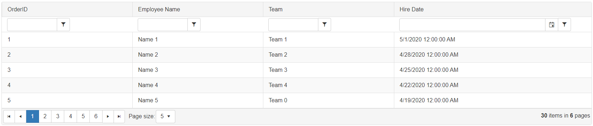


Review the most commonly used key features below, or go directly to [Getting Started with RadGrid]().


## Basic Grid

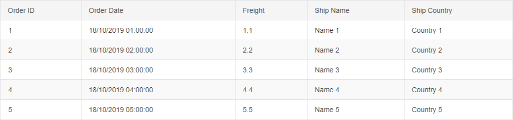


## Advanced Grid

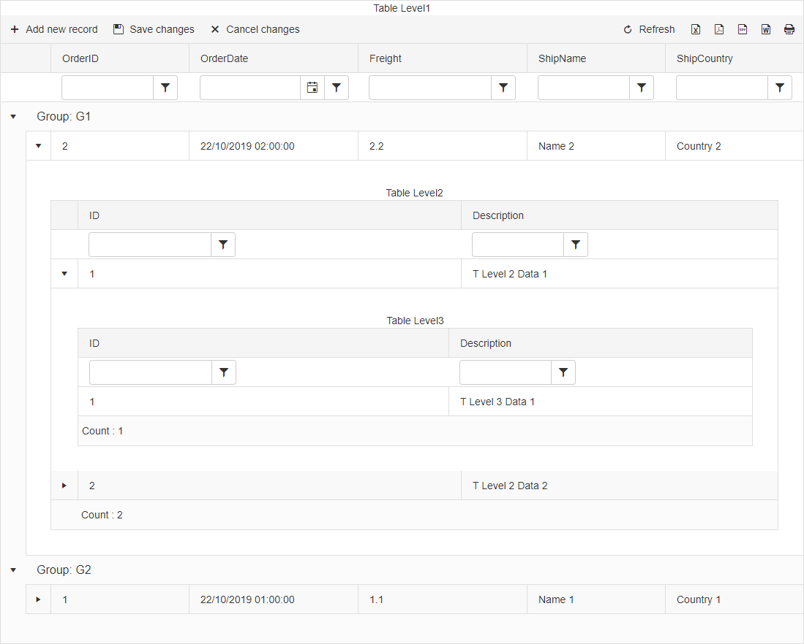

Explore these key RadGrid functionalities:

- [Paging]()
- [Filtering]()
- [Grouping]()
- [Data Binding]()
- [Hierarchy]()
- [CommandItem]()
- [Export To Excel]()
- [Export To CSV]()
- [Export To PDF]()
- [Export To DOC]()
- [Print]()
- [Accessibility Compliance]()


## Colorful Grid with built-in Skins

See the [RadGrid skinning options]().

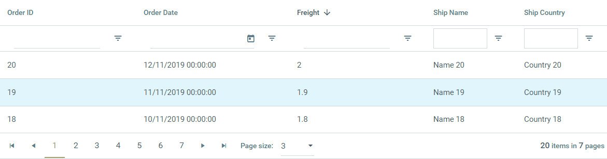

## Paging

See the [RadGrid paging options]().

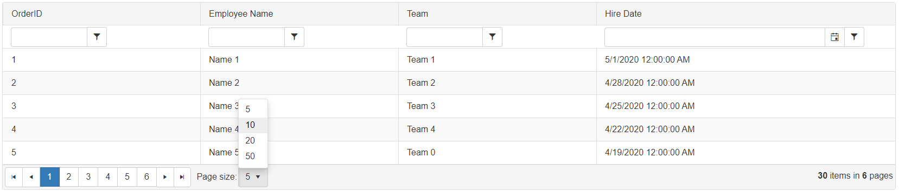

## Filtering

See the [RadGrid filtering options]().

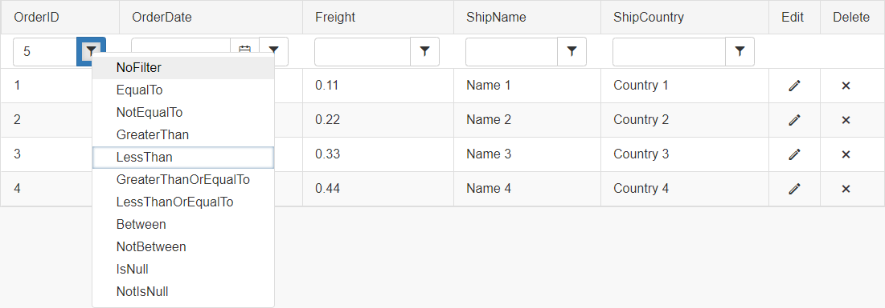

## Sorting

See the [RadGrid sorting options]().

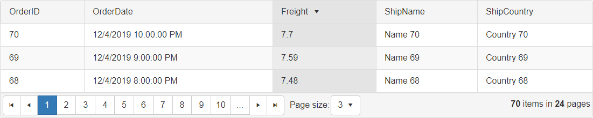

## Grouping

See the [RadGrid grouping options]().

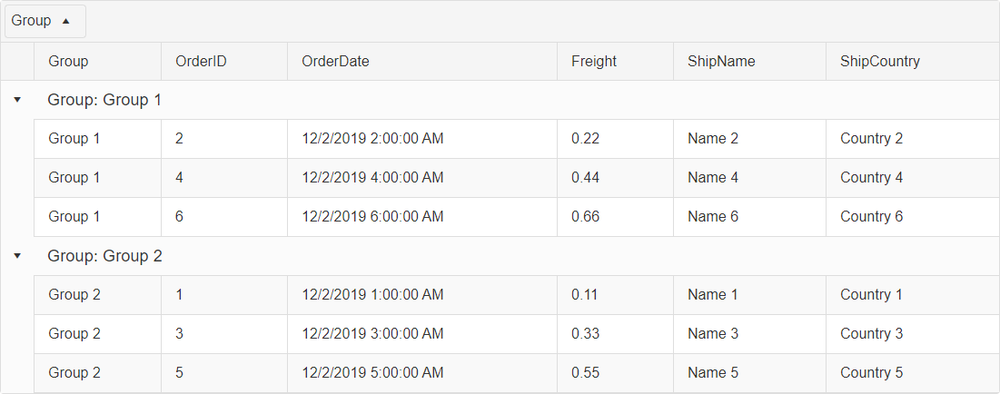

## Hierarchy

See the [RadGrid hierarchical structure and load modes]().

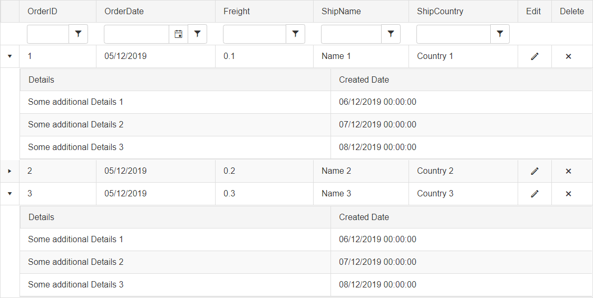

## Create, Read, Update, and Delete (CRUD) Operations

RadGrid supports server-side and client-side editing through several edit-form options.


### Server-Side Editing

Choose one of these server-side editing options:

### Edit Form

See the [RadGrid edit forms]().

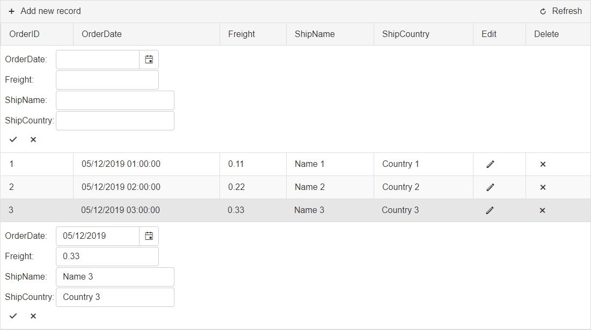

### Popup Edit Form

See the [RadGrid popup edit forms]().

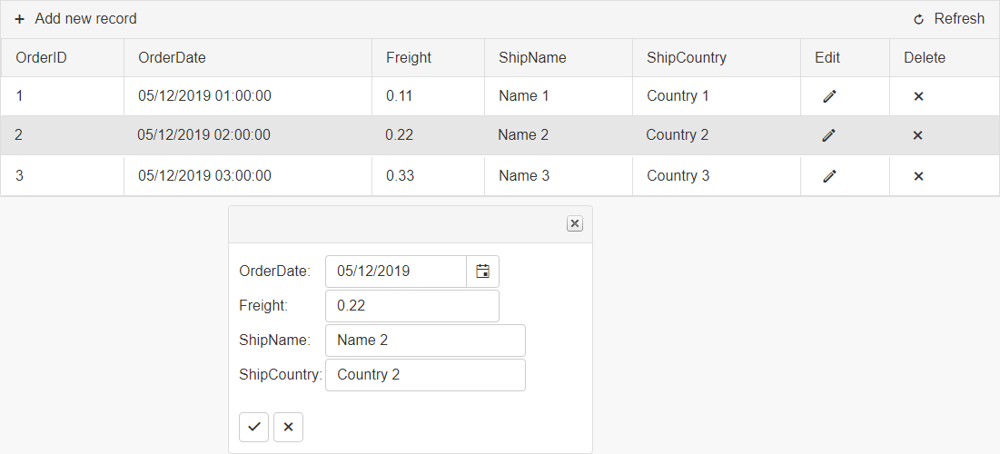

### In-place Editing

See [RadGrid in-place editing]().

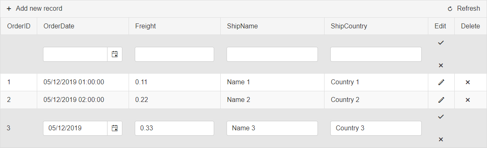

### Client-Side Editing

Use batch editing to update multiple records on the client before sending the changes to the server.

### Batch Editing

See [RadGrid batch editing]().

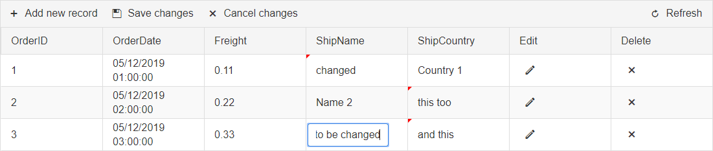


## API Reference

Use these API references for the RadGrid and its table views:

- [Telerik.Web.UI.RadGrid](https://docs.telerik.com/devtools/aspnet-ajax/api/server/Telerik.Web.UI/RadGrid) (RadGrid)

- [Telerik.Web.UI.GridTableView](https://docs.telerik.com/devtools/aspnet-ajax/api/server/Telerik.Web.UI/GridTableView) (MasterTable and/or DetailTables)

## See Also

Continue with these related RadGrid resources:

- [Getting Started]()

- [RadGrid overview demos](https://demos.telerik.com/aspnet-ajax/grid/examples/overview/defaultcs.aspx)
- [Telerik UI for ASP.NET AJAX Grid](https://www.telerik.com/products/aspnet-ajax/grid.aspx)


