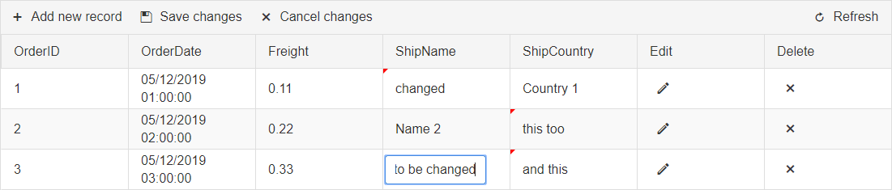

# Grid Overview

Telerik **RadGrid** is designed to eliminate the typical trade off associated with ASP.NET grid controls — rich functionality at the expense of weight and performance. Thanks to its innovative architecture, **RadGrid** is extremely fast and generates very little output. Added to this is true cross-browser support — Internet Explorer, all Gecko-based browsers, and Opera.

### Basic Grid

### Advanced Grid

### Colorful Grid with built-in Skins

### Filtering

### Sorting

### Grouping

### Hierarchy

### Create/Read/Update/Delete (CRUD) operations

#### Server-Side Editing

**Edit Form**

**PopUp**

**InPlace (Inline)**

#### Client-Side Editing

**Batch Edit**

