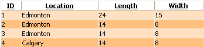

# Data Items

Rows in **RadGrid** are presented by the **GridItem** class and its descendants. There are two types of rows:

* Static rows

* Dynamic rows

## Static Rows

Static rows are always present in the grid structure regardless of whether they are visible or not. The number of these items is always known. To this group belong [Header and Footer rows](), [CommandItem](), Status bar item and [Pager row]().

## Dynamic Rows

Each dynamic row in the grid represents a record from the specified [data source](). Dynamic rows are represented by the **GridDataItem** class (a descendent of **GridItem**).

Each **GridTableView** has a set of rows (the **Items** collection) of type **GridDataItem.** The collection does not provide any methods to add or remove items. However, you can control the content of an item by providing a handler for the **ItemCreated** event.

>note
* Only Items bound to the data source (such as normal and alternating rows) are kept in the **Items** collection. The header, footer, pager, filter and separator are not included in this collection.
* The **ItemsHierarchy** collection contains all Items of the owner's **GridTableView** and all Items of the child views nested in that table view.
* The **Items** property of **RadGrid** is a reference to the **ItemsHierarchy** property of its **MasterTableView** .>

The number of dynamic rows depends on the number of rows (records) in the Data Source and the number of groups (if [grouping]() is enabled). Dynamic rows consist of **data items**, **nested-view items**, **group-header items** and **edit-form items**. (for examples of these different row types, see [Overview of Telerik RadGrid structure]())

Data items can come in two types:

* **Normal Rows** - these are the odd rows of the grid (see rows 1 and 3 below). The appearance of the normal rows is controlled by the **ItemStyle** property.

* **Alternating Rows** - these are the even rows of the grid (see rows 2 and 4 below). The appearance of the alternating rows is controlled by the **AlternatingItemStyle** property.

Both **ItemStyle** and **AlternatingItemStyle** are of type **GridTableItemStyle**. Additionally, for skins which have different styling for normal/alternating rows, you can disable the zebra effect by setting the**ClientSettings -> EnableAlternatingItems** property of the grid to false.

## See Also

 * [Accessing Cells and Rows]()

 * [Simple Databinding]()

 * [Programmatic Databinding Using NeedDataSource Event]()

 * [Customizing Row Appearance]()
