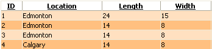

# Data Items

Rows in **RadGrid** are represented by the **GridItem** class and its descendants. There are two types of rows:

* Static rows

* Dynamic rows

## Static Rows

Static rows are always present in the grid structure, regardless of whether they are visible. Their number is known in advance. This group includes [header and footer rows](), the [CommandItem](), the status bar item, and the [pager row]().

## Dynamic Rows

Each dynamic row in the grid represents a record from the specified [data source](). Dynamic rows are represented by the **GridDataItem** class, which derives from **GridItem**.

Each **GridTableView** has a set of rows in its **Items** collection. These rows are **GridDataItem** instances. The collection does not provide methods to add or remove items, but you can control an item’s content by handling the **ItemCreated** event.

>note
* Only Items bound to the data source (such as normal and alternating rows) are kept in the **Items** collection. The header, footer, pager, filter and separator are not included in this collection.
* The **ItemsHierarchy** collection contains all Items of the owner's **GridTableView** and all Items of the child views nested in that table view.
* The **Items** property of **RadGrid** is a reference to the **ItemsHierarchy** property of its **MasterTableView** .>

The number of dynamic rows depends on the number of records in the data source and the number of groups, if [grouping]() is enabled. Dynamic rows consist of **data items**, **nested-view items**, **group-header items**, and **edit-form items**. For examples of these row types, see [Overview of Telerik RadGrid structure]().

Data items can come in two types:

* **Normal Rows** - these are the odd rows of the grid (see rows 1 and 3 below). The appearance of the normal rows is controlled by the **ItemStyle** property.

* **Alternating Rows** - these are the even rows of the grid (see rows 2 and 4 below). The appearance of the alternating rows is controlled by the **AlternatingItemStyle** property.

Both **ItemStyle** and **AlternatingItemStyle** are of type **GridTableItemStyle**. For skins with different normal and alternating row styles, you can disable the zebra effect by setting **ClientSettings > EnableAlternatingItems** to `false`.

## See Also

 * [Accessing Cells and Rows]()

 * [Simple Databinding]()

 * [Programmatic Databinding Using NeedDataSource Event]()

 * [Customizing Row Appearance]()

 * [RadGrid structure overview]()
