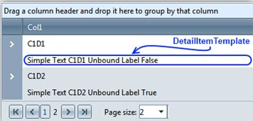

# Detail Item Template

The **DetailItemTemplate** is part of the **GridDataItem** and is rendered in a new row immediately after the **GridDataItem** itself.

## Defining a Detail Item Template

The template is instantiated in a single cell that spans the entire row. Define it inside the **MasterTableView** or a detail **GridTableView**.

````ASP.NET
	  <telerik:RadGrid RenderMode="Lightweight" runat="server" ID="RadGrid1" AutoGenerateColumns="false">
	  <MasterTableView>
		<DetailItemTemplate>
			Text content
			<asp:Label ID="Label2" runat="server" Text='<%# Eval("DataField1") %>' />
			<asp:Label ID="Label1" runat="server" Text="Unbound label" />
			<%# Eval("DataField2") %>
		</DetailItemTemplate>
	  </MasterTableView>
	  </telerik:RadGrid>
````


The **GridItemType.DetailTemplateItem** item type represents the rendered template. Because the **GridDetailTemplateItem** is an integral part of the **GridDataItem**, the **ItemCreated** and **ItemDataBound** events are not raised when the detail template item is created or bound. You can get all **GridDetailTemplateItem** instances by using the **GetItems()** method of the **GridTableView**.

Hiding the **GridDataItem** will hide the **GridDetailTemplateItem**.

## Appearance and Styling

Base row style **(rgRow, rgAltRow)** is applied according to the parent item’s current style.

## Accessing the DetailItemTemplate

The data cell of the detail item can be accessed through the **DetailTemplateItemDataCell** property of the corresponding **GridDataItem**. The template supports data binding through that item's **DataItem** property. You can also access all detail template items by using **GetItems()** on the **GridTableView**.



>note **DetailItemTemplate** is not supported when **MasterTableView ItemTemplate** is used.
>


## See Also

* [Accessing Cells and Rows]()

* [RadGrid structure overview]()
