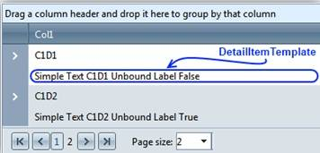

# Detail Item Template


The **DetailItemTemplate** is considered a part of the **GridDataItem** and is rendered in a new row right after the **GridDataItem** itself.

## 

The template is instantiated within a single cell that spans over the whole row/item.

````ASP.NET
	  <telerik:RadGrid RenderMode="Lightweight" runat="server" ID="RadGrid1" AutoGenerateColumns="false">
	  <MasterTableView>
		<DetailItemTemplate>
			Text content
			<asp:Label ID="Label2" runat="server" Text='<%# Eval("DataField1") %>' />
			<asp:Label ID="Label1" runat="server" Text="Unbound label" />
			<%# Eval("DataField2") %>
		</DetailItemTemplate>
	  </MasterTableView>
	  </telerik:RadGrid>
````


There is a new item type in RadGrid - **GridItemType.DetailTemplateItem**. Due to the fact that the **GridDetailTemplateItem** is an integral part of the **GridDataItem**, **ItemCreated** and **ItemDataBound** events won’t be triggered when it is created/bound. It is possible, however to get all items of type **GridDetailTemplateItem** by using the **GetItems()** method of the **GridTableView**.

Hiding the **GridDataItem** will hide the **GridDetailTemplateItem**.

## Appearance and Styling

Base row style **(rgRow, rgAltRow)** is applied according to the parent item’s current style.

## Accessing the DetailItemTemplate

It is important to note that the data cell of the new item can be directly accessed via the **DetailTemplateItemDataCell** property of **GridDataItem**.
The new template supports databinding using the **DataItem** of the corresponding **GridDataItem**.All items of type **GridDetailTemplateItem** could be accessed by using the **GetItems()** method of the **GridTableView**.


>note **DetailItemTemplate** is not supported when **MasterTableView ItemTemplate** is used.
>


## See Also
