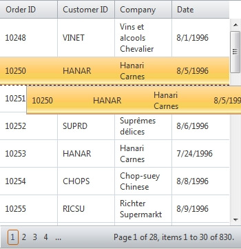

# Drag and Drop of Grid Items


## 

RadGrid exposes flexible event-driven mechanism to drag and drop grid records to reorder them within the same grid, move them to different grid instance or drop them over other html element on the page. In order to enable drag and drop of grid items, you need to set the two boolean grid properties to true, namely:

````ASPNET
	  <ClientSettings AllowRowsDragDrop="true">
	        <Selecting AllowRowSelect="True" />
	  </ClientSettings>
````


This will make the grid data rows draggable and the end user will be able to relocate them if needed. Additionally, you can define a [GridDragDropColumn]() in your GridTableView's Columns collection. This will make your grid items draggable only when grabbed by the drag handle in the GridDragDropColumn. For a live demo, please refer to the [RadGrid Items Drag-and-Drop QSF example](http://demos.telerik.com/aspnet-ajax/grid/examples/programming/draganddrop/defaultcs.aspx).

Furthermore, depending on the position you drag an item (above or below other record) it will be placed respectively above or below the corresponding grid item. This is meaningful only when you reorder rows within the same RadGrid or from one RadGrid to another.

The event-driven model which allows you to process and complete the drag and drop operation can be separated into two phases: client-side and server-side phase.

>note On mobile devices the row drag-drop and scrolling features in the grid are performed by the same touch gesture: dragging of the content area of the grid. This imposes a limitation when both features are enabled on touch devices because it cannot be exclusively determined which one of the two should be performed. One way to distinguish between scrolling and row drag-drop on mobile devices is touse a GridDragDropColumn - this way the dragging of the rows will be performed only when you drag a row by the icon in theGridDragDropColumn and on the rest of the content area scrolling will be performed.
>


__Client-side phase__

There are three client grid events exposed to handle drag/drop action: __OnRowDragStarted__ (cancelable), __OnRowDropping__ (cancelable) and __OnRowDropped__.

* The __OnRowDragStarted__ event can be intercepted if you want to perform some conditional check and determine whether to cancel the drag operation or not. The syntax of the event handler follows the general client-side event signature of RadGrid for ASP.NET AJAX. The row which is about to be dragged can be accessed through the __get_gridDataItem__() property of the second argument passed in the OnRowDragStarted handler.

* The __OnRowDropping__ event should be attached to identify the target element on which the dragged grid record is dropped. If this element does not meet your criteria for acceptable target, cancel the operation by setting *args.set_cancel(true)* where args is the second argument passed to the OnRowDropping handler. Additionally, to determine the destination element or set it explicitly use the *get_destinationHtmlElement()* and *set_destinationHtmlElement()* properties that can be accessed through the args argument in the handler. Again, the syntax of the event handler follows the general client-side event signature of RadGrid for ASP.NET AJAX.

* The __OnRowDropped__ event can be handled if you would like to execute some extra code logic prior to the server-side OnRowDrop event rising. This event cannot be cancelled and have the same set of arguments as the OnRowDropping client event.

__Server-side phase__

On the server there is a single event (named __OnRowDrop__). Subscribing to this event allows you to reorder the items in the source grid or remove them and append these rows to a destination grid instance. The sequence of actions you will have to undertake in order to change the source structure may vary because this depends strictly on the underlying data source and its data model. The common logic in all cases, however, is that you can use three arguments passed in the handler to accomplish the task:

* __e.HtmlElement__ - holds the html element (or grid item)

* __e.DestDataItem__ - the destination grid item object (either GridDataItem or GridNoRecordsItem)

* __e.DraggedItems__ - a collection of GridDataItems which holds the rows that are taking part in the current drop operation

* __e.DestinationGrid__- a reference to the grid instance to which the row has been dragged to

* __e.DestinationTableView__- a reference to the table to which the row has been draggged to, points to the MasterTableView or detail table in hierarchical grid

Combining the client and server part completes the circle and separates logically each part of the drag and drop process until it is finalized. For richer end user experience you can ajaxify the grid via RadAjaxManager and use RadAjaxLoadingPanel indicators. Otherwise the drag and drop operation will be performed with plain postback.

>note Note that with single row selection enabled (AllowMultiRowSelection = "false") the items will be automatically selected when a drag action is triggered. With multi-row selection enabled (AllowMultiRowSelection = "true") a prerequisite is first to select row(s) and then drag to reorder them/drop them over other grid/html element.
>




Below is a code extraction from the [ relevant online demo ](http://demos.telerik.com/aspnet-ajax/Grid/Examples/Programming/DragAndDrop/DefaultCS.aspx) in the RadGrid QSF:


````ASPNET
	 <asp:ScriptManager ID="ScriptManager1" runat="server" />
	 <telerik:RadAjaxLoadingPanel ID="RadAjaxLoadingPanel" runat="server" Transparency="30" CssClass="LoadingPanel_Hay"></telerik:RadAjaxLoadingPanel>
	 <telerik:RadAjaxManager runat="server" ID="radAjax" DefaultLoadingPanelID="RadAjaxLoadingPanel">
	     <AjaxSettings>
	         <telerik:AjaxSetting AjaxControlID="grdPendingOrders">
	             <UpdatedControls>
	                 <telerik:AjaxUpdatedControl ControlID="grdPendingOrders" />
	                 <telerik:AjaxUpdatedControl ControlID="grdShippedOrders" />
	                 <telerik:AjaxUpdatedControl ControlID="msg" />
	             </UpdatedControls>
	         </telerik:AjaxSetting>
	         <telerik:AjaxSetting AjaxControlID="grdShippedOrders">
	             <UpdatedControls>
	                 <telerik:AjaxUpdatedControl ControlID="grdPendingOrders" />
	                 <telerik:AjaxUpdatedControl ControlID="grdShippedOrders" />
	                 <telerik:AjaxUpdatedControl ControlID="msg" />
	             </UpdatedControls>
	         </telerik:AjaxSetting>
	     </AjaxSettings>
	 </telerik:RadAjaxManager>
	 <telerik:RadScriptBlock runat="server" ID="scriptBlock">
	     <script type="text/javascript">
	         function onRowDropping(sender, args) {
	             if (sender.get_id() == "grdPendingOrders") {
	                 var node = args.get_destinationHtmlElement();
	                 if (!isChildOf('<%=grdShippedOrders.ClientID %>', node) && !isChildOf('<%=grdPendingOrders.ClientID %>', node)) {
	                     args.set_cancel(true);
	                 }
	             }
	             else {
	                 var node = args.get_destinationHtmlElement();
	                 if (!isChildOf('trashCan', node)) {
	                     args.set_cancel(true);
	                 }
	                 else {
	                     if (confirm("Are you sure you want to delete this order?"))
	                         args.set_destinationHtmlElement('trashCan');
	                     else
	                         args.set_cancel(true);
	                 }
	             }
	         }
	          function isChildOf(parentId, element) {
	             while (element) {
	                 if (element.id && element.id.indexOf(parentId) > -1) {
	                     return true;
	                 }
	                 element = element.parentNode;
	             }
	             return false;
	         }
	     </script>
	 </telerik:RadScriptBlock>
	   
	 <div class="exWrap">
	      <p class="howto">Drag orders from pending to shipped when dispatched<br />
	      Reorder pending orders on priority<br />
	      Drop a shipped order over the recycle bin to delete it</p>
	      <div style="float:left; padding:0 6px 0 10px">
	          <h2 style="color:#9c3608">Pending Orders</h2>
	          <telerik:RadGrid runat="server" ID="grdPendingOrders" Skin="Silk" OnNeedDataSource="grdPendingOrders_NeedDataSource"
	              AllowPaging="True" Width="350px" OnRowDrop="grdPendingOrders_RowDrop"
	              AllowMultiRowSelection="true">
	              <MasterTableView DataKeyNames="OrderId">
	              </MasterTableView>
	              <ClientSettings AllowRowsDragDrop="True">
	                    <Selecting AllowRowSelect="True" EnableDragToSelectRows="true"/>
	                    <ClientEvents OnRowDropping="onRowDropping" />
	              </ClientSettings>
	          </telerik:RadGrid>
	      </div>
	      <div style="float:right; padding:0 10px 0 6px">
	          <h2 style="color:#3c8b04">Shipped Orders</h2>
	          <telerik:RadGrid runat="server" AllowPaging="True" ID="grdShippedOrders" Skin="Silk"
	               OnNeedDataSource="grdShippedOrders_NeedDataSource" Width="350px"
	               OnRowDrop="grdShippedOrders_RowDrop" AllowMultiRowSelection="false">
	              <MasterTableView DataKeyNames="OrderId">
	              </MasterTableView>
	              <ClientSettings AllowRowsDragDrop="True">
	                  <Selecting AllowRowSelect="True" EnableDragToSelectRows="false"/>
	                  <ClientEvents OnRowDropping="onRowDropping" />
	              </ClientSettings>
	          </telerik:RadGrid>
	      </div>
	      <div style="clear:both;"><!-- --></div>
	      <div class="exFooter">
	          <div id="trashCan">Recycle Bin</div>
	          <div class="exMessage" runat="server" id="msg" visible="false" enableviewstate="false">
	               Order(s) succsesfully deleted!
	          </div>
	 </div>
	</div>
````
````C#
	    protected IList<Order> PendingOrders
	    {
	        get
	        {
	            try
	            {
	                object obj = Session["PendingOrders"];
	                if (obj == null)
	                {
	                    obj = GetOrders();
	                    if (obj != null)
	                    {
	                        Session["PendingOrders"] = obj;
	                    }
	                    else
	                    {
	                        obj = new List<Order>();
	                    }
	                }
	                return (IList<Order>)obj;
	            }
	            catch
	            {
	                Session["PendingOrders"] = null;
	            }
	            return new List<Order>();
	        }
	        set
	        {
	            Session["PendingOrders"] = value;
	        }
	    }
	    protected IList<Order> ShippedOrders
	    {
	        get
	        {
	            try
	            {
	                object obj = Session["ShippedOrders"];
	                if (obj == null)
	                {
	                    Session["ShippedOrders"] = obj = new List<Order>();
	                }
	                return (IList<Order>)obj;
	            }
	            catch
	            {
	                Session["ShippedOrders"] = null;
	            }
	            return new List<Order>();
	        }
	        set
	        {
	            Session["ShippedOrders"] = value;
	        }
	    }
	    protected void grdPendingOrders_NeedDataSource(object source, GridNeedDataSourceEventArgs e)
	    {
	        grdPendingOrders.DataSource = PendingOrders;
	    }
	    protected IList<Order> GetOrders()
	    {
	        IList<Order> results = new List<Order>();
	        using (IDbConnection connection = DbProviderFactories.GetFactory("System.Data.SqlClient").CreateConnection())
	        {
	            connection.ConnectionString = ConfigurationManager.ConnectionStrings["NorthwindConnectionString"].ConnectionString;
	            using (IDbCommand command = connection.CreateCommand())
	            {
	                command.CommandText = "SELECT o.OrderID, o.CustomerID, o.RequiredDate, c.CompanyName FROM orders o INNER JOIN customers c on o.customerID = c.customerID";
	                connection.Open();
	                try
	                {
	                    IDataReader reader = command.ExecuteReader();
	                    while (reader.Read())
	                    {
	                        int id = (int)reader.GetValue(reader.GetOrdinal("OrderID"));
	                        string customerID = (!reader.IsDBNull(reader.GetOrdinal("CustomerID"))) ? (string)reader.GetValue(reader.GetOrdinal("CustomerID")) : string.Empty;
	                        DateTime requiredDate = (!reader.IsDBNull(reader.GetOrdinal("RequiredDate"))) ? (DateTime)reader.GetValue(reader.GetOrdinal("RequiredDate")) : DateTime.MinValue;
	                        string companyName = (!reader.IsDBNull(reader.GetOrdinal("CompanyName"))) ? (string)reader.GetValue(reader.GetOrdinal("CompanyName")) : string.Empty;
	                        results.Add(new Order(id, customerID, companyName, requiredDate.ToShortDateString()));
	                    }
	                }
	                catch
	                {
	                    results.Clear();
	                }
	            }
	        }
	        return results;
	    }
	    protected void grdShippedOrders_NeedDataSource(object source, GridNeedDataSourceEventArgs e)
	    {
	        grdShippedOrders.DataSource = ShippedOrders;
	    }
	    protected void grdPendingOrders_RowDrop(object sender, GridDragDropEventArgs e)
	    {
	        if (string.IsNullOrEmpty(e.HtmlElement))
	        {
	            if (e.DraggedItems[0].OwnerGridID == grdPendingOrders.ClientID)
	            {                    // items are drag from pending to shipped grid     
	                if ((e.DestDataItem == null && ShippedOrders.Count == 0) || e.DestDataItem != null && e.DestDataItem.OwnerGridID == grdShippedOrders.ClientID)
	                {
	                    IList<Order> shippedOrders = ShippedOrders;
	                    IList<Order> pendingOrders = PendingOrders;
	                    foreach (GridDataItem draggedItem in e.DraggedItems)
	                    {
	                        Order tmpOrder = GetOrder(pendingOrders, (int)draggedItem.GetDataKeyValue("OrderId"));
	                        if (tmpOrder != null)
	                        {
	                            shippedOrders.Add(tmpOrder);
	                            pendingOrders.Remove(tmpOrder);
	                        }
	                    }
	                    ShippedOrders = shippedOrders;
	                    PendingOrders = pendingOrders;
	                    grdPendingOrders.Rebind();
	                    grdShippedOrders.Rebind();
	                }
	                else if (e.DestDataItem != null && e.DestDataItem.OwnerGridID == grdPendingOrders.ClientID)
	                {                        //reorder items in pending  grid   
	                    IList<Order> pendingOrders = PendingOrders;
	                    Order order = GetOrder(pendingOrders, (int)e.DestDataItem.GetDataKeyValue("OrderId"));
	                    int destinationIndex = pendingOrders.IndexOf(order);
	                    List<Order> ordersToMove = new List<Order>();
	                    foreach (GridDataItem draggedItem in e.DraggedItems)
	                    {
	                        Order tmpOrder = GetOrder(pendingOrders, (int)draggedItem.GetDataKeyValue("OrderId"));
	                        if (tmpOrder != null)
	                            ordersToMove.Add(tmpOrder);
	                    }
	                    foreach (Order orderToMove in ordersToMove)
	                    {
	                        pendingOrders.Remove(orderToMove);
	                        pendingOrders.Insert(destinationIndex, orderToMove);
	                    }
	                    PendingOrders = pendingOrders;
	                    grdPendingOrders.Rebind();
	                    e.DestDataItem.Selected = true;
	                }
	            }
	        }
	    }
	    private static Order GetOrder(IEnumerable<Order> ordersToSearchIn, int orderId)
	    {
	        foreach (Order order in ordersToSearchIn)
	        {
	            if (order.OrderID == orderId)
	            {
	                return order;
	            }
	        }
	        return null;
	    }
	    protected void grdShippedOrders_RowDrop(object sender, GridDragDropEventArgs e)
	    {
	        if (!string.IsNullOrEmpty(e.HtmlElement) && e.HtmlElement == "trashCan")
	        {
	            IList<Order> shippedOrders = ShippedOrders;
	            bool deleted = false;
	            foreach (GridDataItem draggedItem in e.DraggedItems)
	            {
	                Order tmpOrder = GetOrder(shippedOrders, (int)draggedItem.GetDataKeyValue("OrderId"));
	                if (tmpOrder != null)
	                {
	                    shippedOrders.Remove(tmpOrder);
	                    deleted = true;
	                }
	            }
	            if (deleted)
	            {
	                msg.Visible = true;
	            }
	            ShippedOrders = shippedOrders;
	            grdShippedOrders.Rebind();
	        }
	    }
	
	    protected class Order
	    {
	        private string _companyName;
	        private string _customerId;
	        private int _orderId;
	        private string _date;
	        public Order(int orderId, string customerId, string companyName, string requiredDate)
	        {
	            _orderId = orderId;
	            _customerId = customerId;
	            _companyName = companyName;
	            _date = requiredDate;
	        }
	        public int OrderID
	        {
	            get
	            {
	                return _orderId;
	            }
	        }
	        public string CustomerID
	        {
	            get
	            {
	                return _customerId;
	            }
	        }
	        public string Company
	        {
	            get
	            {
	                return _companyName;
	            }
	        }
	        public string Date
	        {
	            get
	            {
	                return _date;
	            }
	        }
	    }
````
````VB.NET
	    Protected Property PendingOrdersStore() As IList(Of Order)
	        Get
	            Try
	                Dim obj As Object = Session("PendingOrders_VB")
	                If obj Is Nothing Then
	                    obj = GetOrders()
	                    Session("PendingOrders_VB") = obj
	                End If
	                Return DirectCast(obj, IList(Of Order))
	            Catch ex As Exception
	                Session("PendingOrders_VB") = Nothing
	            End Try
	            Return New List(Of Order)
	        End Get
	        Set(ByVal value As IList(Of Order))
	            Session("PendingOrders_VB") = value
	        End Set
	    End Property
	    Protected Property ShippedOrdersStore() As IList(Of Order)
	        Get
	            Try
	                Dim obj As Object = Session("ShippedOrders_VB")
	                If obj Is Nothing Then
	                    obj = New List(Of Order)()
	                    Session("ShippedOrders_VB") = obj
	                End If
	                Return DirectCast(obj, IList(Of Order))
	            Catch ex As Exception
	                Session("ShippedOrders_VB") = Nothing
	            End Try
	            Return New List(Of Order)
	        End Get
	        Set(ByVal value As IList(Of Order))
	            Session("ShippedOrders_VB") = value
	        End Set
	    End Property
	    Protected Sub Page_Load(ByVal sender As Object, ByVal e As EventArgs)
	    End Sub
	    Protected Sub grdPendingOrders_NeedDataSource(ByVal source As Object, ByVal e As GridNeedDataSourceEventArgs)
	        grdPendingOrders.DataSource = PendingOrdersStore
	    End Sub
	    Protected Function GetOrders() As IList(Of Order)
	        Dim results As IList(Of Order) = New List(Of Order)()
	        Using connection As IDbConnection = DbProviderFactories.GetFactory("System.Data.SqlClient").CreateConnection()
	            connection.ConnectionString = ConfigurationManager.ConnectionStrings("NorthwindConnectionString").ConnectionString
	            Using command As IDbCommand = connection.CreateCommand()
	                command.CommandText = "SELECT o.OrderID, o.CustomerID, o.RequiredDate, c.CompanyName FROM orders o INNER JOIN customers c on o.customerID = c.customerID"
	                connection.Open()
	                Try
	                    Dim reader As IDataReader = command.ExecuteReader()
	                    While reader.Read()
	                        Dim id As Integer = DirectCast(reader.GetValue(reader.GetOrdinal("OrderID")), Integer)
	                        Dim customerID As String = IIf((Not reader.IsDBNull(reader.GetOrdinal("CustomerID"))), DirectCast(reader.GetValue(reader.GetOrdinal("CustomerID")), String), String.Empty)
	                        Dim requiredDate As DateTime = IIf((Not reader.IsDBNull(reader.GetOrdinal("RequiredDate"))), DirectCast(reader.GetValue(reader.GetOrdinal("RequiredDate")), DateTime), DateTime.MinValue)
	                        Dim companyName As String = IIf((Not reader.IsDBNull(reader.GetOrdinal("CompanyName"))), DirectCast(reader.GetValue(reader.GetOrdinal("CompanyName")), String), String.Empty)
	                        results.Add(New Order(id, customerID, companyName, requiredDate))
	                    End While
	                Catch ex As SqlException
	                    results.Clear()
	                End Try
	            End Using
	        End Using
	        Return results
	    End Function
	    Protected Sub grdShippedOrders_NeedDataSource(ByVal source As Object, ByVal e As GridNeedDataSourceEventArgs)
	        grdShippedOrders.DataSource = ShippedOrdersStore
	    End Sub
	    Protected Sub grdPendingOrders_RowDrop(ByVal sender As Object, ByVal e As GridDragDropEventArgs)
	        If String.IsNullOrEmpty(e.HtmlElement) Then
	            If e.DraggedItems(0).OwnerGridID = grdPendingOrders.ClientID Then
	                ' items are drag from pending to shipped grid
	                If (e.DestDataItem Is Nothing AndAlso ShippedOrdersStore.Count = 0) OrElse (e.DestDataItem IsNot Nothing AndAlso e.DestDataItem.OwnerGridID = grdShippedOrders.ClientID) Then
	                    Dim shippedOrders As IList(Of Order)
	                    Dim pendingOrders As IList(Of Order)
	                    shippedOrders = ShippedOrdersStore
	                    pendingOrders = PendingOrdersStore
	                    For Each draggedItem As GridDataItem In e.DraggedItems
	                        Dim tmpOrder As Order = GetOrder(pendingOrders, DirectCast(draggedItem.GetDataKeyValue("OrderId"), Integer))
	                        If tmpOrder IsNot Nothing Then
	                            shippedOrders.Add(tmpOrder)
	                            pendingOrders.Remove(tmpOrder)
	                        End If
	                    Next
	                    ShippedOrdersStore = shippedOrders
	                    PendingOrdersStore = pendingOrders
	                    grdPendingOrders.Rebind()
	                    grdShippedOrders.Rebind()
	                ElseIf e.DestDataItem IsNot Nothing AndAlso e.DestDataItem.OwnerGridID = grdPendingOrders.ClientID Then
	                    'reorder items in pending grid
	                    Dim pendingOrders As IList(Of Order)
	                    pendingOrders = PendingOrdersStore
	                    Dim order As Order = GetOrder(pendingOrders, DirectCast(e.DestDataItem.GetDataKeyValue("OrderId"), Integer))
	                    Dim destinationIndex As Integer = pendingOrders.IndexOf(order)
	                    Dim ordersToMove As New List(Of Order)()
	                    For Each draggedItem As GridDataItem In e.DraggedItems
	                        Dim tmpOrder As Order = GetOrder(pendingOrders, DirectCast(draggedItem.GetDataKeyValue("OrderId"), Integer))
	                        If tmpOrder IsNot Nothing Then
	                            ordersToMove.Add(tmpOrder)
	                        End If
	                    Next
	                    For Each orderToMove As Order In ordersToMove
	                        pendingOrders.Remove(orderToMove)
	                        pendingOrders.Insert(destinationIndex, orderToMove)
	                    Next
	                    PendingOrdersStore = pendingOrders
	                    grdPendingOrders.Rebind()
	                    e.DestDataItem.Selected = True
	                End If
	            End If
	        End If
	    End Sub
	    Private Shared Function GetOrder(ByVal ordersToSearchIn As IEnumerable(Of Order), ByVal orderId As Integer) As Order
	        For Each order As Order In ordersToSearchIn
	            If order.OrderId = orderId Then
	                Return order
	            End If
	        Next
	        Return Nothing
	    End Function
	    Protected Sub grdShippedOrders_RowDrop(ByVal sender As Object, ByVal e As GridDragDropEventArgs)
	        If Not String.IsNullOrEmpty(e.HtmlElement) AndAlso e.HtmlElement = "trashCan" Then
	            Dim shippedOrders As IList(Of Order)
	            shippedOrders = ShippedOrdersStore
	            Dim deleted As Boolean = False
	            For Each draggedItem As GridDataItem In e.DraggedItems
	                Dim tmpOrder As Order = GetOrder(shippedOrders, DirectCast(draggedItem.GetDataKeyValue("OrderId"), Integer))
	                If tmpOrder IsNot Nothing Then
	                    deleted = True
	                    shippedOrders.Remove(tmpOrder)
	                End If
	            Next
	            If (deleted) Then
	                msg.Visible = True
	            End If
	            ShippedOrdersStore = shippedOrders
	            grdShippedOrders.Rebind()
	        End If
	    End Sub
	
	    Protected Class Order
	        Private _companyName As String
	        Private _customerId As String
	        Private _orderId As Integer
	        Private _requiredDate As DateTime
	        Public Sub New(ByVal orderId As Integer, ByVal customerId As String, ByVal companyName As String, ByVal requiredDate As DateTime)
	            _orderId = orderId
	            _customerId = customerId
	            _companyName = companyName
	            _requiredDate = requiredDate
	        End Sub
	        Public ReadOnly Property OrderId() As Integer
	            Get
	                Return _orderId
	            End Get
	        End Property
	        Public ReadOnly Property CustomerId() As String
	            Get
	                Return _customerId
	            End Get
	        End Property
	        Public ReadOnly Property CompanyName() As String
	            Get
	                Return _companyName
	            End Get
	        End Property
	        Public ReadOnly Property RequiredDate() As DateTime
	            Get
	                Return _requiredDate
	            End Get
	        End Property
	    End Class
````

