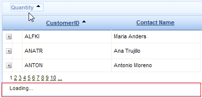

# Functional Items

Functional items are static rows in the grid that provide built-in functionality, such as paging, commands, or status information.

## Pager Item

The [Pager]() is a row that contains the paging navigation controls. To have the grid divide its data into pages, set the grid's **AllowPaging** property to **True**.

You can define the style of the pager row using the [RadGrid property builder]() or the **PagerStyle** section of the **RadGrid** property pane.

## CommandItem

The **CommandItem** is a placeholder for commands that perform actions on selected items or all items in the grid. See the [Command reference]() topic for details about the commands you can add to the **CommandItem**.

## StatusBarItem

The **GridStatusBarItem** appears below all other items in the grid and displays information about the current grid status. It is intended primarily for use when **RadGrid** is used with **RadAjaxManager** to indicate that the grid is performing asynchronous AJAX requests. To show the status bar item, set the grid’s **ShowStatusBar** property to `true`.

>note You should have a data source assigned in order to use **RadGrid** with a status bar.
>

## See Also

 * [Pager Item]()

 * [Overview]()

 * [Data Items]()
