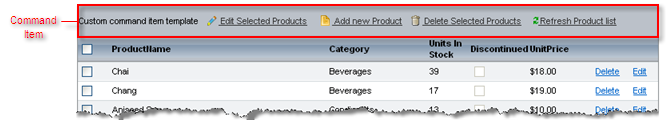

# Functional Items

Functional items are static rows in the grid that perform some function.

## Pager Item

The [Pager]() is a row that contains the paging navigation controls. To have the grid divide its data into pages, set the grid's __AllowPaging__ property to __True__.

You can define the style of the Pager Row using the [ RadGrid property builder ]() or the __PagerStyle__ section of the __RadGrid__ property pane.

## CommandItem

The CommandItem is a place holder for commands that can perform some action on the items in the grid. Commands can be processed on the selected items, or on all items in the grid. See the [Command reference]() topic for details about the available commands you can add to the __CommndItem__.

## StatusBarItem

The GridStatusBarItem appears below all other items in the grid and displays the information about the current grid status. This item is intended primarily for use when __RadGrid__ is used with __RadAjaxManager__ to indicate when __RadGrid__ is performing asynchronous AJAX requests. To show the status bar item, set the grid's __ShowStatusBar__ property to __True__.

>note You should have a data source assigned in order to use __RadGrid__ with a status bar.
>

# See Also

 * [Pager Item]()

 * [Overview]()
