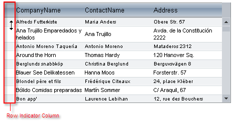

# Resizing Rows


## 

You can allow row resizing by setting the **ClientSettings.Resizing.AllowRowResize** property to **true**. When you set this property, **RadGrid** automatically generates a column of type **GridRowIndicatorColumn**, to make it easier for users to resize rows. Rows can be resized by dragging any part of their bottom edge, so if you prefer to hide the RowIndicatorColumn, please set **ClientSettings.Resizing.ShowRowIndicatorColumn** to **false**.



````ASP.NET
<telerik:RadGrid RenderMode="Lightweight" ID="RadGrid1" runat="server" DataSourceID="AccessDataSource1" Skin="WebBlue">
  <MasterTableView DataSourceID="AccessDataSource1" TableLayout="Auto">
  </MasterTableView>
  <ClientSettings>
    <Scrolling AllowScroll="True" UseStaticHeaders="True" />
    <Resizing AllowRowResize="True" />
  </ClientSettings>
</telerik:RadGrid>
````


