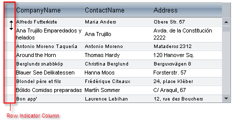

# Resizing Rows

You can allow users to change the height of **RadGrid** rows by enabling row resizing. The grid displays a row indicator column that provides a resize handle unless you hide it.

## Enabling Row Resizing

Set **ClientSettings.Resizing.AllowRowResize** to `true` to enable row resizing. **RadGrid** automatically generates a **GridRowIndicatorColumn** that provides a resize handle. Users can resize rows by dragging any part of the bottom edge. To hide the indicator column, set **ClientSettings.Resizing.ShowRowIndicatorColumn** to `false`.



````ASP.NET
<asp:ScriptManager ID="ScriptManager1" runat="server" />
<asp:AccessDataSource ID="AccessDataSource1" runat="server"
    DataFile="~/App_Data/Northwind.mdb"
    SelectCommand="SELECT * FROM Customers" />
<telerik:RadGrid RenderMode="Lightweight" ID="RadGrid1" runat="server" DataSourceID="AccessDataSource1" Skin="WebBlue">
  <MasterTableView DataSourceID="AccessDataSource1" TableLayout="Auto">
  </MasterTableView>
  <ClientSettings>
    <Scrolling AllowScroll="True" UseStaticHeaders="True" />
    <Resizing AllowRowResize="True" />
  </ClientSettings>
</telerik:RadGrid>
````

## See Also

* [OnRowResizing client-side event]()

* [OnRowResized client-side event]()

* [GridRowIndicatorColumn](#gridrowindicatorcolumn)


