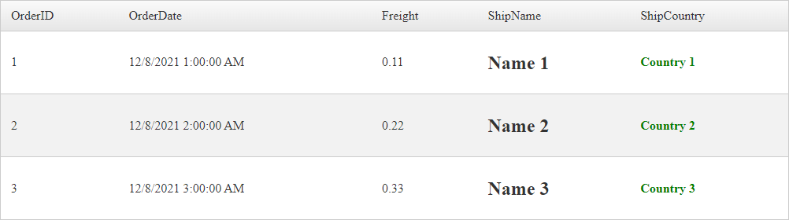
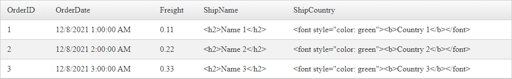

# RadGrid Security

This article addresses Security issues concerning the Telerik RadGrid.

## Cross-site Scripting (XSS)

Cross Site Scripting (XSS) attacks are a type of injection in which malicious scripts are injected in the web application and submitted to the server. If no validation or protective measures are undertaken, the injected script will be executed during displaying data by the Web UI Control such as the RadGrid. Subsequently, any sensitive information could be successfully hijacked to a location, known by the attacker.

These type of attacks are popular, therefore, this matter is a commonly discussed topic in various public articles. You can learn more about how to protect your applications against XSS attacks by following these materials:

- MSDN: [How To: Prevent Cross-Site Scripting in ASP.NET](https://msdn.microsoft.com/en-us/library/ff649310.aspx)
- OWASP: [Cross-site Scripting (XSS)](https://www.owasp.org/index.php/Cross-site_Scripting_%28XSS%29)
- MDN: [Cross-site scripting](https://developer.mozilla.org/en-US/docs/Glossary/Cross-site_scripting)


**RadGrid** by default will display HTML content. For instance, if one of the Fields in the Data Source contain HTML code such as `<b>some text</b>`, this value will be displayed in bold, or `<font style="color: green">some text</font>` will be green when rendered on the page.

Or in case the data source content contains scripts such as `<script>function(){ alert("window.alert run from a script")}</script>`, they will be executed upon loading the page.

For Example assuming the following content
- ShipName column has its values wrapped in `<h2>` elements e.g. `<h2>Name 1</h2>`
- ShipCountry column has its values wrapped in `<font>` and `<b>` elements e.g. `<font style="color: green"><b>Country 1</b></font>`

>caption Outputs



In order to prevent displaying HTML code or executing scripts, the built-in columns expose a property called **HtmlEncode** (`default true`) that you can use to Enable/Disable encoding. By setting its value to **True** all HTML tags will be encoded to HTML entities.

>caption Example Column definition

````ASP.NET
<telerik:GridBoundColumn DataField="ShipName" HeaderText="ShipName" HtmlEncode="true">
</telerik:GridBoundColumn>
<telerik:GridBoundColumn DataField="ShipCountry" HeaderText="ShipCountry" HtmlEncode="true">
</telerik:GridBoundColumn>
````

>caption Example Output



>caption Encoding HTML inside GridTemplateColumn

````ASP.NET
<telerik:GridTemplateColumn HeaderText="Template Column">
    <ItemTemplate>
        <%# EncodeValue(Eval("ShipName")) %>
    </ItemTemplate>
</telerik:GridTemplateColumn>
````

>caption C#/VB Function

````C#
protected string EncodeValue(object value)
{
    return HttpUtility.HtmlEncode(value.ToString());
}
````
````VB
Protected Function EncodeValue(ByVal value As Object) As String
    Return HttpUtility.HtmlEncode(value.ToString())
End Function
````

>important While the Grid is capable of encoding the content to HTML Entities, this functionality only adds an extra layer of security. It is the **Developer's responsibility to sanitize the user input and eliminate malicious code** before inserting the values into the database.


## SQL Injection

*SQL injection* is a code injection technique used to attack data-driven applications, in which malicious SQL statements are inserted into an entry field for execution (e.g. to dump the database contents to the attacker)

>important **RadGrid** will only work with the datasource (e.g. DataSet, DataTable, Array, List, Entity Objects, SqlDataSource) provided by the Developer and **does not**/**cannot interact with the database directly**.
>
>important Upon filtering, sorting, paging, etc., the Grid uses the Data Set provided by the Developer to perform those actions.

[](https://docs.microsoft.com/en-us/archive/msdn-magazine/2004/september/data-security-stop-sql-injection-attacks-before-they-stop-you)


If binding data using SqlDataSource, the Grid requests data from that data source control configured by the developer.

The Developer will associate the Grid with the SqlDataSource Control. Upon Editing/Inserting the Grid will send a collection of Key (FieldName) & Value (User input) pairs, and from that point the SqlDataSource will take care of the rest.

````ASP.NET
<telerik:RadGrid ID="RadGrid1" runat="server" AllowPaging="True" Width="800px"
    AutoGenerateEditColumn="true"
    AutoGenerateDeleteColumn="true"
    DataSourceID="SqlDataSource1"
    AllowAutomaticInserts="true"
    AllowAutomaticUpdates="true"
    AllowAutomaticDeletes="true">
</telerik:RadGrid>
````

The SqlDataSource will use the collection of key/pair values sent by the Grid and Queries that database.

>important It is not mandatory, yet **Crucial** to Parameterize the Values. That is the way to protect the Database from SQL Injections.

>caption Example SqlDataSource with Parameters

````ASP.NET
<asp:SqlDataSource ID="SqlDataSource1" runat="server"
    ConnectionString="<%$ ConnectionStrings:ConnectionString %>"
    InsertCommand="INSERT INTO [Orders] ([OrderDate], [Freight], [ShipName], [ShipCountry]) VALUES (@OrderDate, @Freight, @ShipName, @ShipCountry)"
    SelectCommand="SELECT [OrderID], [OrderDate], [Freight], [ShipName], [ShipCountry] FROM [Orders]"
    UpdateCommand="UPDATE [Orders] SET [OrderDate] = @OrderDate, [Freight] = @Freight, [ShipName] = @ShipName, [ShipCountry] = @ShipCountry WHERE [OrderID] = @OrderID"
    DeleteCommand="DELETE FROM [Orders] WHERE [OrderID] = @OrderID">
    <InsertParameters>
        <asp:Parameter Name="OrederID" DbType="Int32" />
        <asp:Parameter Name="OrderDate" DbType="DateTime" />
        <asp:Parameter Name="Freight" DbType="Decimal" />
        <asp:Parameter Name="ShipName" DbType="String" />
        <asp:Parameter Name="ShipCountry" DbType="String" />
    </InsertParameters>
    <UpdateParameters>
        <asp:Parameter Name="OrederID" DbType="Int32" />
        <asp:Parameter Name="OrderDate" DbType="DateTime" />
        <asp:Parameter Name="Freight" DbType="Decimal" />
        <asp:Parameter Name="ShipName" DbType="String" />
        <asp:Parameter Name="ShipCountry" DbType="String" />
    </UpdateParameters>
    <DeleteParameters>
        <asp:Parameter Name="OrederID" DbType="Int32" />
    </DeleteParameters>
</asp:SqlDataSource>
````

If binding data programmatically, the Grid will be assigned a Data Set provided by the developer.

````ASP.NET
<telerik:RadGrid ID="RadGrid1" runat="server" AllowPaging="True" Width="800px" OnNeedDataSource="RadGrid1_NeedDataSource">
</telerik:RadGrid>
````

````C#
protected void RadGrid1_NeedDataSource(object sender, GridNeedDataSourceEventArgs e)
{
    var myDataSource = new DataTable();

    // Developer's logic to QUERY the database e.g. "SELECT [Column] FROM [Table] WHERE [Column] = @someValue"
    // Developer's needs to make sure to parameterize the Query before fetching data from the SQL Server
    // Developer's logic to get the results in a Data Set such as DataTable, or List or a Business Object

    // Example - Developer's Functions fetching data from the DataSource
    myDataSource = FetchData("SELECT [Column] FROM [Table] WHERE [Column] = @someValue");
    // Assing the results to RadGrid
    (sender as RadGrid).DataSource = myDataSource;
}
````
````VB
Protected Sub RadGrid1_NeedDataSource(ByVal sender As Object, ByVal e As GridNeedDataSourceEventArgs)
    Dim myDataSource = New DataTable()
    'Developer's logic to QUERY the database e.g. "SELECT [Column] FROM [Table] WHERE [Column] = @someValue"
    'Developer's needs to make sure to parameterize the Query before fetching data from the SQL Server
    'Developer's logic to save the results in a Table such as DataTable, or List or a Business Object
    'Developer's Functions fetching data from the DataSource
    myDataSource = FetchData("SELECT [Column] FROM [Table] WHERE [Column] = @someValue")
    'Assing the results to RadGrid
    (TryCast(sender, RadGrid)).DataSource = myDataSource
End Sub
````

## FAQ

### RadGrid is vulnerable to SQL Injection using StoredProcedures.

RadGrid does not/cannot have direct access to the database. Check out the [SQL Injection](#sql-injection) section.

To avoid SQL Injection, the developer must create parameters for StoredProcedures as well.

>caption Example Stored Procedure with Parameters

````SQL
CREATE PROCEDURE SelectAllCustomers @City nvarchar(30), @PostalCode nvarchar(10)
AS
SELECT * FROM Customers WHERE City = @City AND PostalCode = @PostalCode
GO;
````


### Vulnerability detected in RadGrid pagination

RadNumericTextBox in the Grid pager having reference to JavaScript [eval()](https://developer.mozilla.org/en-US/docs/Web/JavaScript/Reference/Global_Objects/eval) function which is not recommended.

There is no reason to worry, the **RadNumericTextBox** Control does not allow any value set other than numbers (0-9).

Often when conducting a [Static Application Security](#what-are-static-and-dynamic-application-security-testing) Testing, results may contain *false positive* because it could detect a function or JS version known to be vulnerable, however, in practice that would not happen.

Furthermore, the embedded jQuery in the Telerik Assemblies has BackPorts to address the Vulnerabilities, see [Vulnerabilities of jQuery versions embedded in UI for ASP.NET AJAX](). This is the reason we recommend using the embedded jQuery rather than Including External (other versions).


### What are Static and Dynamic Application Security Testing?

**Static Testing**

Static analysis is performed in a non-runtime environment. Static application security testing (SAST) is a testing process that looks at the application from the inside out. This test process is performed without executing the program, but rather by examining the source code, byte code or application binaries for signs of security vulnerabilities. In the static test process, the application data and control paths are modeled and then analyzed for security weaknesses. Static analysis is a test of the internal structure of the application, rather than functional testing.

**Dynamic Testing**

Dynamic analysis adopts the opposite approach and is executed while a program is in operation. Dynamic application security testing (DAST) looks at the application from the outside in — by examining it in its running state and trying to manipulate it in order to discover security vulnerabilities. The dynamic test simulates attacks against a web application and analyzes the application’s reactions, determining whether it is vulnerable.


