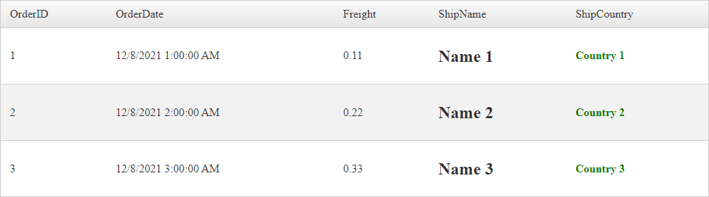
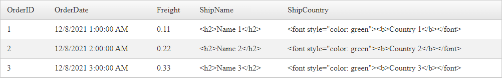

# RadGrid Security

This article explains how RadGrid handles HTML content and data-source operations, and how to reduce XSS and SQL injection risks in ASP.NET AJAX applications.

## Cross-site Scripting (XSS)

Cross Site Scripting (XSS) attacks are a type of injection in which malicious scripts are injected in the web application and submitted to the server. If no validation or protective measures are undertaken, the injected script will be executed during displaying data by the Web UI Control such as the RadGrid. Subsequently, any sensitive information could be successfully hijacked to a location, known by the attacker.

These attacks are common. Learn more about protecting applications against XSS in the following resources:

- [Microsoft guidance for preventing cross-site scripting in ASP.NET](https://msdn.microsoft.com/en-us/library/ff649310.aspx)
- [OWASP cross-site scripting (XSS) guidance](https://owasp.org/www-community/attacks/xss/)
- [MDN cross-site scripting glossary entry](https://developer.mozilla.org/en-US/docs/Glossary/Cross-site_scripting)


**RadGrid** by default will display HTML content. For instance, if one of the Fields in the Data Source contain HTML code such as `<b>some text</b>`, this value will be displayed in bold, or `<font style="color: green">some text</font>` will be green when rendered on the page.

If the data source contains scripts such as `<script>function(){ alert("window.alert run from a script")}</script>`, the scripts execute when the page loads.

For example, assume the following column content:

- The `ShipName` column contains values wrapped in `<h2>` elements, such as `<h2>Name 1</h2>`.
- The `ShipCountry` column contains values wrapped in `<font>` and `<b>` elements, such as `<font style="color: green"><b>Country 1</b></font>`.

>caption Outputs



To prevent HTML from rendering or scripts from executing, set the built-in column `HtmlEncode` property to `True`. Its default value is `false`, and setting it to `True` encodes HTML tags as HTML entities.

>caption Example Column definition

````ASP.NET
<telerik:GridBoundColumn DataField="ShipName" HeaderText="ShipName" HtmlEncode="true">
</telerik:GridBoundColumn>
<telerik:GridBoundColumn DataField="ShipCountry" HeaderText="ShipCountry" HtmlEncode="true">
</telerik:GridBoundColumn>
````

>caption Example Output



>caption Encoding HTML inside GridTemplateColumn

````ASP.NET
<telerik:GridTemplateColumn HeaderText="Template Column">
    <ItemTemplate>
        <%# EncodeValue(Eval("ShipName")) %>
    </ItemTemplate>
</telerik:GridTemplateColumn>
````

>caption C#/VB Function

````C#
protected string EncodeValue(object value)
{
    return HttpUtility.HtmlEncode(value.ToString());
}
````
````VB.NET
Protected Function EncodeValue(ByVal value As Object) As String
    Return HttpUtility.HtmlEncode(value.ToString())
End Function
````

>important Encoding adds an extra layer of security. The **developer is responsible for sanitizing user input and eliminating malicious code** before inserting values into the database.


## SQL Injection

SQL injection is a code injection technique that targets data-driven applications. An attacker inserts malicious SQL statements into an input field for execution, such as a statement that attempts to dump database contents.

>important **RadGrid** works with the data source provided by the developer, such as a `DataSet`, `DataTable`, array, list, entity object, or `SqlDataSource`. RadGrid does not interact with the database directly.
>
>important During filtering, sorting, and paging, RadGrid performs operations on the data set provided by the developer.

[Microsoft guidance for preventing SQL injection](https://docs.microsoft.com/en-us/archive/msdn-magazine/2004/september/data-security-stop-sql-injection-attacks-before-they-stop-you)


When you bind RadGrid to `SqlDataSource`, the grid requests data from the data source control configured by the developer.

The developer associates the grid with the `SqlDataSource` control. During editing or inserting, the grid sends key and value pairs to the data source control, which processes the operation.

````ASP.NET
<telerik:RadGrid ID="RadGrid1" runat="server" AllowPaging="True" Width="800px"
    AutoGenerateEditColumn="true"
    AutoGenerateDeleteColumn="true"
    DataSourceID="SqlDataSource1"
    AllowAutomaticInserts="true"
    AllowAutomaticUpdates="true"
    AllowAutomaticDeletes="true">
</telerik:RadGrid>
````

`SqlDataSource` uses the key and value pairs sent by the grid to query the database.

>important Always parameterize values to protect the database from SQL injection.

>caption Example SqlDataSource with Parameters

````ASP.NET
<asp:SqlDataSource ID="SqlDataSource1" runat="server"
    ConnectionString="<%$ ConnectionStrings:ConnectionString %>"
    InsertCommand="INSERT INTO [Orders] ([OrderDate], [Freight], [ShipName], [ShipCountry]) VALUES (@OrderDate, @Freight, @ShipName, @ShipCountry)"
    SelectCommand="SELECT [OrderID], [OrderDate], [Freight], [ShipName], [ShipCountry] FROM [Orders]"
    UpdateCommand="UPDATE [Orders] SET [OrderDate] = @OrderDate, [Freight] = @Freight, [ShipName] = @ShipName, [ShipCountry] = @ShipCountry WHERE [OrderID] = @OrderID"
    DeleteCommand="DELETE FROM [Orders] WHERE [OrderID] = @OrderID">
    <InsertParameters>
        <asp:Parameter Name="OrederID" DbType="Int32" />
        <asp:Parameter Name="OrderDate" DbType="DateTime" />
        <asp:Parameter Name="Freight" DbType="Decimal" />
        <asp:Parameter Name="ShipName" DbType="String" />
        <asp:Parameter Name="ShipCountry" DbType="String" />
    </InsertParameters>
    <UpdateParameters>
        <asp:Parameter Name="OrederID" DbType="Int32" />
        <asp:Parameter Name="OrderDate" DbType="DateTime" />
        <asp:Parameter Name="Freight" DbType="Decimal" />
        <asp:Parameter Name="ShipName" DbType="String" />
        <asp:Parameter Name="ShipCountry" DbType="String" />
    </UpdateParameters>
    <DeleteParameters>
        <asp:Parameter Name="OrederID" DbType="Int32" />
    </DeleteParameters>
</asp:SqlDataSource>
````

If binding data programmatically, the Grid will be assigned a Data Set provided by the developer.

````ASP.NET
<telerik:RadGrid ID="RadGrid1" runat="server" AllowPaging="True" Width="800px" OnNeedDataSource="RadGrid1_NeedDataSource">
</telerik:RadGrid>
````

````C#
protected void RadGrid1_NeedDataSource(object sender, GridNeedDataSourceEventArgs e)
{
    var myDataSource = new DataTable();

    // Developer's logic to QUERY the database e.g. "SELECT [Column] FROM [Table] WHERE [Column] = @someValue"
    // Developer's needs to make sure to parameterize the Query before fetching data from the SQL Server
    // Developer's logic to get the results in a Data Set such as DataTable, or List or a Business Object

    // Example - Developer's Functions fetching data from the DataSource
    myDataSource = FetchData("SELECT [Column] FROM [Table] WHERE [Column] = @someValue");
    // Assing the results to RadGrid
    (sender as RadGrid).DataSource = myDataSource;
}
````
````VB.NET
Protected Sub RadGrid1_NeedDataSource(ByVal sender As Object, ByVal e As GridNeedDataSourceEventArgs)
    Dim myDataSource = New DataTable()
    'Developer's logic to QUERY the database e.g. "SELECT [Column] FROM [Table] WHERE [Column] = @someValue"
    'Developer's needs to make sure to parameterize the Query before fetching data from the SQL Server
    'Developer's logic to save the results in a Table such as DataTable, or List or a Business Object
    'Developer's Functions fetching data from the DataSource
    myDataSource = FetchData("SELECT [Column] FROM [Table] WHERE [Column] = @someValue")
    'Assing the results to RadGrid
    (TryCast(sender, RadGrid)).DataSource = myDataSource
End Sub
````

## FAQ

Review these frequently asked questions about RadGrid security behavior:

### Is RadGrid vulnerable to SQL injection through stored procedures?

RadGrid does not have direct access to the database. Review the [SQL injection](#sql-injection) section for the data-source boundary.

To avoid SQL injection, create parameters for stored procedures.

>caption Example Stored Procedure with Parameters

````SQL
CREATE PROCEDURE SelectAllCustomers @City nvarchar(30), @PostalCode nvarchar(10)
AS
SELECT * FROM Customers WHERE City = @City AND PostalCode = @PostalCode
GO;
````


### Vulnerability Detected in RadGrid Pagination

The `RadNumericTextBox` control in the grid pager references the JavaScript [`eval()` function](https://developer.mozilla.org/en-US/docs/Web/JavaScript/Reference/Global_Objects/eval), which is not recommended.

The **RadNumericTextBox** control accepts only numeric values from `0` through `9`.

Static Application Security Testing (SAST) tools can report a false positive when they detect this function or a JavaScript version known to be vulnerable. In this case, the reported issue does not represent the pager's numeric input behavior.

The embedded jQuery in Telerik assemblies includes backports that address known vulnerabilities. Review [vulnerabilities in jQuery versions embedded in UI for ASP.NET AJAX]() and use the embedded jQuery instead of including another version.


### What Are Static and Dynamic Application Security Testing?

#### Static Testing

Static analysis examines source code, byte code, or application binaries without executing the application. Static Application Security Testing (SAST) evaluates the application's internal structure and data paths for security weaknesses.

#### Dynamic Testing

Dynamic analysis evaluates an application while it runs. Dynamic Application Security Testing (DAST) examines the application from the outside, simulates attacks, and analyzes the application's responses for vulnerabilities.

## See Also

- [Review vulnerabilities in embedded jQuery versions]()
- [Review RadGrid accessibility support]()


