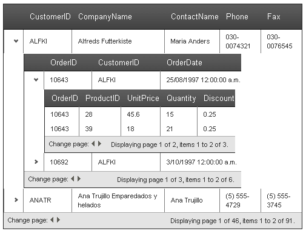
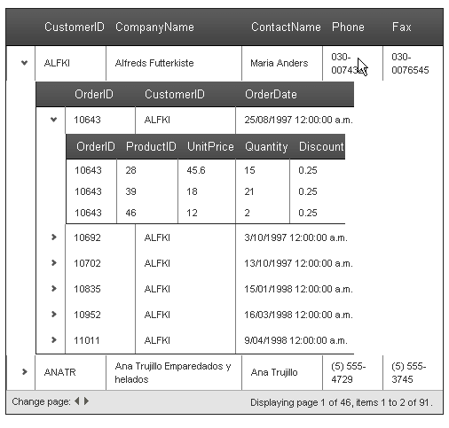
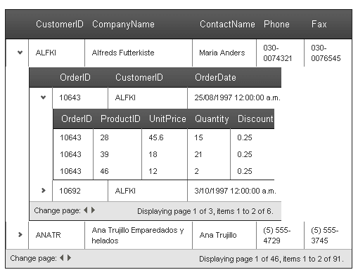

# RadGrid and MasterTableView Difference

The **RadGrid** control has a **MasterTableView** property that represents the top table in the grid. The instances of **RadGrid** and **MasterTableView** are almost identical, although they are of different types (**RadGrid** and **GridTableView**, respectively).

The main difference between **RadGrid** and **MasterTableView** is that **RadGrid** properties specify defaults for every **GridTableView** in the grid, including the **MasterTableView** and any **DetailTables**. **MasterTableView** properties apply only to the top-level table. They are not inherited by nested **DetailTables** and instead override the defaults set on **RadGrid**.

For example, if you set a blue border on the **RadGrid** object, the **MasterTableView** and any **DetailTables** also use that border unless they override it. If you set the border on the **MasterTableView**, it appears only on the top-level table.

## Example

The following examples illustrate this difference. They use the same page-level setup and three alternative **RadGrid** declarations.

* The first example shows a **RadGrid** control that enables paging with **PageSize** set to 2. All tables in the grid inherit paging and a page size of 2.

* The second example shows the same declaration, except that **AllowPaging** and **PageSize** are set on the **MasterTableView**. Only the master table view uses paging.

* The third example shows a **RadGrid** control that enables paging with **PageSize** set to 2, while a detail table overrides the setting.

>caption Page setup shared by the RadGrid and MasterTableView examples

````ASP.NET
<asp:ScriptManager ID="ScriptManager1" runat="server" />
<asp:AccessDataSource ID="AccessDataSource1" runat="server" DataFile="~/App_Data/Nwind.mdb"
  SelectCommand="SELECT * FROM [Customers]"></asp:AccessDataSource>
<asp:AccessDataSource ID="AccessDataSource2" runat="server" DataFile="~/App_Data/Nwind.mdb"
  SelectCommand="SELECT * FROM [Orders] WHERE ([CustomerID] = ?)">
  <SelectParameters>
    <asp:Parameter Name="CustomerID" Type="String" />
  </SelectParameters>
</asp:AccessDataSource>
<asp:AccessDataSource ID="AccessDataSource3" runat="server" DataFile="~/App_Data/Nwind.mdb"
  SelectCommand="SELECT * FROM [Order Details] WHERE ([OrderID] = ?)">
  <SelectParameters>
    <asp:Parameter Name="OrderID" Type="Int32" />
  </SelectParameters>
</asp:AccessDataSource>
````

## Defaults set in RadGrid

>caption Apply paging defaults to the RadGrid control
````ASP.NET
<telerik:RadGrid RenderMode="Lightweight" ID="RadGrid1" runat="server" DataSourceID="AccessDataSource1" AllowPaging="True"
  PageSize="2">
  <MasterTableView DataKeyNames="CustomerID" DataSourceID="AccessDataSource1" TableLayout="Auto">
    <DetailTables>
      <telerik:GridTableView runat="server" DataKeyNames="OrderID" DataSourceID="AccessDataSource2"
        TableLayout="Auto">
        <ParentTableRelation>
          <telerik:GridRelationFields DetailKeyField="CustomerID" MasterKeyField="CustomerID" />
        </ParentTableRelation>
        <DetailTables>
          <telerik:GridTableView runat="server" TableLayout="Auto" DataSourceID="AccessDataSource3">
            <ParentTableRelation>
              <telerik:GridRelationFields DetailKeyField="OrderID" MasterKeyField="OrderID" />
            </ParentTableRelation>
          </telerik:GridTableView>
        </DetailTables>
      </telerik:GridTableView>
    </DetailTables>
  </MasterTableView>
</telerik:RadGrid>
````


> caption Figure 1: RadGrid with paging defaults inherited by the master and detail tables



## Properties set in MasterTableView

>caption Apply paging only to the master table view

````ASP.NET
<telerik:RadGrid RenderMode="Lightweight" ID="RadGrid1" runat="server" DataSourceID="AccessDataSource1">
  <MasterTableView DataKeyNames="CustomerID" DataSourceID="AccessDataSource1" TableLayout="Auto"
    AllowPaging="True" PageSize="2">
    <DetailTables>
      <telerik:GridTableView runat="server" DataKeyNames="OrderID" DataSourceID="AccessDataSource2"
        TableLayout="Auto">
        <ParentTableRelation>
          <telerik:GridRelationFields DetailKeyField="CustomerID" MasterKeyField="CustomerID" />
        </ParentTableRelation>
        <DetailTables>
          <telerik:GridTableView runat="server" TableLayout="Auto" DataSourceID="AccessDataSource3">
            <ParentTableRelation>
              <telerik:GridRelationFields DetailKeyField="OrderID" MasterKeyField="OrderID" />
            </ParentTableRelation>
          </telerik:GridTableView>
        </DetailTables>
      </telerik:GridTableView>
    </DetailTables>
  </MasterTableView>
</telerik:RadGrid>
````

> caption Figure 2: RadGrid with paging configured only on the master table view



## Defaults set in RadGrid with overrides by detail table

>caption Override inherited paging settings on a detail table

````ASP.NET
<telerik:RadGrid RenderMode="Lightweight" ID="RadGrid1" runat="server" DataSourceID="AccessDataSource1" AllowPaging="True"
  PageSize="2">
  <MasterTableView DataKeyNames="CustomerID" DataSourceID="AccessDataSource1" TableLayout="Auto">
    <DetailTables>
      <telerik:GridTableView runat="server" DataKeyNames="OrderID" DataSourceID="AccessDataSource2"
        TableLayout="Auto">
        <ParentTableRelation>
          <telerik:GridRelationFields DetailKeyField="CustomerID" MasterKeyField="CustomerID" />
        </ParentTableRelation>
        <DetailTables>
          <telerik:GridTableView runat="server" TableLayout="Auto" DataSourceID="AccessDataSource3"
            AllowPaging="False">
            <ParentTableRelation>
              <telerik:GridRelationFields DetailKeyField="OrderID" MasterKeyField="OrderID" />
            </ParentTableRelation>
          </telerik:GridTableView>
        </DetailTables>
      </telerik:GridTableView>
    </DetailTables>
  </MasterTableView>
</telerik:RadGrid>
````

> caption Figure 3: RadGrid with inherited paging and a detail table that disables paging



## See Also

* [RadGrid Structure Overview]()

* [Hierarchy load modes]()

* [Data binding overview]()
