# RadGrid Structure Overview

The **RadGrid** control is composed of table views, rows, columns, and functional elements. Most rendered items derive from **GridItem** and can be retrieved with the **GetItems()** method of a **GridTableView**.


## Grid Item Types

The following sections describe common **RadGrid** item types and show how to access them.

### GridDataItem

The data rows of the grid are called **items**. Each data row is represented by a **GridDataItem**.

> caption Figure 1: RadGrid data rows showing normal and alternating items

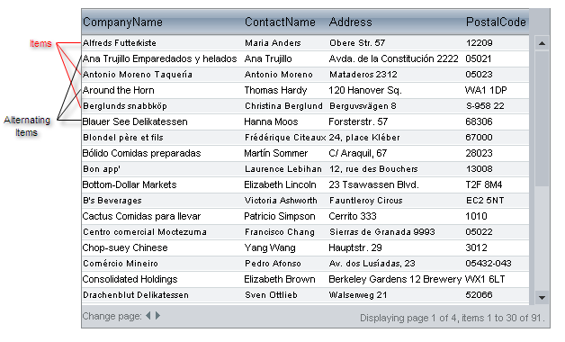

You can access data items through the **Items** collection of the **RadGrid** or **GridTableView** object.

>caption Access the data rows through RadGrid and GridTableView

````C#
protected void Page_PreRender(object sender, EventArgs e)
{
    foreach (GridDataItem dataItem in RadGrid1.Items)
    {

    }
    foreach (GridDataItem dataItem in RadGrid1.MasterTableView.Items)
    {

    }
}
````

````VB
Protected Sub Page_PreRender(sender As Object, e As EventArgs)
    For Each dataItem As GridDataItem In RadGrid1.Items
    Next

    For Each dataItem As GridDataItem In RadGrid1.MasterTableView.Items
    Next
End Sub
````

If the grid uses different styles for odd- and even-numbered rows, the even-numbered rows are called **AlternatingItems**. The **GridDataItem.ItemType** property identifies the row type as `Item` or `AlternatingItem`. You can retrieve each type separately with **GetItems()**.

>caption Access normal and alternating items by their GridItemType values

````C#
protected void Page_PreRender(object sender, EventArgs e)
{
    foreach (GridDataItem item in RadGrid1.MasterTableView.GetItems(GridItemType.Item))
    {

    }

    foreach (GridDataItem alternatingItem in RadGrid1.MasterTableView.GetItems(GridItemType.AlternatingItem))
    {

    }
}
````

````VB
Protected Sub Page_PreRender(sender As Object, e As EventArgs)
    For Each item As GridDataItem In RadGrid1.MasterTableView.GetItems(GridItemType.Item)
    Next

    For Each alternatingItem As GridDataItem In RadGrid1.MasterTableView.GetItems(GridItemType.AlternatingItem)
    Next
End Sub
````


If there are no records to display, the grid displays a **GridNoRecordsItem**:

> caption Figure 2: RadGrid no-records item displaying a message when the data source is empty

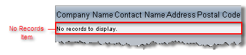

You can access the no-records item as follows:

>caption Access the GridNoRecordsItem from the master table view

````C#
protected void Page_PreRender(object sender, EventArgs e)
{
    foreach (GridNoRecordsItem noRecordsItem in RadGrid1.MasterTableView.GetItems(GridItemType.NoRecordsItem))
    {
    }
}
````

````VB
Protected Sub Page_PreRender(sender As Object, e As EventArgs)
    For Each noRecordsItem As GridNoRecordsItem In RadGrid1.MasterTableView.GetItems(GridItemType.NoRecordsItem)
    Next
End Sub
````

### GridHeaderItem

The header appears above the data rows and is represented by a **GridHeaderItem** object:

> caption Figure 3: RadGrid header item above the data rows

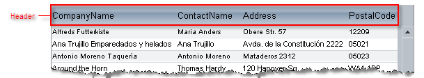

#### Accessing the Header Item

>caption Access the GridHeaderItem from the master table view

````C#
protected void Page_PreRender(object sender, EventArgs e)
{
    GridHeaderItem headerItem = RadGrid1.MasterTableView.GetItems(GridItemType.Header)[0] as GridHeaderItem;
}
````

````VB
Protected Sub Page_PreRender(sender As Object, e As EventArgs)
    Dim headerItem As GridHeaderItem = TryCast(RadGrid1.MasterTableView.GetItems(GridItemType.Header)(0), GridHeaderItem)
End Sub
````


You can hide or show the header by using the grid's **ShowHeader** property. For more information, see [Using columns]().

### GridFooterItem

The footer appears below the data rows and is represented by the **GridFooterItem** object:

> caption Figure 4: RadGrid footer item below the data rows

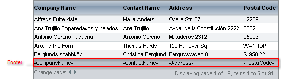

You can hide or show the footer using the grid's **ShowFooter** property. For more information about footers, see [Using columns]().

### GridFilteringItem

The grid filtering item appears when you enable [filtering]() through the **RadGrid.AllowFilteringByColumn** or **GridTableView.AllowFilteringByColumn** property.

> caption Figure 5: RadGrid filtering item with filter inputs below the column headers

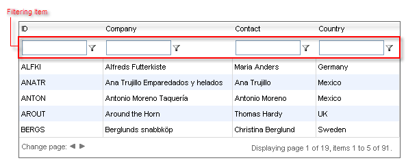

### GridEditFormItem

The edit form item contains the controls used to edit a data item:

> caption Figure 6: RadGrid edit form item with controls for editing a data row

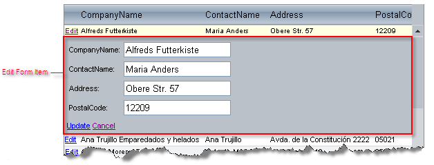

For information about edit forms, see [Edit forms]().

### GridPagerItem

If paging is enabled, **RadGrid** renders a pager item (**GridPagerItem**) at the top, bottom, or both locations of the grid table view:

> caption Figure 7: RadGrid pager item with page navigation controls

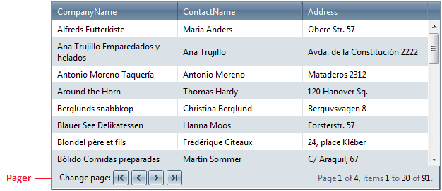

For information about **GridPagerItem**, see [Pager item]().

### GridCommandItem

You can add a command item (**GridCommandItem**) to display command buttons in the grid.

> caption Figure 8: RadGrid command item template with toolbar commands

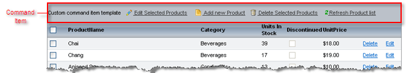

The **GridCommandItem** object can appear at the top, bottom or top and bottom of the grid. You can specify the content of the command item using a template. **GridCommandItem** is commonly used for automatic database operations, but it can be used for executing any **RadGrid** commands. For more information, see [Command Item]().

### GridRowIndicatorColumn

When row resizing is enabled, **RadGrid** automatically generates a column of type **GridRowIndicatorColumn**.

> caption Figure 9: RadGrid row indicator column used to resize row height


For information about resizable rows, see [Resizing rows]().

### GridBoundColumn

If the grid auto-generates its columns (the **AutoGenerateColumns** property is **True**), the grid generates **GridBoundColumn** objects for each column that displays data:

> caption Figure 10: RadGrid bound column highlighted in the first data column

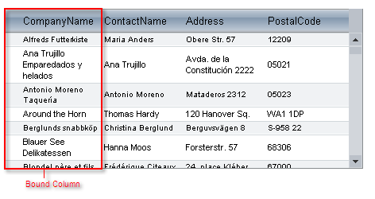

You can also explicitly add columns to the grid of other types. For details, see [Column types]().

### GridExpandColumn

The **GridExpandColumn** is an automatically generated and automatically placed column that appears when the grid has a hierarchical structure:

> caption Figure 11: RadGrid expand column with controls for showing detail rows

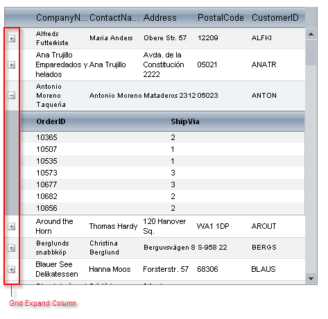

The expand column holds the expand and collapse buttons that show or hide detail tables. It is always placed in front of all other grid content columns and cannot be moved.

>note You can manually add additional instances of this column type.
>


### MasterTableView

The **MasterTableView** is the **GridTableView** object for the topmost table in the hierarchical structure:

> caption Figure 12: RadGrid master table view containing data rows and a detail table

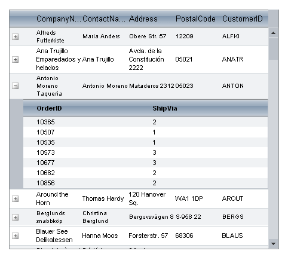

The **MasterTableView** contains all inner tables (**DetailTables**), which are available on demand (see [Hierarchy Load]()). When there is no hierarchical structure, the **MasterTableView** coincides with **RadGrid** itself.

For more information about the relationship between the **MasterTableView** and the grid, see [RadGrid and MasterTableView difference]().

### DetailTableView

The **DetailTableView** is the **GridTableView** object for an inner table of a hierarchical structure:

> caption Figure 13: RadGrid detail table view showing orders for a selected customer

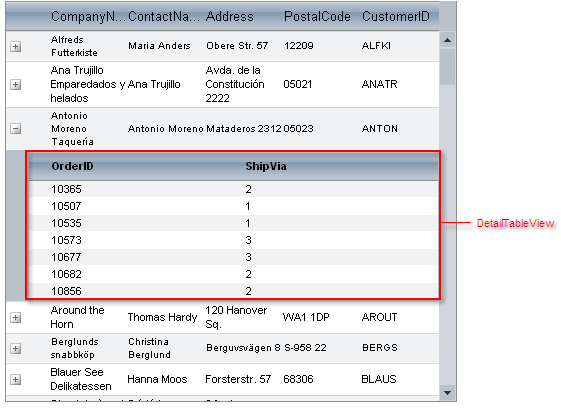

Detail table views can be nested inside a **MasterTableView**, or inside another Detail table view (when the hierarchy includes multiple levels).

### NestedViewItem

Nested view items are **Items** of a parent table that contain a nested **DetailTableView**.

> caption Figure 14: RadGrid nested view item containing a detail table


Each nested view item contains only a single **GridTableView**. If a master table has more than one detail table, each detail table has its own nested view item.

### ScrollBars

Scroll bars appear when the [ scrolling is enabled]() and the grid cannot display all of its rows or the width of a **GridTableView** exceeds the width of the item in which it is nested (or, in the case of the MasterTableView, the width of the grid).

> caption Figure 15: RadGrid horizontal and vertical scroll bars

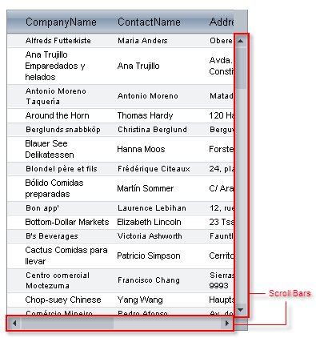

By default, scrolling is not enabled.

### Grouping elements

When you set the grid's **GroupingEnabled** property to `True`, RadGrid generates several grouping elements:

> caption Figure 16: RadGrid grouping elements including the group panel, splitter column, and group header

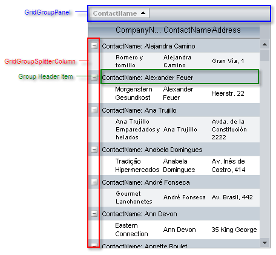

The **GridGroupSplitterColumn** appears on the far left of each **GridTableView**, and enables users to expand and collapse groups of records. The group splitter column is always placed first and cannot be moved. For more information about the **GridGroupSplitterColumn**, see [Column types]().

Each group of records in a **GridTableView** is preceded by a **GroupHeaderItem**, which indicates the grouping field.

The **GridGroupPanel** is added to the top of the grid. This panel acts as a repository for panel items, which represent the columns on all table views in the grid that are used for grouping. You can optionally hide the **GridGroupPanel** using the grid's **ShowGroupPanel** property. You can access the panel using the grid's GroupPanel property.

For more information on grouping, see [Basic grouping]().

### Panel Items

Each Panel item represents a column in one of the table views that the grid displays. Users can click on the panel items to change the sort direction of the corresponding group, drag items off the Grid group panel to remove grouping on that field, and drag header cells to the group panel to add new panel items (and corresponding groups).

> caption Figure 17: RadGrid group panel item showing a grouped column

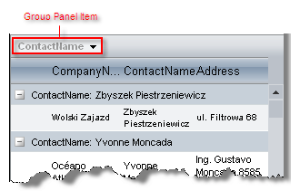

## See Also

* [RadGrid and MasterTableView difference]()

* [Data Items]()

* [Using columns]()

* [Understanding hierarchical grid structure]()
