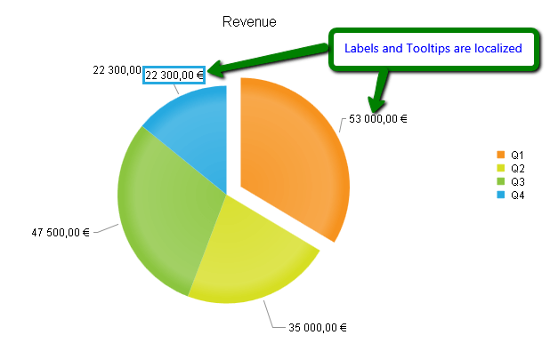

# Localization

Telerik makes it easy to localize **RadHtmlChart**. Some chart elements have custom strings that you localize before you pass them to the control and some text can be localized by using the KendoUI framework. This Help article will show you how to use the KendoUI framework (**Example 1**) to create the localized **PieSeries** shown in **Figure 1**.	**RadHtmlChart** can use KendoUI framework localizations and in order to set a certain culture,you should follow the steps that are listed [here](http://docs.kendoui.com/getting-started/framework/globalization/overview). Here is a summary of the steps:

1. Add a reference in your page to the desired culture file. You can find the KendoUI Culture files in the "**js/cultures**" folder located in the root of the archive. You can download KendoUI from the [Download page of Your Telerik.com Account](https://www.telerik.com/account/product-download?product=KENDOUICOMPLETE).

	>caution When using an external script the KendoUI culture script must be declared before setting the culture of the kendo object.

1. Set the desired culture through the kendo object.

1. Apply the desired numeric format either in the **DataFormatString** property or in the **kendo.format()** method when using templates. You can see an example on this regard in the [Format Numbers]() help article.

>important 
*  **ChartTitle** , **XAxis.Title** / **YAxis.Title** , **Series.Names** and text in categorical **Axes' Items** are custom strings that developers pass to the chart and are not localized by the control.
* Labels and tooltips of **SeriesItems** , and labels of numeric or date axes can be localized by the KendoUI framework.


## Example of a Localized Chart

You can see in **Example 1** and **Figure 1**, an example of a localized **PieSeries RadHtmlChart**.

>caption Example 1: Use the KendoUI framework JavaScript culture files to localize the labels and tooltips of a Pie chart.

````ASP.NET
<form id="form1" runat="server">
	<script type="text/javascript" src="kendo/js/cultures/kendo.culture.fr-FR.min.js"></script>
	<script type="text/javascript">
		kendo.culture("fr-FR");
	</script>
	<!--Where "fr-FR" is the desired culture-->
	<asp:ScriptManager runat="server" ID="ScriptManager1">
	</asp:ScriptManager>
	<telerik:RadHtmlChart runat="server" ID="RadHtmlChart1" Height="400px" Width="400px">
		<PlotArea>
			<Series>
				<telerik:PieSeries>
					<SeriesItems>
						<telerik:PieSeriesItem Exploded="true" Y="53000" Name="Q1" />
						<telerik:PieSeriesItem Exploded="false" Y="35000" Name="Q2" />
						<telerik:PieSeriesItem Exploded="false" Y="47500" Name="Q3" />
						<telerik:PieSeriesItem Exploded="false" Y="22300" Name="Q4" />
					</SeriesItems>
					<LabelsAppearance DataFormatString="C">
					</LabelsAppearance>
					<TooltipsAppearance DataFormatString="C"></TooltipsAppearance>
				</telerik:PieSeries>
			</Series>
			<YAxis>
			</YAxis>
		</PlotArea>
		<ChartTitle Text="Revenue">
		</ChartTitle>
	</telerik:RadHtmlChart>
</form>
````

>caption Figure 1: Localized labels and tooltips using the KendoUI framework.



**Figure 1** shows a Pie chart localized from the default culture of the page: "en-US" to "fr-FR" culture.The format of the indicated labels and tooltips has been changed from $22,300.00 and $53,000.00 to 22 300,00 € and 53 000,00 €.

## See Also

 * [Get Kendo UI from Your Account](https://www.telerik.com/account/product-download?product=KENDOUICOMPLETE)

 * [KendoUI Kendo Globalization Overview](http://docs.kendoui.com/getting-started/framework/globalization/overview)

 * [KendoUI Number Formatting](http://docs.kendoui.com/getting-started/framework/globalization/numberformatting)

 * [RadHtmlChart Formatting Numbers]()
